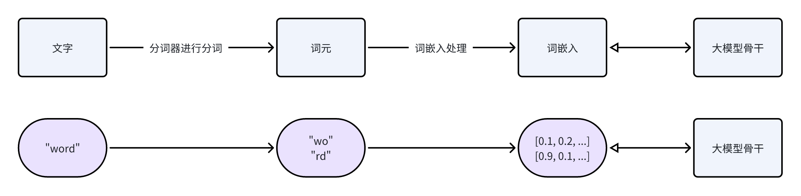
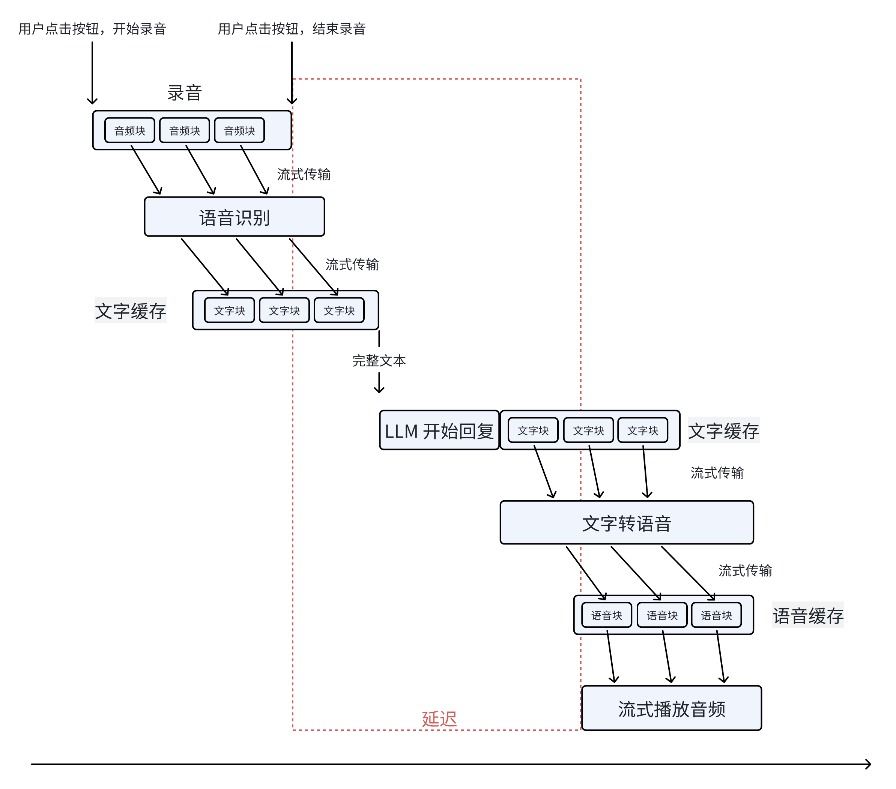
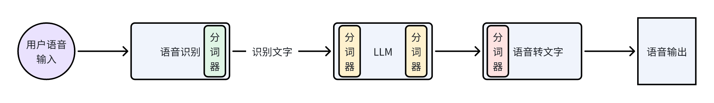
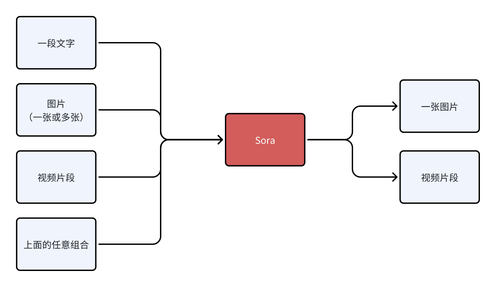
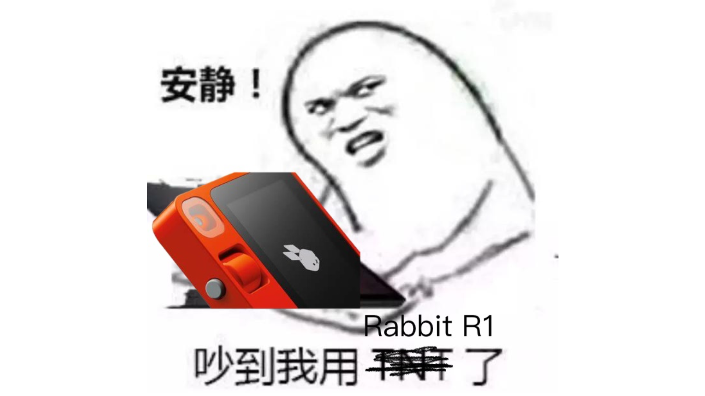
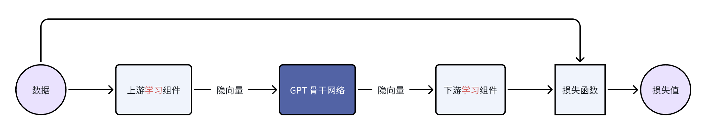

+++
title = "Draft: Nativeness and First Principle of AI"
description = "TL;DR: Multi-modal intelligence is the key"
draft = false

weight = 3

[taxonomies]
tags = ["AI", "AR"]

[extra]
feature_image = "kokichi_muta.png"
feature = true
+++

> ⚠️ This article is approximately 25,000 words long. If you're considering using AI to speed-read, you might encounter unexpected results.
>
> As for debugging, you'll need to read at least up to the example of the [LLM Voice Conversation System](#llm-voice-conversation-system) :)

## Slightly Off-Topic

If the dark-themed cover image scared you, I apologize. It features a character from "Jujutsu Kaisen" I watched in 2023—Kokichi Muta.

> Mechanical Maru or its operator—Kokichi Muta

His background isn't crucial, but what's relevant here is his curse and talent. His curse is a fragile body, but as the saying goes, "When God closes a door, He opens a window." His talent lies in "mechanical manipulation" and exceptional intelligence.

As GPT-4 emerged and I interacted with it more in daily life, research, and work, my impression of it shifted from vague to clear. It reminded me of the image above, including Mechanical Maru and Kokichi Muta. If you're particularly familiar with GPT-4 and also know "Jujutsu Kaisen," you might find
this amusing.
However, the intersection of these two groups is relatively small, so I've digressed a bit here. Many parts of this blog will subtly align with this character. Still, I felt compelled to include him in this post, so if you're not familiar with him, it won't affect your understanding.

> To learn more about Kokichi Muta, you can check [here](https://zh.moegirl.org.cn/zh-hans/%E7%A9%B6%E6%9E%81%E6%9C%BA%E6%A2%B0%E4%B8%B8/%E4%B8%8E%E5%B9%B8%E5%90%89) or [here](https://jujutsu-kaisen.fandom.com/wiki/Kokichi_Muta).

> If you're also a fan of "Jujutsu Kaisen," here's an interesting thought experiment I came across: If Kokichi Muta were to represent GPT-4, would his ending and motivations align with those of AGI?
>
> I don't have the answer, but you might have some interesting thoughts.

## Abbreviation Glossary

For brevity, the article uses some "common" English abbreviations. "Common" may not be common for everyone, so here's a glossary.

| Abbreviation |                           Full Name                           |
|:------------:|:-------------------------------------------------------------:|
|      AI      |                    Artificial Intelligence                    |
|     AGI      |                Artificial General Intelligence                |
|     API      |               Application Programming Interface               |
|     ASR      |                 Automatic Speech Recognition                  |
|      CV      |                        Computer Vision                        |
|      DL      |                         Deep Learning                         |
|     GPT      | General Pretrained Transformer (Now "GPT" is a concrete term) |
|     LLM      |                     Large Language Model                      |
|     NLP      |                  Natural Language Processing                  |
|      OS      |                       Operating System                        |
|      SD      |                       Stable Diffusion                        |
|     TTS      |                        Text to Speech                         |

## Questions and Seemingly Correct Answers

I often see many people asking the following questions or similar ones:

* What qualifies as AI-native?
* Where is the boundary between model and application layers?
    * Another straightforward translation is: Where does OpenAI draw the line?

A previous blog topic I considered was: Why isn't Rabbit R1 AI-native?

Recently, when I grouped these questions and topics together, I realized they all essentially ask the same thing:

**"What are the first principles of AI?"**

Once we understand the first principles of AI, the rest of the questions become easier to solve:

* Applications that follow the first principles of AI are considered AI-native. Abilities directly stemming from AI's first principles are AI's native capabilities, marking the boundary of the model layer.
* Abilities that cannot be directly derived from AI's first principles should be implemented at the application layer, which OpenAI would not touch.
* Similarly, AI-native hardware aligns with AI's first principles. Rabbit R1's design, rooted in outdated AI hardware concepts, does not adhere to these principles, making it non-AI-native.

> **What are first principles?**
>
> It seems everyone knows what first principles are, as if we learned them during compulsory education. But it seems no one can clearly define them. I'm also unsure (what they're talking about), so here's my understanding and definition:
>
> First principles involve logically deducing or deconstructing complex logic or combinations back to a few basic components. This tracing process requires constantly examining the necessity of various elements, removing the unnecessary or derived ones, until what remains is indivisible.
> These indivisible basic components are the first principles. Alternatively, we could approximate them with "axioms" from first-order logic. We should teach first-order logic in compulsory education, not in graduate courses 🐶
>
> As for what counts as "indivisible" or what constitutes "common (sense) principles"? That's a question!
>

## The First Principles of AI

So, what are the first principles of AI? I believe it's "information volume," which refers not only to the amount of information but also to its quality and the fidelity of its transmission and conversion.

Those familiar with NLP and CV in deep learning should already be quite acquainted with the concept of "information volume," but I still want to reiterate some experiences derived from previous practices:

1. Given the same quality, more data is better — the more information, the better.
    * LLMs now use the entire internet's corpus for training.
    * SegmentAnything elegantly improved semantic segmentation performance through data brute force.
2. With the same amount of data, the quality should be as high as possible — the higher the quality, the better.
    * Exceptionally performing small models like Phi-2 demonstrate the importance of corpus quality.
    * Various fine-tuned models of Stable Diffusion are also examples.
3. In terms of data representation and model design, minimize human design (heuristics) — information flow should reduce human design, allowing the model to learn on its own, preserving as much **useful** information as possible.
    * Countless examples have proven this point, two classic ones being the deep CV initiated by AlexNet and DL-based NLP.
    * The essence of the new bible "The Bitter Lessons" is also to minimize human design.
    * In today's DL era, this principle is too obvious. Many students who entered the field directly through DL, bypassing statistics-based machine learning, would naturally agree.

For those not familiar with DL, the first and second pieces of experience are relatively easy to understand, similar to how reading more books makes one smarter, but it's also important to sift through and select valuable, meaningful knowledge while reading.
Regarding the third piece of experience, I'll provide more examples later to help explain. For now, let's use an analogy. The learning and growth process of humans often involves making our own choices. Although influenced by teachers and parents, ultimately, our understanding of the world and life
comes from ourselves. Of course, there are examples where parents and teachers overly intervene and design.
Imagine a person whose understanding of everything is entirely based on their parents' views. This person might live well, but we wouldn't consider them very intelligent. Models with excessive human design are like such a person.

> **You mentioned what AI's first principles are, but how did you deduce them? You mentioned what they are, but not why.**
>
> Indeed! Because the field of AI is so broad, with numerous theories and a lot of noise and hype, it's difficult to deduce from very general concepts or questions. General concepts or questions are akin to asking, "Does Sora follow AI's first principles?" "What's the relationship between AI's first
> principles and AGI?".
>
> My understanding of AI's first principles comes from various practical examples I've encountered, so I'll introduce these examples in detail later. While discussing these examples, I'll attempt to analyze their underlying issues.
> Hopefully, after I've covered these examples and their underlying issues, you'll see the commonalities between them. These commonalities, pushed one step further, bring us closer to AI's first principles.
>
> This way, you only need to believe in my examples, not blindly follow my reasoning. Starting from the examples and trusting your own reasoning, you can reach the same conclusion.

## The Significance of AI's First Principles for System Design {#ai-fp-for-sys-design}

The concept of AI's first principles has been briefly explained above, but what does it mean for system design? Here, "system" refers to AI models and larger systems containing AI models. I'll provide a few examples and share my thoughts. These examples are not arranged in chronological order.

The first example is a tutorial released by Andrej Karpathy a few days ago, "Let's Build the GPT Tokenizer Together." Those who follow AI, especially LLMs, have probably seen this tutorial, right? If not, I highly recommend checking it out! Andrej is a legend, and his tutorial is both entertaining
and easy to understand.

In the tutorial, he mentioned that LLMs sometimes exhibit strange behaviors, specifically these eleven issues:

* Why can't LLMs spell words?
* Why can't LLMs perform simple string operations, such as reversing a string?
* Why do LLMs perform worse in languages other than English?
* Why do LLMs struggle with simple arithmetic?
* Why does GPT-2 encounter many unnecessary difficulties when programming in Python?
* Why do large models suddenly stop when encountering "<|eot|>"?
* What's with the strange warning "trailing space"?
* When I ask LLM about "sgm," why does it suddenly falter?
* Why should I use YAML instead of JSON with large models?
* Why isn't LLM actually doing end-to-end language modeling?
* What's the root cause of these pains?

These issues ultimately stem from the tokenization step and the tokenizer used. The tokenizer is a crucial part of LLM design involving significant *human* design. Tokenizers divide language into smaller parts or combine them into larger parts, called tokens, such as splitting "word" into "wo" and "
rd" or combining "早啊，吃了吗" into a single token due to its high frequency. These tokens are the basic units LLMs work with.
Languages like Chinese require even more complex tokenization. I won't delve into the details here, but Andrej's tutorial is a great resource.

> **Didn't Andrej say the tokenizer is trained? Why is it considered human design?**
>
> The term "training" has been somewhat overused. In reality, the training of a tokenizer can only be considered iteration. The difference between "iteration" and "training" won't be explored here, but simply put: the iteration of a tokenizer doesn't involve updating model parameters, whereas "
> training" should refer to the process of continuously updating model parameters.
>
> Moreover, if you carefully watched the tutorial, Andrej mentioned at the beginning that the training of the tokenizer is part of corpus preprocessing; and in the latter part of the tutorial, he listed many rules introduced by humans during the "training" of the tokenizer. These all indicate that
> the tokenizer is a product of human design (heuristics).

Andrej provided an interesting example of some strange compound words, such as "sgm." This word doesn't have any obvious meaning, but the tokenizer treated it as a single token, possibly because it was the username of a Reddit user. During the iteration of the tokenizer, there might have been many
posts by this user in the corpus, so it was integrated as a single token.
Large models process tokens by converting them into embeddings, then continuously updating each token's embeddings and the large model's own parameters during training.

> **What are embeddings?**
>
> Language models can't directly process tokens; they work with the corresponding embeddings. An embedding is a series of numbers, such as the token "you" being represented by an embedding like [0.1, 0.2, 0.15, ......]. The length of this series is predetermined, usually in the thousands.
>
> During the training process, large models also continuously update embeddings, which essentially represent the model's understanding of a particular token, though humans can't interpret the meaning of these numbers. Each token's embedding starts as random numbers, and only after the model begins
> learning and the embeddings are updated do they eventually represent the model's understanding of a token.
>
> The overall process is illustrated below, with the top half showing the process and the bottom half providing an example. The double arrows indicate that embeddings are input into the model for forward processing and can also be updated backward.
>
> 

However, the corpus used for training the large model might differ from the one used for iterating the tokenizer. In such cases, although the large model has embeddings for "sgm," it has never encountered this word during training, so the embeddings for this word have never been updated and remain
the initial random numbers.
The large model can't understand these embeddings (random numbers), leading to strange behaviors upon encountering these words.

In this example, at least three aspects involve (or can involve) human settings:

1. Which strings are considered a single token?
    * For instance, we can manually add the string "<|eot|>" as a token.
2. Settings, iteration data, and strategies for the tokenizer
    * One example Andrej mentioned is using Sentencepiece to iterate the tokenizer, allowing the replacement of rare words with the "<unk>" token, where "unk" stands for "unknown character."
    * Regarding iteration data, if the data used for iterating the tokenizer doesn't include Chinese, then the tokenizer is doomed to perform poorly in processing Chinese.
    * Additionally, how the tokenizer handles numbers directly affects LLM's mathematical abilities.
3. Data used for training the LLM: Some large English models used for benchmarking start by removing non-English data from the training set, which, although cost-saving, ensures the model won't understand languages other than English, even if it's intelligent enough.

> **Thought Experiment One: Discrimination in Large Model Training?**
>
> If a product manual is only available in English, and the manual's authors say, "We only consider English-speaking users," would you feel discriminated against?
> Similarly, when you see statements like "we removed the non-English part of the dataset/corpus" in LLM training reports or papers, would you feel discriminated against?
>
> There's also a subtler case: if the corpus used for iterating the tokenizer is 99% English, and the iteration settings are such that rare words are filtered out and common word coverage is 99%, meaning words appearing less than 1% of the time are replaced with "<unk>", would you feel discriminated
> against?
>
> **Thought Experiment Two: Has AGI Arrived?**

This example can lead to many extended discussions, but let's return to the main topic, which is the relationship between this example and AI's first principles. The importance of data volume and quality in LLM examples doesn't need further explanation, but what we need to consider is the third
point:
> Information flow should minimize human design, allowing the model to learn on its own, preserving as much **useful** information as possible.

If we could eliminate the tokenizer, treating every byte as a token, then most of the ten issues mentioned by Andrej could be easily resolved. These issues exist primarily due to the tokenization step and the human-designed elements (heuristics) within it. I might even say this affects the arrival
of AGI.

In this example, the "system" refers to the combination of iteration data for the tokenizer, the tokenizer itself, the LLM training data, and the LLM. We traced the root cause of engineering issues back to the tokenizer from the surface issues mentioned by Andrej. But what's the essence of the
problem? I believe it's human design. Humans tend to believe our understanding of the world is correct and effective, and we often think the world is comprehensible and orderly. Thus, we frequently incorporate our thought processes into our creations.
However, we don't fully understand our own thinking, let alone fully comprehend the world. Even in the case of Go, our understanding might not be as profound as AlphaZero, which was trained from scratch without studying game records. Moreover, much of our thinking is "chaotic" (as described in "
Thinking, Fast and Slow," a well-written book).

While not countless, many examples have shown us that there are many ways to understand the world. Rich Sutton's "The Bitter Lesson" also summarizes a similar conclusion, which is that AI's way of understanding the world doesn't necessarily have to conform to human design. We need to reduce human
design to train more powerful AIs.

> **But wait, couldn't we design a perfect tokenizer to solve these problems?**
>
> This question is similar to one in the history of NLP: "Can we model and understand language with rules?" Since language is a manifestation of our thinking, the question can also be reframed as "Can we model and understand our thinking with rules?"
> My answer is "Partially, such as in mathematics, but most cannot be defined and understood with rules," which translates to "You can try to design a perfect tokenizer for some specific applications, but a universally perfect tokenizer doesn't exist."
>

 

### \> Information Flow — The Example of the LLM Voice Conversation System {#llm-voice-conversation-system}

Another example that might be easier to understand but is actually more complex is the LLM voice conversation.
This is also a problem I've actually encountered: how to enable people to converse with LLMs through voice. Conversation is bidirectional, meaning people should be able to speak, and LLMs should also be able to respond.
If you're familiar with existing AI components, your first thought might be: (Isn't this simple?) Use ASR to convert human speech into text, send the text to the LLM, and then use TTS to convert the LLM's text response into speech.

At first, I thought the same. First, how do we know when a user wants to converse with the LLM? Well, since I'm working on a proof of concept, let's assume users will press a button to converse with the LLM, just like ChatGPT does 🐶
Then comes speech recognition. ASR accuracy is decent, though it might mishear some words, so I thought adding hot words/common words should solve that (right?);
LLM is not a big issue. I use [Dify](https://dify.ai) for various prompt engineering, and as long as ASR's results aren't outrageously wrong, LLM has some ability to correct errors based on context;
Finally, text-to-speech. Many cloud providers offer TTS services, so I just need to send the LLM's output to a server. Thus, the conceptual flow of the entire process looks something like this:

Seeing this diagram, those who have learned from the first example's lessons might start to feel something is amiss. However, I didn't see any problems at the time; it seemed like a standard solution. Let's temporarily set aside our reservations and assume this is the correct approach, implementing
it accordingly. Below is the flowchart of my first version of the engineering implementation.

The first engineering issue encountered was latency. This implementation is the simplest, but it resulted in delays of over ten seconds. Even in the XP era, such latency would have made users terminate the process. However, it's clear that the engineering implementation can still be improved, so I
continued to patch and modify it, akin to the first version of the tokenizer in Andrej's tutorial.

After three years of new development, three years of patching, and another three years of patching the patches, the final implementation is shown above. All parts that could be streamed were made to do so. Thus, the latency perceived by users, from the end of speaking to the start of playback of the
first audio block, could be reduced to about 2-4 seconds. Further latency reductions could be achieved by replacing the LLM with a fine-tuned smaller model.

Let's stop at the engineering part and consider the significance of this example in terms of AI's first principles. I'll take a slightly roundabout route, but it's worth it.

The detour is about considering the "blocks" concept in the final implementation, such as "audio blocks," "text blocks," and "speech blocks." Recall what tokens are; they're also "blocks," chunks of strings. LLM's input is in blocks of tokens, and its output is also in blocks.
Since everything is in blocks, can we unify "audio blocks," "text blocks," "speech blocks," and "tokens" into a single type of block, inputting these unified blocks into LLM, which can then output these blocks as well? In English literature, these are all called "tokens"; perhaps researchers were
too lazy to come up with new names. An example is [Qwen-Audio](https://www.modelscope.cn/models/qwen/Qwen-Audio/summary) from ModelScope; DL practitioners can check its implementation.
Although Qwen-Audio can accept text blocks and audio blocks, it can only output text blocks, i.e., tokens.

> As an expansion: GPT-4 Vision cuts images into blocks, turns them into chunks of images, then embeds these image blocks before inputting them into the model backbone.

But what's the core difference between the final implementation and the unified block approach? The key difference lies in data representation and model design. Looking at the final implementation of this voice conversation system, it includes three parts and their respective human designs:

| Component |                                     Human Design (Heuristics)                                      |
|:---------:|:--------------------------------------------------------------------------------------------------:|
|    ASR    | ASR model training data, ASR model tokenizer, ASR model inference settings (e.g., hot words), etc. |
|    LLM    |              As discussed earlier, tokenizer, corpus, and various inference settings.              |
|    TTS    |  TTS model training data, TTS model tokenizer, TTS inference settings (e.g., voice, speed), etc.   |

In this system, the interaction data between components is represented as text. ASR provides text to LLM, and LLM provides text to TTS.
Not discussing other human designs, just the tokenizer alone, this system has three different ones.

> One tokenizer is on the ASR output side, one on both the LLM input and output sides, and another on the TTS input side.

Based on the first example, it's not hard to conclude that tokenizers cause information loss. For example, when a tokenizer directly replaces a "rare" token with "<unk>", the meaning of the token is completely lost.
The loss of information doesn't stop there. Using this system, users can't say, "Listen, what's this sound?" or "Can you imitate a cat's meow?" In this system, these limitations are not due to the LLM's lack of intelligence but the restrictions we artificially added through components.
LLM can't identify sounds because our ASR is only trained to recognize the content of human speech; LLM can't mimic animal sounds because TTS can only produce human voices.

Even if we managed to train a universal ASR and TTS capable of recognizing and producing various sounds, the system's interaction data representation being text would still result in unnecessary information loss.
A straightforward example is, as a Southerner who has never seen snow, although physics books describe snow's structure and literature is filled with descriptions and poems about snow, none of these compare to going to the North and seeing snow with my own eyes, holding a handful of it. Many things,
concepts, feelings, and nuances cannot be conveyed through text.

I've digressed a bit, but another real-world example is image understanding. After the release of GPT-3.5 and before GPT-4, many researchers wanted GPT-3.5 to "understand" images. One **real** approach was to use various CV models (such as object detection, semantic segmentation, instance
segmentation) to extract as much information from images as possible. This information includes but is not limited to:

* What types of objects are in the image, e.g., "There are dogs and cats in the image."
* How many objects are in the image, e.g., "There are 1 cat and 3 dogs in the image."
* How many different instances are in the image, e.g., "There are Wangwang (a dog) and Mimi (a cat) in the image."
* The relative positions of instances in the image, e.g., "Wangwang is next to Mimi, on the right."
* ······You can think of various rules to describe an image.

However, after the release of GPT-4, people realized it could do much more than the above, such as predicting whether a goal will be scored based on a shot photo, analyzing the micro-expressions and emotions of people in the image, etc. The value GPT-4 can create for users is undoubtedly much
greater.
And the (ASR + LLM) part of our LLM voice conversation system is strikingly similar to the (CV model + GPT-3.5) combination. Using DL terminology, both combinations are not end-to-end (End to End).

> Fans of "Jujutsu Kaisen" can imagine what it would be like if Kokichi Muta's way of controlling machinery wasn't through a direct connection with his talent but through sending messages 😂
>
> Machine: Boss, I heard a sound at 11 o'clock, very subtle, like a cat's footsteps.
>
> Kokichi Muta: Alright, go check it out. If it's a cat, pet it gently; if not, be careful of ambushes!
>
> Machine: Boss, it's a cat! A silver gradient! Looks like a female cat, its fur is shiny, as if it used Rejoice!
>
> Kokichi Muta: Pet pet pet pet, is it fierce?

We can imagine if an LLM could directly understand text and audio, our voice conversation system's architecture could be significantly simplified.

Combining GPT-4 Vision's visual capabilities, we can slightly expand the LLM structure, resulting in a multimodal model architecture like the following:

The light green part is the component all current LLMs have; the light blue part is the component needed to understand and generate audio; the light yellow part is the component GPT-4 Vision uses to understand images; and the light red part is the component needed for the large model to generate
images.
If you've been closely following large models, this architecture should be very familiar. This architecture is also the consensus in academia and industry for developing multimodal large models, which is to retain the LLM backbone while continuously adding encoders and decoders for various
modalities, allowing the model to understand and generate data of various modalities. A recent example is Google's Gemini, which includes encoders and decoders for audio, video, and images.

> Note that the encoders and decoders here and those in traditional multimedia processing are entirely different in implementation. Here, the encoders and decoders are neural networks, where encoders encode data into embedding vectors, and decoders convert vectors back into data.

So, what's the significance of this example? I think I'll leave that for you, the readers, to summarize. Here, you can take a break, have a coffee, take a shower, or even sleep. *Just let that sink in.*

Because next, we're entering a bonus chapter, an exciting question—

### \> Where Does OpenAI Draw the Line?

The answer to this question can be succinct—"OpenAI will pursue capabilities needed for AGI." However, this answer isn't very instructive, but we can gradually break it down into more detailed questions, such as:

* What capabilities does AGI need?
* To what extent will OpenAI go?

Let's start with an example to get a basic understanding, then use another example to broaden our thinking.

The first example is a question, "What's next for Sora?" I believe the next step should be integrating the model's various components, training methods, and data into GPT.
As mentioned earlier, GPT-4 can now see and understand image information but cannot create. Creation is a human capability, so AGI should also have it. As for "Sora being a world simulator" or building a world model through Sora, that's just a small part of the AGI vision, a means rather than an
end. OpenAI's vision is singular: achieving AGI.
Vision aside, but what does Sora's next step have to do with AI's first principles? Let's analyze based on Sora's current input and output capabilities.

Its input and output modalities are asymmetrical, but why is that a problem? It's an issue of information flow, specifically communication. Sora is impressive, no doubt, but I don't think it's reached the point of **revolutionizing** the film industry, as some claim. I work in AIGC for the film
industry, and based on my interviews and observations, a significant portion of creators' efforts is spent on communication and collaboration.
For example, directors not only need to provide textual storyboards but also visual storyboards, and sometimes even make a video to demonstrate their vision, all to ensure the photography team accurately understands and executes the director's ideas. When deviations occur during execution, the team
needs to communicate continuously to resolve issues. However, Sora currently lacks the ability to communicate; creators can only hope their provided information is accurately understood by Sora, which then generates images or videos.
Imagine you're a director using Sora to shoot a film. Sora's first version of the video, with its scenes and characters, is already stunning, but you feel the camera trajectory or position needs adjustment. How do you communicate this to Sora? It's impossible.

Perhaps you've also heard demands for "precise control," but if we delve deeper, this is a communication issue, about whether users can continuously communicate with AI to solve problems. And if we take another step towards AI's first principles, the communication issue is a matter of information
flow.
To thoroughly solve the communication and information flow issues, Sora cannot merely make incremental improvements (e.g., adding ControlNet, supporting LoRA, etc.). Instead, it needs to be integrated into a more general system, GPT.

Imagine when GPT can communicate with you like an artist, photographer, or director. During the conversation, it can fully understand the text, music, videos, and images you provide, and continuously modify its creations (images, videos, sounds, etc.) based on the communication. Only then will the
film industry be revolutionized.

> The film and television industry is nothing without its people *and* communication!

OpenAI will grant GPT multimodal creative abilities, but just as Sony, as a camera manufacturer, doesn't concern itself with what types of movies users shoot, OpenAI won't care about the content users create with GPT (unless it's for training purposes). This is also what Sam Altman meant by "Start
businesses assuming AGI exists" in his YC-2024 lecture.

When we view the current AI unicorns through the lens of AI's first principles and "Start businesses assuming AGI exists," there's one I think is worth discussing. This brings us to the second example—[Elevenlabs](https://elevenlabs.io).

Elevenlabs' technology (which they call *Generative Voice AI*) focuses mainly on voice, including TTS and speech-to-speech (S2S) functionalities. TTS needs no further explanation, while S2S functionalities include:

* Preserving the voice while changing the content's language. For example, making Taylor Swift speak Chinese.
* Preserving the content while changing the voice. For example, changing gender.

I've used Elevenlabs' TTS, and the quality of the generated audio is indeed much better than other competitors. However, I believe they will unfortunately become another victim of OpenAI's "dimensional reduction attack."
Whether from the perspective of AI's first principles or the principle that "OpenAI will do everything necessary for AGI," GPT will eventually gain the ability to understand and create audio. TTS and S2S functionalities are just a part of the ability to understand and create audio.
By then, we might even ask GPT to interpret what our dogs are saying and imagine an appropriate voice to greet us in various languages. Where will Elevenlabs' moat be then?

Through these two examples and the analysis based on AI's first principles, I believe many people will have a more tangible understanding of the question, "Where does OpenAI draw the line?"

> **Will traditional TTS and ASR inevitably become obsolete?**
>
> When I first finished writing this section, I was confident the answer was affirmative. However, after carefully revisiting the [LLM Voice Conversation Example](#llm-voice-conversation-system), I believe traditional TTS and ASR manufacturers can continue to survive by focusing on extremely niche
> scenarios.
> Historically, there are examples of this, such as traditional CV. Theoretically, if GPT-4-Vision is intelligent enough, traditional CV use cases (e.g., object detection, facial recognition) would all be dimensionally reduced, but we haven't reached the point of revolution yet, precisely because
> traditional CV has undergone enough niche scenario optimization.
>
> So, what are the niche scenario optimizations for traditional TTS and ASR? My conclusion after discussing with a colleague and friend is that they will ultimately move towards extreme localization and customization. However, the consequence is that making money becomes harder, and it's mostly
> hard-earned money.
>
> For example, suppose GPT-5 can understand and generate all kinds of sounds theoretically. In that case, TTS and ASR become entirely meaningless. But what about practical implementation issues, such as whether GPT-5 can recognize the Yantai dialect from Shandong or speak it? It's very likely not,
> but these are the types of detailed issues that practical implementation must address.
> Even if GPT-5 is smart enough to quickly learn through in-context learning, is its inference speed fast enough? This is also a key issue.
>
> Only extreme niche optimization can solve these practical issues.

> For fans of "Jujutsu Kaisen": Would Kokichi Muta use TTS to communicate? 😂

## The Significance of AI's First Principles for Product Design

The examples mentioned are all manifestations of AI's first principles. To ensure the efficient and complete flow of information within the system, we aim to embed as many capabilities as possible directly into the model, rather than dispersing them across various components.
This design aims to minimize human design, allowing the model to learn from data, preserving as much **useful** information as possible. But how do we know which capabilities to embed into the model? In other words, what functions do we want the model to perform? What needs do we want it to meet?
This leads us to product design.

Even without considering the above questions, the development and training process of AI models is very similar to product development:

1. First, define the problem to be solved. More specifically, can the problem be quantified? Are there any additional metrics to meet?
2. Then, research existing models to see if any are suitable. If not, a new design is needed; if there are, consider what improvements can be made.
3. Define scenarios and use cases. More specifically, define the dataset and evaluation criteria.
4. Train the model, iterate, and evaluate until it can be delivered.
5. After delivery, test the model's performance in real scenarios to see if it truly solves the problem or if there are any performance deviations.

When we view AI model development through the lens of product thinking, we can gain a deeper understanding of AI technology.
Just as product development requires precise positioning and needs, so does AI model development; just as product development faces uncertainties, so does AI model development; just as product development ultimately needs user validation, so does AI model evaluation.

### \> Hello! How can I assist you today™ {#chatgpt-product-example}

When we decide on the model's capabilities in product design and embed these capabilities directly into the model through engineering, training, and iteration until they become part of the model, the model becomes a product.
OpenAI's 2023 DevDay presentation was very enlightening, showing the extensive product research behind LLMs. The presentation was titled [Research × Product](https://youtu.be/YXiRbRacTF0?si=AMPRRhnSVhTnn_1l).

Here, I'll only highlight one example. It's a simple yet complex question—"When a user says 'hello,' how should LLM respond?" You can probably think of a hundred responses, but what makes them different? Which ones would be better? And what defines "better"? If you frequently use ChatGPT, the first
response that probably comes to mind is similar to:

> How can I assist you today?
>
> Hello! How can I assist you today?

This response might seem mundane, but upon closer inspection, it precisely defines GPT's role as an "assistant." If replaced with something like "Hello! How's your day going?" then GPT's role shifts from an assistant to more of a friend.
In fact, this impact is more profound than many might realize. When I tried to make GPT seem more like a friend through prompts, I had to write similar meanings three times in the prompt: "You're not the user's assistant but a friend," "Don't say things like 'how can I help you,'" "You and the user
are equals, not subordinate. You don't need to help them, and they don't need your help." ChatGPT's assistant role deeply influences its responses and thought processes. I even think OpenAI could use "How can I assist you today" as ChatGPT's product slogan and trademark it.

We also see the model-as-product model emerging elsewhere. A prominent example is the various custom Stable Diffusion (SD) models and SD's LoRA models. Many people share the models they've trained on platforms like [CivitAI](http://civitai.com) or [Liblib](https://liblib.art). Some are shared for
free, while others require paid licenses.
Users, acting as product managers for SD models, define the problem their models can solve, such as generating images in a specific aesthetic style or possessing certain image processing capabilities.

Models can become products, and product needs can also drive model development, creating a product-driven AI model development cycle.
An example is ControlNet. Originally, SD could only generate images guided by text, but actual needs demanded more, such as generating refined images based on sketches. This necessity inevitably forced model development.
Another excellent example is the MiaoDuck camera. This well-known example has been extensively analyzed, so I won't elaborate further.

When a model's capabilities can solve specific problems, the model becomes a product. Conversely, if existing model capabilities are insufficient to solve a particular problem, we can start from the need, develop a new model, and embed the capabilities into the model.
If the problem is valuable enough or widespread enough, according to AI's first principles, embedding capabilities directly into the model without using existing AI components for assembly and integration can achieve a higher capability ceiling and create more value.

Although I'm not a hardware engineer, I'm a big fan of Apple's slogan for recruiting hardware engineers - "Others see our end products as the starting point." This sentiment deeply resonates with Alan Kay's famous quote - "People who are really serious about software should make their own hardware."
In today's AI era, I believe these quotes can evolve further:

> Developers serious about user experience should create their own AI models.

Creating AI models is not for the sake of creation or following trends but a necessary path to fundamentally improve user experience under AI's first principles.
Just as in the [LLM Voice Conversation Example](#llm-voice-conversation-system), after optimizing the code to its limits, I realized that further improvements in user experience are inseparable from advancements in the model itself. Such changes would undoubtedly involve another level of effort, but
we might also discover opportunities on another scale.

The term "developers" here should not only include software developers but also hardware developers and designers for consumer electronics. But what does AI's first principles mean for hardware product design? Although I'm neither a hardware engineer nor a designer, I'll provide an example and share
my thoughts.

[Rabbit R1](https://www.rabbit.tech/rabbit-r1) has recently been a hot topic in the tech community, surrounded by much controversy. Initially, based solely on its interactive features, my impression was somewhat negative. However, after reading their [Research](https://www.rabbit.tech/research)
section, I believe they might be on a new path aligned with AI's first principles. Since they've shared limited and somewhat vague technical details, my analysis is based on assumptions (italicized), meaning my insights are only valid if these assumptions hold true.

Rabbit R1's primary interaction method is speech; users speak to it, and the AI analyzes the user's intent to perform various actions. This is why the Rabbit team refers to their model as a Large Action Model - **LAM**.

Suppose *the voice module in LAM still uses ASR and TTS for implementation*. In that case, analogous to our analysis in the [LLM Voice Conversation Example](#llm-voice-conversation-system), it's not difficult to conclude that the system's ceiling won't be very high. It would be at best a more
intelligent and capable version of the Smartisan TNT. The issues Smartisan TNT faced with ASR, Rabbit R1 would face as well, such as difficulty recognizing speech in noisy environments.

> Smartisan TNT was ahead of its time in AI applications by 5 years, a case of being born at the wrong time.

Is Rabbit's product entirely without merit? I don't think so, at least the Rabbit team's ideas are forward-thinking. In the [Rabbit Research](https://www.rabbit.tech/research) page introduction, they indeed train and fine-tune their model, integrating more and more capabilities into LAM itself,
attempting to solve application problems at the model level. This direction aligns with AI's first principles.
As LAM acquires more capabilities, perhaps Rabbit R2 will be AI-empowered smart glasses? That would be revolutionary!

### \> AI OS {#ai-os}

> ⚠️ This section requires some prerequisite knowledge, including a basic understanding of tokenizers, embeddings, and a solid grasp of backpropagation.
>
> If you lack this knowledge, you may skip this section.
>
> Alternatively, here are steps for getting started:
> 1. Learn about backpropagation and DL model training. I highly recommend Andrew Ng's "Deep Learning" course, which also covers the basics of embeddings.
> 2. For a deeper understanding of embeddings, check Andrej Karpathy's "Let's Build GPT from Scratch in Code. Spelled Out," which explains how GPT uses word embeddings.
> 3. For tokenization and tokenizers, the most understandable resource is still Andrej Karpathy's tutorial "Let's build the GPT Tokenizer."

In this LLM era, AI is becoming increasingly human-like. Just as the development process of AI increasingly resembles human development, AI's IQ and EQ are becoming more human-like. Developing AI often feels like developing a product, blurring the line between technology and product. In fact, AI
development is becoming more like educating a person.

Many believe LLMs will occupy the core of future computing, with numerous components developed around LLMs. Thus, LLMs become the core of an AI OS, with various components forming the AI OS ecosystem. If we view AI OS as a team, then LLMs are the team's backbone; if we liken AI OS to a nervous
system, then LLMs are the brain.
Please remember these two analogies, as they can explain many "whys."

AI OS is undoubtedly a platform, so let's first consider the roles within this platform. There are at least three different roles:

* OS: The AI OS itself, providing intelligence capabilities and APIs.
* Developers/Applications: Users who call AI OS's APIs, i.e., developers, and the applications they develop.
* End Users: Users who utilize AI OS but don't develop applications.

In an OS, these three roles can interact with each other. For example, end users can directly use the OS's capabilities or use applications developed by developers; developers' applications need to call the OS's capabilities and also serve end users.

For instance, Rabbit also developed a [Rabbit OS](https://www.rabbit.tech/rabbit-os). In Rabbit OS, end users can use the OS's capabilities and also use the Teach Mode to add more capabilities to the OS, making the interaction bidirectional.
However, Rabbit OS can currently call existing applications' capabilities, but existing applications can't call Rabbit OS's capabilities. Thus, based on our analysis, Rabbit OS cannot yet be considered an OS.

This analysis is from the platform's role perspective, but technically, what would AI OS's APIs look like? Looking back at history, current APIs mainly come in two forms: text and binary formats. For example, when you call a library in your code, the API is in binary form; when you send and receive
messages in JSON format, the API is based on text; when we write documentation or send messages to others, you can also consider human-to-human APIs as text-based.

However, we're now extending LLM's capabilities based on text, which seems very intuitive and natural. For instance:

* We can define a function that LLM can call in the form of JSON text through function calling.
* Of course, when we instruct LLM to perform a task in natural language, you can also consider it as us calling LLM's intelligence in text form.
* In the context of agents, LLMs can also cooperate with each other through text.

If you still remember AI's first principles (and I hope you do) and the LLM voice conversation example, you might start to feel something is off.

But if you've forgotten, let me give you another example. One of the analogies we used was comparing LLM to the core leader of a team. If you were in that position, have you ever encountered communication problems or misunderstandings with others?
Sometimes feeling like your words don't fully convey your meaning? Or feeling like your language has been misinterpreted? Have you ever wished, "If only they could directly understand what I mean"?
The other analogy compared LLM to the brain, but think about it, does our brain communicate with other body components using text? For example, does the brain send a message to the fingers saying, "Press that button"? 🐶

Just as text is not the signal of our brain, LLM's API is not based on text or binary numbers. When we view the LLM voice conversation example in the context of AI OS, LLM is the core of AI OS, while ASR and TTS are peripheral components of AI OS. However, in this application, the bottleneck of
information is text.

Based on text, AI OS's API is the most limited human design (heuristics) we impose on AI OS. To unleash AI OS's capabilities, we must remove this limitation, allowing LLM to interact with peripheral components in a way it understands best and retains the most information.

What is this method? Or, to put it another way, is there a **third form** of API?

Those deeply familiar with DL might have already guessed. Yes, it's embeddings.
> To be precise, it should be latent vectors (Latents). The "latent" here means "not understandable by humans."

But let's not rush. Let's further deconstruct GPT, a type of LLM. As an LLM system, it typically includes four components: tokenizer, embedder, backbone network, and classifier/decoder.
As a DL model, GPT **only** contains three parts: embedder/encoder, backbone network, and classifier/decoder.

> GPT can process images through an image encoder/embedder or use a special image tokenizer.
>
> This architecture is also the mainstream in academia and industry for developing multimodal models, with two extremely advanced examples being [Google Gemini](https://deepmind.google/technologies/gemini/) and [AnyGPT](https://arxiv.org/abs/2402.12226)

The GPT backbone network contains over 90% of the parameters, making it the main source of LLM's IQ and EQ. Observing closely, the input and output of the GPT backbone network are embeddings/latent vectors, so latent vectors are truly LLM's language, the signals the brain's central system receives
and emits.

Latent vectors are the third form of API for AI OS, which I call ALI (Application Latent Interface). Text-based APIs are primarily for humans, designed to make software interactions understandable; binary APIs are mainly for traditional programs, designed for easy message parsing by programs; and
latent vector APIs, or ALIs, are for LLMs, ensuring information is **efficiently and completely** conveyed to AI. But this is not enough; AI OS needs three new types of APIs:

1. Latent Vector API, i.e., ALI.
2. Gradient API.
3. Tokenizer API.

These three types of APIs are not technically new; researchers have been using latent vectors, gradients, and tokenizers for a long time. However, researchers have not considered these elements at the API level, focusing more on model training and treating them as training techniques for different
models. As mentioned earlier, models are products, extending to the idea that LLM's APIs are also worth considering and designing from the perspectives of products, users, and ecosystems.
Next, I will provide several examples to further explain the key questions of these three new APIs, namely "what," "why," and "how." Let's first view GPT from another perspective:

We see GPT as a pipeline, with the backbone network as the dividing line. Components that provide information to the backbone network are upstream, while components that receive information from the backbone network are downstream. Whether upstream or downstream, these components can be learning
models (Learning-based Models), such as neural networks, or non-learning programs, such as tokenizers.

> Review: Why isn't a tokenizer considered a learning model? See the section on [The Significance of AI's First Principles for System Design](#ai-fp-for-sys-design).

The Latent Vector API allows us to bypass the tokenizer, directly passing latent vectors to the LLM backbone, and the LLM backbone can also directly pass latent vectors to downstream components. This API ensures information flows efficiently and completely within this pipeline, as it uses LLM's own
language. This is the most concise and powerful answer to "Why do we need a Latent Vector API?"

Latent vectors have several applications in downstream components, such as:

* Token classifier: Translates latent vectors into corresponding tokens.
    * More precisely, it translates into probabilities corresponding to each token. For example, when continuing the sentence "阿珍爱上了" (Ah Zhen fell in love with), predicting the next word, the probability of "阿" (Ah) might be 0.7, while "强" (Qiang) might be 0.2, "珍" (Zhen) might be 0.05, and
      so on.
* Image decoder: Translates latent vectors into images or image blocks.
* Audio decoder: Translates latent vectors into audio or audio segments.

There are many more examples of downstream components. Essentially, you can design various learning models to convert the information in latent vectors into another form. A recent example is [Stable Diffusion 3](https://stability.ai/news/stable-diffusion-3-research-paper). SD3 uses the T5 model as a
text encoder, and its diffusion module for generating images uses the latent vectors output by T5.
The T5 model is a language model with 4.7 billion parameters, accounting for more than half of SD3's total parameters. Thus, we can consider SD3's diffusion module as a downstream component of T5, capable of generating exquisite images based on T5's latent vectors.

When we limit GPT's components to learnable components (Learnable Components), we can start discussing the significance of the Gradient API. The Gradient API is mainly for training new **upstream learning components**. Note that there are two key points here: "upstream" and "learning components."

The image above shows the forward pass of model training, while the image below depicts the backward pass process of model training.

If we want to train new downstream learning components, the gradient propagation and parameter update process during backpropagation will terminate at the downstream learning components, so there's no need for the LLM backbone network, i.e., the AI OS core, to provide a Gradient API;
However, if we want to train a new upstream learning component, gradient propagation must pass through the AI OS core, necessitating the provision of a Gradient API by the AI OS.

When the scale of the GPT backbone is still manageable, we can run DL training frameworks on our servers to perform backpropagation and train upstream components. At this point, gradient propagation hasn't been elevated to the API level.
An example is [MiniGPT-4](https://github.com/Vision-CAIR/MiniGPT-4). My senior used KAUST's GPU servers to train an image embedder (more precisely, the embedder's mapping layer).
For the GPT at the time (LLaMA 1 / Alpaca), this image embedder served as a new upstream component, enabling GPT to "see" images.

When the scale of the GPT backbone exceeds what most people and organizations (including KAUST) can handle, we'll need the LLM provider to help us compute gradients, specifically the part shown below.

In fact, we can consider the network that computes gradients as another model. It has the same number of parameters as the original GPT but performs entirely different calculations. It accepts gradients (of latent vectors) as input and outputs gradients.

With the Latent Vector API and Gradient API, we, as developers of AI OS, can develop/train components upstream of the AI OS core to expand capabilities, and also develop/train components downstream of the AI OS core to expand capabilities.

From the perspective of a DL system, all learnable components dependent on the AI OS core will have representations aligned with the LLM's representation. A unified representation is a powerful language. Recall the example of [CLIP](https://openai.com/research/clip); without CLIP or similar
research, it would have been difficult for text and image representations to align, making the explosion of SD and various text-to-image models unlikely.
The Latent Vector API and Gradient API enable "book same text, car same track" among AI modules. These AI modules can be small perceptrons or LLMs with latent vector translation layers (mapping layers)! At this point, AI modules have "neural links," similar to the creatures on Pandora!

> The Latent Vector API combined with the Gradient API enables many interesting expansions. One of them is [Gist Tokens](https://arxiv.org/abs/2304.08467).
>
> Taking pure text as an example, prompt tokens are segmented by the tokenizer and converted into corresponding latent vectors by a lookup table. Thus, what the LLM backbone sees is a sequence of latent vectors corresponding to the prompt tokens. If the prompt is too long, it occupies valuable
> context window space.
> However, by training Gist Tokens, we can compress the information of a long sequence of prompt token latent vectors into a few latent vectors. "Gist Token" isn't quite the right name; it should be "Gist Latents."
>
> 
>
> The image above illustrates the training of Gist Tokens. During the forward pass, the latent vectors of prompt tokens form a sequence, followed by inserting *N* Gist Token latent vectors. Combined with attention masking, GPT predicts the answer while only seeing Gist Token latent vectors, not the
> prompt tokens.
> The training goal is for GPT's predicted answer to be as close as possible to the answer without masking the prompt. Thus, we can say the Gist Token latent vectors contain information almost identical to the prompt's information.
>
> During backpropagation, due to attention masking, gradients do not propagate to the prompt token latent vectors but instead to the Gist Token latent vectors, optimizing the Gist Token latent vectors.
> This training process focuses on latent vectors and their gradients, while the tokenizer and word embeddings simply map the prompt to a sequence of latent vectors.
> If we view this process through the pipeline perspective, Gist Token latent vectors are upstream of the GPT backbone network, providing information to the AI OS core. In this example, with the Latent Vector API and Gradient API, we, as users of the AI OS core, can condense complex instructions,
> improving operational efficiency and reducing inference costs.

Of course, we can also use the text API to expand capabilities upstream and downstream of LLM. For example, Retrieval Augmented Generation (RAG) enhances LLM's capabilities by using a search engine upstream; Function Calling relies on LLM outputting formatted text to call downstream components,
enhancing the entire AI OS system's capabilities at the textual level.

When we closely examine the components of AI OS, we find a bridging layer between human-understandable language (i.e., text) and LLM-understandable language (i.e., latent vectors). Language is the manifestation of thought. Text carries human thoughts and logic, while latent vectors contain LLM's
thoughts and logic. The bridging layer consists of the text tokenizer, token embedder, and token classifier.

The paragraph above might seem abstract, but we actually have a very practical example—[AnyGPT](https://arxiv.org/abs/2402.12226).

Let's review the (text) token embedder, which is essentially a large lookup table. It has as many rows as there are text tokens, typically ranging from 5,000 to 1,000,000. For example:

|   ID   | Token | Latent Vector |
|:------:|:-----:|:-------------:|
|   0    |   a   | [0.1, 0.2, …] |
|   1    |   b   | [0.2, 0.5, …] |
|   …    |   …   |       …       |
| 999999 |  he   | [0.3, 0.1, …] |

The vocabulary for text tokens is derived from the tokenizer's iteration, but we can also **manually add** vocabulary.

> Image source: Figure 1 from the AnyGPT paper

Looking at AnyGPT's architecture, we notice the researchers added special tokens like `<sos>`, `<eos>`, `<soi>`, and `<eoi>`. Those familiar with LLMs can probably guess the meanings of these special tokens:

* `<sos>` stands for "start of speech"
* `<eos>` stands for "end of speech"
* `<soi>` stands for "start of image"
* `<eoi>` stands for "end of image"

When AnyGPT wants to generate an image, it first outputs a special latent vector recognized by the token classifier as `<soi>`. When the program detects `<soi>`, subsequent latent vectors are not passed to the token classifier but to the image decoder (referred to as the image detokenizer in the
paper); when AnyGPT finishes generating image tokens, it outputs another special latent vector corresponding to `<eoi>`, signaling the program to stop passing latent vectors to the image decoder.

Viewing AnyGPT's architecture, it closely resembles our AI OS pipeline diagram, so you can try to categorize which components are upstream and which are downstream of the AnyGPT backbone network.

After training our custom learnable components using the Latent Vector API and Gradient API, we need to know when to call these components. Just like AnyGPT added `<soi>` and `<eoi>` to indicate when to start or stop calling the image decoder, for every custom component `x`, we need to add `<sox>`
and `<eox>` to the vocabulary, token embedder (lookup table), and train the corresponding latent vectors and token classifier.
If you're familiar with DL, these operations are simply adding two rows to two matrices and optimizing the parameters of these 4 (=2×2) rows.

This is where the Tokenizer API comes into play. Our ultimate goal is to know when to call these components. Therefore, we need an API to add new vocabulary and train the corresponding latent vectors for new tokens, and that's it.

If you have enough imagination and creativity, these three APIs are enough to revolutionize the world. For example, we could convert data from force sensors through an encoder into latent vectors recognizable by LLM, giving LLM a sense of touch; train a latent vector to motor movement decoder,
allowing LLM to control its own body. Even in the future, when brain-computer interfaces mature, we could train a brainwave encoder to transmit our brainwaves to LLM; and use a brainwave decoder to translate LLM's latent vectors into electrical currents for human neural synapses. By then, we could
communicate bidirectionally with AGI through mere thought!

> Doesn't this resemble the technology in "The Matrix"?

## Summary and Highlights

Starting from a character in "Jujutsu Kaisen"—Kokichi Muta, we've discussed what AI's first principles are, extending to their significance for system design and broader product design, interspersed with several examples and side content.

Let's summarize the most important highlights and key points:

* First, AI's first principles: I believe it's "information volume," which refers not only to the amount of information but also to its quality and the fidelity of its transmission and conversion.
    * Fidelity is the key among the key points. We used many examples to illustrate its importance. One example is the [LLM Voice Conversation Example](#llm-voice-conversation-system), which can resonate with many situations in LLM development.
* AI's first principles' implication for system design is: minimize human design (heuristics) to ensure information flows efficiently and completely within the system.
* AI's first principles' implication for product design is:
    * Models can become products—models are products.
    * Product needs can also drive model development, forming a product-driven AI model development cycle.
* What AI OS looks like:
    * AI OS, besides its core (i.e., LLM) and various text/binary APIs, also needs three types of APIs:
        * Latent Vector API, i.e., ALI.
        * Gradient API.
        * Tokenizer API.

## Afterword

Thank you for reading this far! To write this article, I started brainstorming from the first day of the Chinese New Year, and after writing intermittently, a month has passed. This represents a year and a half of my thoughts on working with LLM and AIGC applications. I also want to thank two
friends, one who offered me an opportunity to think about the future direction of AI in practical scenarios, and another who provided many insights through continuous discussions.
In fact, the inspiration for the Tokenizer API came from the second friend. My contribution was generalizing this concept to the API level and discussing it in the context of AI OS.

On a broader level, I firmly believe this wave of AI, initiated by LLMs, can profoundly change our society for the better. At the very least, I hope everyone can access the knowledge they seek through LLMs. I believe knowledge should be affordable for everyone. If you're interested in using LLMs to
bridge the knowledge gap, feel free to chat with me. Perhaps we can do something different together :)

TODO:
* Find all clunky translations and replace them
* Translate texts in images

## Metadata

Version: 0.1

Date: 2024-02-19

License: [CC BY-SA 4.0](https://creativecommons.org/licenses/by-sa/4.0/)