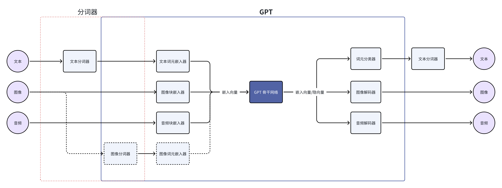
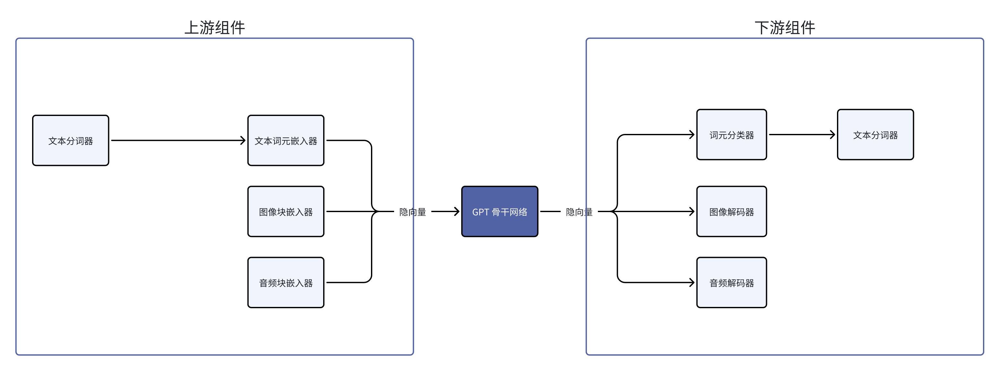
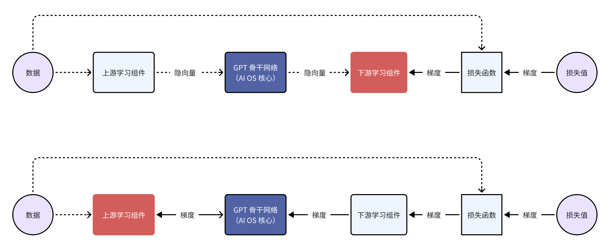
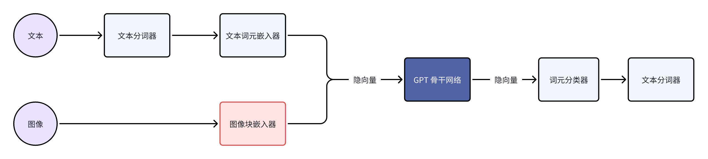

+++
title = "Draft: AI 原生和第一性原理"
description = "太长不看：AI 第一性原理是信息量；遵循 AI 第一性的是 AI 原生；多模态智能是关键"
draft = false

weight = 3

[taxonomies]
tags = ["AI", "增强现实"]

[extra]
feature_image = "kokichi_muta.png"
feature = true
+++

## 略微跑题

如果你被暗黑风的封面图吓到了，我很抱歉。这是我 2023 年看的《咒术回战》里的一个角色——与幸吉。

> 机械丸或者它的操控人——与幸吉

他的身世生平不重要，跟本文相关的是他的诅咒和天赋。他的诅咒是脆弱的身躯，但是“上帝给人关了一扇门，就会给人打开一扇窗”，他的天赋是“机械操纵”和超强的智谋。

当 GPT-4 横空出世并且我在日常中、研究中、工作中跟它打交道越来越多，我对它的印象从模糊变清晰，直到我想起了上面这张图，还有机械丸和与幸吉。如果你恰好对 GPT-4 特别熟悉，并且对《咒术回战》也有所了解，你没准会会心一笑。
但是两部分人的交集毕竟还是少数，所以我在这里稍微跑题了一下。这篇博客的主要内容很多地方会和这个人物有暗合之处。不过，我只是有种冲动，想把他也放进这篇博客里，所以你要是不了解这个人物，也不会影响理解。

> 如果你想再了解一下与幸吉，可以看看 [这里](https://zh.moegirl.org.cn/zh-hans/究极机械丸/与幸吉) 或者 [这里](https://jujutsu-kaisen.fandom.com/wiki/Kokichi_Muta)。

> 如果你恰好也是《咒术回战》的粉丝，那这里还有一个我发现的有意思的思想实验：如果把与幸吉当做 GPT-4，那他的结局和动机会不会是 AGI 的结局和动机呢？
>
> 我不知道答案，没准你有有意思的想法。

## 简写对照

文章里为了简洁，用了一些“常见”的英语缩写。“常见的英语缩写”可能不是对所有人都常见，所以下面是对照表。

| 英文缩写 |               英文全称                |                  中文                  |
|:----:|:---------------------------------:|:------------------------------------:|
|  AI  |      Artificial Intelligence      |                 人工智能                 |
| AGI  |  Artificial General Intelligence  |                通用人工智能                |
| API  | Application Programming Interface |              应用编程界面/接口               |
| ASR  |   Automatic Speech Recognition    |                自动语音识别                |
|  CV  |          Computer Vision          |                计算机视觉                 |
|  DL  |           Deep Learning           |                 深度学习                 |
| GPT  |  General Pretrained Transformer   | 原义是广泛预训练的 Transformer，现在 GPT 已经是整个单词 |
| LLM  |       Large Language Model        |                大语言模型                 |
| NLP  |    Natural Language Processing    |                自然语言处理                |
|  OS  |         Operating System          |                 操作系统                 |
|  SD  |         Stable Diffusion          |               SD 文生图模型               |
| TTS  |          Text to Speech           |                文字转语音                 |

## 问题和似是而非的回答

我常常看到很多人问下面这些问题或者类似的：

* 怎么样才算 AI 原生？
* 模型层和应用层的边界在哪里？
    * 另一个比较直白的翻译是：OpenAI 的边界在哪？

然后我之前想的一个博客选题是：为什么 Rabbit R1 不是 AI 原生的？

当我最近把这些问题和选题放在一起的时候，我突然发现，这些问题和它们延伸出来的问题，其实都在问同一个：

**“ AI 的第一性原理是什么？”**

当我们知道了 AI 的第一性原理，那剩下的问题就好解决了：

* 遵循 AI 第一性原理的应用就是 AI 原生的。AI 第一性原理直接延伸出来的能力就是 AI 的原生能力，也就是模型层的边界。
* 不能从 AI 第一性原理直接推导出来的能力就应该是应用层需要实现的能力，也就是 OpenAI 不会触及的区域。
* 同理，AI 原生的硬件是贴合 AI 第一性原理的硬件。而 Rabbit R1 的设计不贴合AI 第一性原理，是旧思路下的 AI 硬件，它不是 AI 原生的。

> **什么是第一性原理？**
>
> 似乎每个人都知道第一性原理是什么，好像在义务教育阶段就学过。但是好像没人能说清楚第一性原理的定义。 我也不知道（他们在说什么），以下是我自己的理解和定义：
>
> 第一性原理就是，顺着逻辑逆推或者拆解，把复杂的逻辑或者组合追溯到少数的基本部件。这个追溯的过程要不断审视各种东西的必要性，然后把不必要的或者衍生的东西去掉，直到剩下的东西是不可再分的。
> 这些不可再分的基本部件就是第一性原理。或者我们可以用一阶逻辑里的 “公理” 来近似。我们应该在义务教育里教一阶逻辑，而不是研究生课程🐶
>
> 至于怎么样才算“不可再分”或者怎么样才算“公（认的道）理”？That's a question!
>

## AI 第一性原理

那什么是 AI 的第一性原理呢？我认为是“信息量”，这不仅仅指信息的体量，还有信息的质量，还有信息在传递转换中的保真率。

熟悉 NLP 和 CV 等深度学习领域的小伙伴应该已经对“信息量”这个概念比较熟悉了，但是我还是想复述一下前人实践出来的相关经验：

1. 质量相同的情况下，数据的体量越多越好 —— 信息的体量越多越好
    * LLM 已经用上了全互联网的语料来训练。
    * SegmentAnything 用数据暴力，优雅地提高了语义分割（Segmentation）的表现。
2. 数据的体量相同的情况下，数据的质量要尽可能提高 —— 信息的质量越高越好
    * Phi-2 等表现出众的小模型说明语料的质量也很重要。
    * Stable Diffusion 的各种精调模型也是例子。
3. 在数据的表征（Representation）和模型的设计上，要尽可能减少人为的设计（heuristics）—— 信息的流动应该减少人为设计，让模型自己学习，尽可能保留**对模型有用的**信息
    * 已经有无数例子证明了这一点，两个经典例子是 AlexNet 起始的深度 CV 和基于 DL 的 NLP。
    * 新圣经《The Bitter Lessons》其实本质上也是说要尽量减少人为的设计。
    * 在现在这个 DL 时代，这个原则已经太显然了。可能很多没有接触过基于统计学的机器学习，直接从 DL 入门的学生，都会觉得本应如此。

对于不熟悉 DL 的小伙伴，第一第二条经验比较容易理解，跟人一样，读书多了会变聪明，但是读书的时候也要沙里淘金，筛选有价值、有意义的知识。
至于第三条经验，后面我会有比较多的例子来辅助说明。现在可以先打个比方。人的学习、成长历程常常是要自己选的。虽然有老师、父母的影响，但是最终对世界、人生的理解还是靠自己。当然，也有例子是父母、老师的干预和设计过多的。
想象一下有一个人，对于每一个事物、概念的理解都是完全依照 TA 的父母的。可能 TA 会活得好好的，但是我们不会觉得这个人很聪明。过度人为设计的模型就像是这样的一个人。

> **你说了 AI 第一性原理是什么，但是是怎么推导出来的呢？你说了是什么，但是没说为什么。**
>
> 确实！因为 AI 这个领域太广了，理论很多，噪声、狂热也很多，所以很难从很泛的概念或者问题逆推。很泛的概念或者问题类似于 “Sora 遵循了 AI 第一性原理吗？” “AI 第一性原理跟 AGI 有什么关系？”。
>
> 我对 AI 第一性原理的理解是从我遇上的各种实际的例子逆推来的，所以后面我会详细介绍这些例子。在介绍这些例子的时候，我会尝试分析它们底层的问题。
> Hopefully, 当我把这些例子和底层的问题讲完之后，你可以看到他们之间的共性。这些共性，再往前推一步，就靠近 AI 第一性原理了。
>
> 这样，你只需要相信我的例子，不需要盲从我的推理，自己从例子出发，相信你自己的推理，就可以达到同样的结论。

## AI 第一性原理对系统设计的意义 {#ai-fp-for-sys-design}

以上已经简单解释了 AI 第一性原理的概念，但是它对系统设计的意义是什么？这里的“系统”我指的是 AI 模型、包含 AI 模型的更大系统。我会举几个例子，并且说说我自己的思考。这些例子不是按时间顺序排序的。

第一个例子是 Andrej Karpathy 前几天发布的教程《一起构建 GPT 分词器 - Let's build the GPT Tokenizer》。关注 AI 特别是 LLM 的人应该都看了这个教程，吧？如果没有看，强烈建议去看一下！Andrej 是个传奇，他的教程也非常有意思而且易懂。

在教程里，他说到 LLM 有时候会有奇怪的表现，具体是这十一个问题：

* 为什么 LLM 不能拼写单词？
* 为什么 LLM 不能做简单的字符串处理，例如逆转字符串？
* 为什么 LLM 的对除了英语之外的语言的表现更差？
* 为什么 LLM 在简单算术上都做不好？
* 为什么 GPT2 编程 Python 的时候会有很多不必要的麻烦？
* 为什么大模型看见“<|endoftext|>”的时候就突然中断了？
* 这个奇怪的警告“末尾带有空格”是什么？
* 我问 LLM 关于“SolidGoldMagikarp”，为什么它突然绷不住了？
* 为什么用大模型的时候我应该用 YAML 而不是 JSON？
* 为什么 LLM 其实不算是在做端到端语言建模？
* 上述这些痛苦的根源是什么？

这些问题追根溯源，是分词这个步骤（Tokenization）和分词器（Tokenizer）引起的。而分词器是 LLM 的设计里非常重要的一项*人为*设计。分词器把语言里的词分成更小的部分或者整合成更大的部分，这些都叫词元（Token），例如： “word” 可能会分割成 “wo” 和 “rd”两个词元，而“早啊，吃了吗”可能会因为出现频率比较高而被整合成一个词元。这些词元，才是
LLM 书写的基本单位。
中文等语言，分词器做的会更加复杂了。细节不赘述了，可以看 Andrej 的教程。

> **Andrej 不是说分词器是训练出来的吗？为什么说它是人为设计？**
>
> “训练”这个词已经有点滥用了，其实分词器的训练只能算迭代。“迭代”和“训练”的区别在这里就不深究了，简单地说就是：分词器的迭代不涉及到模型参数的更新，而“训练”这个词本应该是指不断更新模型参数这个过程的。
>
> 而且假如说你仔细看了教程的话，在教程一开始，Andrej 就说了分词器的训练是语料预处理的一部分；而且在教程后半部分，他列举了很多“训练”分词器的时候人为引入的规则。这些都说明分词器是人为的设计（heuristics）。

Andrej 举了一个很有意思的例子，是一些奇怪的复合词，比如说“SolidGoldMagikarp”。这个词没有什么明显的含义，但是分词器把它当成了一整个词元，可能是某个 Reddit 用户的用户名。迭代分词器的时候，可能语料里有很多这个用户的发言，所以它被整合成了一个词元。
大模型在处理词元的时候，会把词元转换成词嵌入（embedding），然后在训练的时候不断更新每个词元的词嵌入和大模型自己的参数。

> **词嵌入是什么？**
>
> 语言模型并不能直接处理词元，它们处理的是词元对应的词嵌入。一个词嵌入就是一串数字，比如说“你”这个词元可能对于的词嵌入是 [0.1, 0.2, 0.15, ......]，这串数字的长度是人为设定的，一般来说，词嵌入的长度以千计。
>
> 大模型在训练过程中也会不断更新词嵌入，这些词嵌入相当于是大模型对某个词元的理解，虽然人不能解释这串数字的含义。 每个词元的词嵌入一开始是随机数，只有模型开始学习了之后，词嵌入不断更新，才最终变成了大模型对某个词元的理解。
>
> 整个流程的大意如下图，上半部分是流程示意，下半部分是例子。最后的双箭头指的是：前向，词嵌入输入模型，然后也可以反向更新词嵌入。
>
> 

但是，可能大模型训练用的语料跟迭代分词器用的语料不一样。这样的话，大模型虽然有“SolidGoldMagikarp”的词嵌入，但是它训练的时候从来没有见过这个词，所以这个词的词嵌入从来没有更新过，一直是一开始的随机数。
大模型不能理解这些词嵌入（随机数），在理解的盲区里，所以遇上这些词之后就出现奇怪的行为了。

在这个例子里，我们仔细审视，至少有三个地方是（或者可以）人为设定的：

1. 什么字符串作为一个词元？
    * 例如我们可以人为添加 “<\|endoftext\|>” 这个字符串作为一个词元
2. 分词器的设置、迭代数据和迭代策略
    * Andrej 提到的一个例子是：Sentencepiece 迭代分词器的时候可以设置把罕见词替换成 “\<unk\>” 这个词元，“unk” 是 “unknown” 的缩写，意思是未知字符。
    * 至于迭代数据，假如说我们迭代分词器用的数据就不包含中文，那么注定这个分词器对中文的处理不好。
    * 另外，分词器怎么处理数字，会直接影响到 LLM 的数学能力。
3. 用于 LLM 训练的数据：一些用来跑分的英语大模型，从一开始训练的时候就去掉了非英语的数据，这样虽然可以节省成本，但是注定模型不会理解英语之外的其他语言，即使它本身足够智能。

> **思考题一：大模型训练里的歧视？**
>
> 如果一个产品的说明书只有英文，如果说明书作者说：我们只考虑英语用户，你会不会觉得被歧视了？
> 同样的，当你在 LLM 的训练报告或者论文里看到类似于“我们剔除了数据集/语料中的非英文部分”，你会不会觉得被歧视了？
>
> 还有更微妙的，假如分词器迭代语料里有99%是英文，然后分词器迭代设置是：开启罕见词过滤、常见词覆盖率是 99%，意味着出现少于 1% 的词都会被替换为 “\<unk\>”，你会不会觉得被歧视了？
>
> **思考题二：AGI 到来了吗？**

这个例子能拓展的话题太多了，但是我们先回归正题，也就是这个例子跟 AI 第一性原理有什么关系。 LLM 的例子里，数据的体量和质量的重要性不需要我多说了，我们需要联想的是第三条，也就是
> 信息的流动应该减少人为设计，让模型自己学习，尽可能保留对模型有用的信息

假如说我们能够去掉分词器，每一个字节就是一个词元，那么 Andrej 提到的十一个问题里的大部分就可以迎刃而解了。这些问题之所以存在，还是在于分词这个步骤，以及这个步骤里人工设计的部分（heuristics）。我可以说这甚至影响到了 AGI 的到来。

在这个例子里，系统指的是分词迭代数据、分词器、LLM 训练数据和 LLM 的组合。我们从表象上，也就是 Andrej 提到的十一个问题，追溯到了工程上的根源，也就是分词器。但是思维上追根溯源，本质在哪里？我觉得还是人为的设计。人类觉得对世界的理解是正确而且有效的，而且很多时候我们觉得世界是可以理解的，是有秩序的，所以很多时候会把我们的思维融入到我们的创造里。
但是其实我们都不完全了解我们自己的思维，更别说完全理解世界了。甚至就连围棋，我们对它的理解，可能都没有从零训练、不看棋谱的 AlphaZero 要深刻。而且其实我们的思维很大部分是“混乱” （见《快思慢想》，写得很好）。

虽然算不上无数，但是很多例子已经告诉我们，理解世界的方式有很多。而 Rich Sutton 写的《The Bitter Lesson （苦涩的教训）》也总结了类似的结论，也就是 AI 理解世界的方式不一定要符合人类的设计，我们需要减少人为的设计才可能训练出更强大的 AI。

> **但是等一下，我们能不能设计出完美的分词器来解决这些问题呢？**
>
> 这个问题其实跟 NLP 历史上的一个问题类似，就是“我们能够用规则来建模、理解语言吗”。而语言是我们思维的一种体现，其实问题也可以转换成“我们能够用规则来建模、理解我们的思维吗”。
> 我的答案是“小部分可以，例如数学，但是大部分是不能用规则来框定、理解的”，那翻译过来就是“在一些特定应用上，你可以试着设计完美的分词器，但是通用的完美分词器是不存在的”。
>

 

### \> 信息的流动 —— 以 LLM 语音对话系统为例 {#llm-voice-conversation-system}

另一个例子可能更容易理解，也更贴近应用，但是我觉得却是更加复杂的，就是 LLM 语音对话。
这个也是我实际遇到的问题，就是我们怎么让人可以和 LLM 通过语音对话。对话是双向的，也就意味着人能说话，LLM 也要能说话。
如果你比较熟悉现有的 AI 组件的话，那第一时间想到的可能是：（这还不简单？）用 ASR 把人的话转换成文字，文字发给 LLM，然后用 TTS 把 LLM 的文字转换成声音。

一开始我也是这么想的。首先，我们怎么知道用户想和 LLM 对话？算了，我做的还是概念验证，就先假设用户会按下按钮和 LLM 对话吧，毕竟 ChatGPT 也差不多是这样做的🐶
然后就到了语音识别，ASR 的准确率还行，有的词会听错，那么我应该加热词/常见词就可以解决了（吧？）；
LLM 问题不大，我用 [Dify](https://dify.ai) 来做各种提示词工程，而且只要 ASR 的结果没有错得离谱，LLM 也有一定根据上下文纠错的能力；
然后就是文字转语音，TTS 很多云厂商都提供了，随便调用一个就行，就是把 LLM 的输出发送到服务器嘛。那么整个流程的概念图像是这样

看到这个图，估计有的人从第一个例子的教训里联想，就开始感觉有点不对劲了。但是我当时没觉得有什么问题，这就像是标准答案。我们先忍住不对劲的感受，暂且当它是标答的思路，把它实现出来。下面是我第一版的工程实现的流程图。

遇上的第一个工程问题是延迟。这个实现是最简单的，只是延迟会有十多秒。就算是在 XP 时代，十多秒的延迟也会让用户杀掉进程了。但是很明显，工程实现还可以改进，所以我还可以修修补补，就像 Andrej 教程里的第一版的分词器。

新三年，旧三年，缝缝补补又三年。总之上图是最终的实现，把能流式传输的地方全都做了流式。这样，用户感知到的延迟就是结束说话到第一个音频块播放之间的时间，大概可以做到 2-4 秒。后续我还可以把 LLM 换成微调过的小模型，那么延迟会进一步降低。

工程部分点到即止，这个例子跟 AI 第一性原理有什么关系？我绕一个稍微远一点的路，但是值得。

绕路的地方在于，我们看终版实现里，有很多“块”的概念，“音频块”“文字块”“语音块”。我们回想一下词元（token）是什么，其实它也是“块”，是字符串的一块。LLM 的输入是按词元，也就是一块一块输入的，而它的输出也是一块一块的。
既然都是一块一块的，我们能不能把“音频块”“文字块”“语音块”和“词元”都统一起来，这些统一的块作为输入给 LLM，然后它也可以输出这些块。其实英语文献里，这些都是 "token"，只能说研究者懒得起名了。一个例子是[通义千问 Audio](https://www.modelscope.cn/models/qwen/Qwen-Audio/summary)， DL 从业者可以看看它的实现。
只不过通义千问 Audio 虽然可以接收文字块和音频块，但是只能输出文字块，也就是词元。

> 拓展：GPT-4 Vision 会把图片切块，变成一片一片的图片块，然后对图片块做嵌入（embedding），然后输入到模型骨干里。

但是终版实现和统一块的区别是什么？最核心的区别在于数据的表征（Representation）和模型的设计。我们看终版实现的这个语音对话系统，包含了三个部分以及相应人为设计的地方：

| 组件  |             人为设计（heuristics）              |
|:---:|:-----------------------------------------:|
| ASR | ASR 模型的训练数据、ASR 模型的分词器、ASR 模型的推理设置（如热词）等  |
| LLM |           像上文讨论的，分词器、语料和各种推理设置            |
| TTS | TTS 模型的训练数据、TTS 模型的分词器、TTS 的推理设置（如音色、语速）等 |

在这个系统里，每个组件之间的交互数据的表征是文字。ASR 给 LLM 的是文字，LLM 给 TTS 的是文字。
不讨论别的人为设计，光是分词器，这个系统里就有三个不同的。

> 一个分词器在 ASR 的输出部分，一个在 LLM 的输入和输出部分，还有一个在 TTS 的输入部分。

根据第一个例子，我们不难推出，分词器会造成信息的损失。例如，分词器把“罕见”的词元直接替换成了“\<unk\>”，词元的意思就完全灭失了。
信息的损失不止于此，使用这个系统，用户不能说“你听，这是什么声音？”或者“你能不能学猫叫？”。在这个系统里，这些限制不是因为 LLM 本身智能不够，而是我们人为添加的组件的限制。
LLM 不能辨别声音，是因为我们的 ASR 只训练成只能分辨人说话的内容；LLM 不能模仿动物声音，是因为 TTS 只能发出人的声音。

就算我们训练出来万能的 ASR 和 TTS，可以识别、发出各种声音，因为这个系统里交互数据的表征是文字，也会造成不必要的信息损失。
一个直白的例子就是，我作为一个南方人，从来没有见过雪。虽然物理书上写过雪的结构，文学上描写雪的文章、诗句数不胜数，但是这些都比不上我去到北方，亲眼看到雪，用手捧起一堆雪。有很多事物、概念、感受和微妙之处是文字描述不出来的。

说得有点远了，另一个真实的例子是图像理解。在 GPT-3.5 发布之后，GPT-4 发布之前，很多研究者想让 GPT-3.5 “理解”图片。一种**真实的**做法就是，使用不同的 CV 模型（比如说目标检测、语义分割、实例分割）把图像的信息尽可能完整抽取出来。这些信息包括但不限于：

* 图像中有什么种类的物体，例如“图中有狗和猫”
* 图像中有多少个物体，例如“图中有 1 只猫和 3 只狗”
* 图像中有多少个不一样的实例，比如说“图中有汪汪（狗）和咪咪（猫）”
* 图像中实例的相对位置，比如说“汪汪在咪咪的旁边，右边”
* ······你可以想各种各样的规则来描述一张图

但是 GPT-4 发布之后，人们发现它不仅仅可以做到上面的事，还能做更多，例如：根据射门照片，预测会不会进球；分析图中人物的微表情和情绪等等。GPT-4 能帮用户创造的价值当然也多得多。
而我们这个 LLM 语音对话系统里的（ASR + LLM）部分，跟（CV 模型 + GPT-3.5）的组合是惊人地相似。用 DL 的术语来说，这两种组合都不是端到端的（End to End）。

> 《咒术回战》的粉丝可以想一下，假如与幸吉操纵机械的方式不是通过天赋直接和机器相连，而是通过发消息，会是什么样子 😂
>
> 机械：老大，我听到 11 点方位有声音，很微妙，像是猫的脚步
>
> 与幸吉：好，去看看，如果是猫，摸摸它，要温柔一点；不是的话小心有埋伏！
>
> 机械：老大，是猫！银渐层！看起来像是母猫，毛很有光泽，像是用了飘柔！
>
> 与幸吉：摸摸摸摸，凶不凶？

我们可以想象一下，假如说一个 LLM 就是用文字和音频训练的，能够同时理解文字音频，也能生成文字、音频回复，那么我们的这个语音对话系统在架构上就可以变得非常简洁。

结合 GPT-4 Vision 的视觉能力，我们稍微扩展一下 LLM 的结构，那么就可以得到多模态大模型的结构，如下：

浅绿色的部分是当前所有 LLM 都有的组件；浅蓝色的部分是理解、生成音频能力所需要的组件；浅黄色是 GPT-4 Vision 用来理解图片的组件；而浅红色部分是大模型生成图片需要的组件。
如果你对大模型关注得比较多，这张图应该非常熟悉了。这种架构其实也是学术界、工业界发展多模态大模型的共识，也就是保留 LLM 的骨干，不断添加各个模态的编码器、解码器，让模型去理解、生成各种模态的数据。一个最新的例子是谷歌的 Gemini，里面就包含了音频、视频、图片的编解码器。

> 注意这里的编码器、解码器和传统多媒体处理里的编码器、解码器的实现是完全不同的。这里的编解码器是神经网络，编码器把数据编码成嵌入向量（embedding），解码器则是把向量转换为数据。

所以这个例子的意义是什么呢？我觉得还是留给你们读者来总结。在这里，你们可以停一下，喝口咖啡、洗个澡，或者睡个觉，都可以。*Just let that sink in.*

因为，下面我们要进入一个副本章节，一个令人激动的问题——

### \> OpenAI 的边界在哪里？

这个问题的答案可以很简洁——“AGI 需要的能力，OpenAI 都会做”。但是这个答案没什么指导意义，不过我们可以慢慢拆分，拆成更细的问题，比如说：

* AGI 需要的能力有什么？
* OpenAI 会做到哪种程度？

我们先用一个例子来入门，再用另一个例子来发散思考。

第一个例子是一个问题 “Sora 的下一步是什么？” 我觉得下一步应该是把模型的各个组件、训练的方法和数据整合到 GPT 中。
就像上文说的，目前 GPT-4 能看见、理解图像信息，但是不能创造。创造是人的一种能力，那么 AGI 也要有。至于“Sora 是世界模拟器”或者通过 Sora 构建世界模型，其实是 AGI 愿景的一小部分，是手段不是目的。OpenAI 的愿景只有一个，就是实现 AGI。
愿景归愿景，但是 Sora 的下一步和 AI 第一性原理有什么关系？我们从 Sora 目前能够支持的输入、输出来分析。

它的输入和输出的模态是不对称的，但是这有什么问题呢？信息流通的问题，具体来说是沟通的问题。现在的 Sora 很厉害没错，但是我觉得还没到一部分人说的**颠覆**影视行业的地步。我自己就在影视行业里做 AIGC，根据我的采访和观察，行业里的创作者的很大一部分精力花费在沟通和协作上。
例如，导演不仅仅要给出文字分镜，要给出画面分镜，甚至有的时候要自己做一段视频来示意，为的是摄影团队能够准确理解导演的想法并且准确执行。执行的时候出现了偏差，团队需要不断沟通来解决问题。但是目前 Sora 做不了沟通，创作者只能希望提供的信息能够被 Sora 准确理解，然后生成图片或者视频。
想象你是导演，你要用 Sora 拍片。Sora 生成的第一版视频里的场景和人物就足够惊艳了，但是你觉得相机的轨迹或者机位需要调整，这个时候你要怎么和 Sora 沟通？做不到。

或许你也听过类似于“精准控制”这样的要求，但是往深一步想，这是沟通的问题，就是用户能不能和 AI 不断沟通来解决问题。而我们再往 AI 第一性原理的方向再想一步，沟通的问题是信息流通的问题。
要彻底解决沟通问题、信息流通的问题，Sora 就不能只是渐进式地改进（比如加入 ControlNet，添加 LoRA 支持等），而是把 Sora 放进一个更加通用的系统，也就是 GPT 里。

想象一下，当 GPT 可以像一个画家、摄影师、导演一样和你沟通。沟通的时候它可以最完整地理解你给它的文字、音乐、视频、图片，并且在沟通中不断修改它的创造物（图片、视频、声音等）。这个时候，影视行业才会被颠覆、革命。

> Film and television industry is nothing without its people *and* communication!

OpenAI 会让 GPT 有多模态创造的能力，但是就像是 Sony 作为摄像机制造商不会关心用户拍什么类型的电影，OpenAI 不会关心用户和 GPT 创造的内容（除非是为了训练），这也是 Sam Altman 在 YC-2024届上讲 “以存在一个 AGI 为前提来创业” 的含义。

当我们以 AI 第一性原理和 “以存在一个 AGI 为前提来创业” 为原则审视目前的 AI 独角兽的时候，有一个我觉得有必要来讨论一下。这就是第二个例子 —— [Elevenlabs](https://elevenlabs.io)

Elevenlabs 的技术 （他们称之为 *Generative Voice AI*）就主要集中在语音，例如说 TTS 和语音转语音（Speech to Speech）。TTS 不用再赘述了，而语音转语音的功能包括：

* 保留音色，转换内容的语言。例如让 Taylor Swift 讲中文。
* 保留内容，转换音色。例如转性。

我用过 Elevenlabs 的 TTS，生成音频的质量确实很好，比别的竞品都好很多，但是我觉得它会不幸地变成下一个 OpenAI 降维打击的牺牲者。
无论以 AI 第一性原理还是 “AGI 需要的能力，OpenAI 都会做” 这个原则，GPT 都最终会获得理解、创造音频的能力。而 TTS 和语音转语音的功能仅仅是理解、创造音频的能力的一部分而已。
到那时，我们甚至可以让 GPT 解读我们的狗狗在说什么，然后想象一个合适的音色，让我们的狗狗以各种语言跟我们打招呼。到那时，Elevenlabs 的护城河在哪里呢？

通过这两个例子和基于 AI 第一性原理的分析，我觉得很多人会对“OpenAI 的边界在哪里”这个问题有更多实感。

> **传统的 TTS 和 ASR 就一定会灰飞烟灭吗？**
>
> 在一开始写完这个章节的时候，我很自信，觉得答案是肯定的。但是在仔细审视了上面的 [LLM 语音对话的例子](#llm-voice-conversation-system)之后，我觉得传统的 TTS 和 ASR 厂商想要继续活下去，就要做到极致地细分场景。
> 其实历史上也有例子，就是传统的 CV。理论上说，只要 GPT-4-Vision 足够智能，传统的 CV 的用例（例如目标检测、人脸识别等）都会被降维打击，但是现在还没到颠覆的时候，就是因为传统的 CV 做了足够多的细分场景优化。
>
> 而传统的 TTS 和 ASR 的细分场景优化在哪？我跟我的一位同事也是朋友交流之后得到的结论是：它们最终都会走向极致的本地化和定制化。但是，后果就是，赚钱难赚了，最终都是辛苦钱。
>
> 举个例子，假设 GPT-5 能理解、生成各种声音，理论上 TTS 和 ASR 就完全没有意义了。但是落地时可能的问题是，GPT-5 能够识别山东烟台方言吗？GPT-5 能够说烟台方言吗？很可能不行，但是在实际落地实用的时候要面对的问题就可能是细化到这种程度。
> 即使 GPT-5 足够聪明，能够通过上下文学习（In-context Learning）的方式来快速学习，但是它的推理速度足够快吗？这个也是关键问题。
>
> 只有极致细分的优化才能解决上面这些落地问题。

> 给《咒术回战》的粉丝：与幸吉操纵机械丸的时候，会用 TTS 说话吗 😂

## AI 第一性原理对产品设计的意义

上述的例子都是 AI 第一性原理的体现。为了尽可能保留信息的体量、质量和流通效率，我们要尽可能把各种能力嵌入到模型里，而不是把各种能力分散到各个组件里。
这样的设计是为了尽可能减少人为设计，让模型自己从数据中学习，尽可能保留对模型有用的信息。但是我们怎么知道要把哪些能力嵌入到模型里呢？也就是说，我们希望模型实现什么功能？满足什么需求？这就是产品设计的问题了。

就算不管上面的问题，AI 模型的开发、训练过程就非常像开发一个产品：

1. 首先要定义解决的问题是什么？更具体地，这个问题能不能量化？有没有额外的指标要满足？
2. 然后调研现有的模型，看有没有合适的。如果没有，需要重新设计；如果有，则看有什么地方可以改进。
3. 定义好场景和用例。更具体地是定义好数据集和评价标准。
4. 训练模型，不断迭代、评估，直到能够交付。
5. 交付之后还要测试真实场景里的表现，看是不是真正地解决了问题，或者性能有没有偏差。

当我们用产品思维去看 AI 模型开发的时候，我们反而可以对 AI 技术有更加深刻的理解。
就像开发产品，我们需要找准定位和需求，开发 AI 模型也要清晰定义问题；就像开发产品会面对不确定性，AI 模型的开发也是充满不确定性的；就像开发产品最终需要用户验证，AI 模型的表现也需要不断面向用户验证。

### \> Hello! How can I assist you today? ™ {#chatgpt-product-example}

当我们在产品设计上决定好模型的能力范围，并且把这些能力在工程上直接嵌入到模型里，训练、迭代直至变成模型的一部分，那其实模型也就变成了产品。
OpenAI 2023 DevDay 的分享就让我很有启发，让我看到了 LLM 背后大量的产品研究。分享的题目是 [Research × Product](https://youtu.be/YXiRbRacTF0?si=AMPRRhnSVhTnn_1l)。

我在这里只摘取一个例子。这个例子是一个简单又复杂的问题——“当用户说’你好’的时候，LLM 要怎么回复？” 相信你可以想出一百种回复，但是这些回复有什么不同呢？哪一些会更好？怎么样才算“更好”？如果你经常使用 ChatGPT，那估计第一个在你脑子里冒出来的回答会类似于

> 你好，今天我可以怎么帮你？
>
> Hello! How can I assist you today?

这个回答看起来平平无奇，但是仔细想想，这一句话准确定义了 GPT 的角色，也就是 "assistant"。如果换成别的，例如说“你好！今天过得怎么样？”，那 GPT 的角色就从助手变成类似于朋友了。
实际上，这种影响远比很多人想象得深刻。当我通过提示词，想让 GPT 变得更加像朋友的时候，我不得不在提示词里写了三遍类似的意思：“你不是用户的助手，而是朋友”“你不要说类似于‘我怎么帮你’这样的话”“你和用户是平等的，不是从属的关系，你不需要帮助 TA，TA 也不需要你的帮助”。
ChatGPT 的助手定位对 LLM 的影响已经渗透到了它的回答、思考的方方面面。我甚至觉得 OpenAI 都可以把 "How can I assist you today" 作为 ChatGPT 的产品 Slogan 并且注册商标了。

我们在别的地方也看到模型即产品这种模式涌现出来。一个非常突出的例子是各种定制化 Stable Diffusion (SD) 模型和 SD 的 LoRA 模型。很多人在 [CivitAI](http://civitai.com) 或者 [Liblib](https://liblib.art) 上发布他们训练的模型。有的是免费分享，有的是要付费授权的。
用户作为 SD 模型的产品经理，定义的问题是他们的模型可以生成什么样的美学风格的图片，或者有哪些图像处理的能力。

模型可以变成产品，产品需求也可以推动模型开发，这就变成了产品驱动的 AI 模型开发。
一个例子是 ControlNet。因为原本的 SD 只能靠文字指引图片生成，但是实际的需求需要更多，比如根据草图来生成完善后的图片。这个时候就不得不倒逼模型的开发了。
而另一个非常好的例子是妙鸭相机。这个非常有名，并且有非常多分析的文章，就不赘述了。

当模型的能力可以解决特定问题的时候，模型就变成了产品。；反过来，如果现有的模型能力不足以解决某个问题，那也可以从需求出发，开发新的模型，把能力嵌入到模型里。
假如这个问题足够有价值或者足够广泛，根据 AI 第一性原理，不使用现有的 AI 组件拼凑、整合，把能力嵌入模型能够实现的能力上限会更高，并且创造更多价值。

虽然我不是硬件工程师，但我非常喜欢苹果招聘硬件工程师的 Slogan —— “别人眼中的终点，正是我们最喜欢的起点”。这句话深深呼应了 Alan Kay 的名言 —— “对软件较真的人，应该做自己的硬件”。而我觉得在今天这个 AI 时代，这两句话可以有新的进化

> 对用户体验较真的开发者，应该做自己的 AI 模型。

做 AI 模型不是为了做而做，不是跟风，而是在 AI 第一性原理的背景下，根本性提升用户体验的必经之路。
就像上面的 [LLM 语音对话例子](#llm-voice-conversation-system)，我优化代码到最后，发现如果还要进一步提升用户体验，模型本身的改进是绕不过的。这种改变的代价肯定会是另一个量级，但是我们也可以发现另一个量级的新机会。

上面这句话的“开发者”不仅仅是软件开发者，我觉得还应该包括消费电子的硬件开发者和设计师。但是 AI 第一性原理对硬件产品设计的意义是什么？我不是硬件工程师或者设计师，这里我举一个例子，谈谈我自己的看法。

[Rabbit R1](https://www.rabbit.tech/rabbit-r1) 最近在科技圈里非常火热，争议也很多。一开始，单单看表面上的交互，我的印象是偏负面的。但是看完他们 [Research](https://www.rabbit.tech/research) 的介绍之后，我觉得他们很有可能走在一条新的道路上。这条道路，和 AI
第一性原理在大方向上是一致的。因为技术上的细节他们透露得不多也比较模糊，所以我只能做一些猜测，基于这些假设（斜体）来给出我的看法。这也就意味着我的看法只有在假设正确的前提下才有意义（叠甲）。

Rabbit R1 的主要交互方式是说话，对着它说话，然后 AI 会分析用户的意图，替用户做出各种动作。这也是 Rabbit 团队把他们的模型称之为动作模型（Large Action Model - **LAM**）的原因。

假如说*在 LAM 系统里，语音模块还是使用 ASR 和 TTS 实现的*，那么类比我们在 [LLM 语音对话例子](#llm-voice-conversation-system)里的分析，不难得出一个结论：这个系统的上限不会太高。它最多是一台更好更智能的锤子
TNT。而锤子 TNT 在 ASR 遇上的问题，Rabbit R1 同样也有，例如说噪音下识别困难的问题。

> 锤子 TNT 在 AI 应用的意义上，领先了业界 5 年，可谓生不逢时

它只能听懂人的语音，理解不了别的声音，也就意味着在输入信息量方面，Rabbit R1 和 ChatGPT 手机 App 是一样的。当 ChatGPT 手机 App 的模型换成了能够理解声音的新一代 GPT，在各种基于声音的新用例涌现，Rabbit R1 在理解声音方面就变成了功能机，没人会在意 Rabbit R1 是否比手机更加轻巧便捷。

而在输出信息量方面，Rabbit R1 有语音输出或者可以在小屏幕上显示。在输入和输出信息量这方面，我只能说不如手机。需要输入的时候，同样是举起一个设备，举起手机可以拍照、打字、说话，但是举起 Rabbit R1 只能拍照或者说话；查看输出的时候，手机和 R1 同样可以听语音输出，但是手机还能更好地显示文字和图像。
所以，一些人对 Rabbit R1 硬件的批判是有道理的。在硬件上，我始终觉得智能眼镜会是 AI 最好的载体。在智能眼镜上，AI 能看到你看到的，听到你听到的，AI 能让你看见，AI 也能让你听见，而且这些都不用你举起一个设备。

Rabbit 的产品就一无是处了吗？我觉得也不是，至少 Rabbit 团队的想法走在了前面。在 [Rabbit Research](https://www.rabbit.tech/research) 页面的介绍里，他们确实在训练、微调着自己的模型，把越来越多的能力融合进 LAM 本身，在模型的层面尝试解决应用的问题。这个方向是和 AI 第一性原理相符合的。
当 LAM 具备越来越多的能力，没准 Rabbit R2 就会是一副 AI 附身的智能眼镜呢？那会是革命性的！

### \> AI OS {#ai-os}

> ⚠️ 本章节需要一些前置知识，包括：对分词器、嵌入（Embedding）的基本了解和对反向传播（Back Propagation）的扎实理解。
>
> 如果你没有这些知识，可以跳过本章节。
>
> 或者，以下是入门步骤：
> 1. 学习反向传播和 DL 模型的训练，强烈推荐看吴恩达的《深度学习 - Deep Learning》课程。里面也涉及嵌入（Embedding）的基本知识。
> 2. 进一步学习嵌入（Embedding），可以看 Andrej Karpathy 的《从头用代码构建 GPT - Let's Build GPT from Scratch in Code. Spelled Out》教程。教程的一部分介绍了 GPT 是怎么使用词嵌入（Word Embedding）的。
> 3. 对于分词（Tokenization）和分词器（Tokenizer），最易懂的还是 Andrej Karpathy 的教程《一起构建 GPT 分词器 - Let's build the GPT Tokenizer》。

在这个 LLM 时代，AI 越来越像人了。就像前面说的，AI 的开发过程越来越像人，同时 AI 的智商也越来越像人。开发 AI，很多时候非常像开发一个产品，技术与产品的区分会越来越模糊。甚至 AI 开发会越来越像教育一个人。

很多人都觉得 LLM 会占据未来计算的核心部分，围绕着 LLM 会开发非常多的组件。这样，LLM 就变成了一个 OS 的核心，然后各种组件会形成这个 AI OS 的生态。假如我们把 AI OS 当成一个团队，那么 LLM 就是团队里的中流砥柱；假如我们把 AI OS 类别为神经系统，那么 LLM 是大脑。
我想请你们记住这两个比方，这两个比方就可以解释很多“为什么”。

AI OS 毋庸置疑是一个平台，所以我们先不管技术，看看这个平台里的角色。这个平台里至少会有三个不同的角色：

* OS：AI OS 本身，提供智能能力和 API
* 开发者/应用：调用 AI OS 的 API 的用户，也就是开发者，以及他们开发的应用
* 终端用户：使用 AI OS 的用户，但是不开发应用

在一个 OS 里，这三种角色是可以相互交互的，比如：终端用户可以直接使用 OS 提供的能力，也可以使用开发者开发的应用；开发者提供的应用需要调用 OS 的能力，同时也面向终端用户服务。

举个例子，Rabbit 也开发了一个 [Rabbit OS](https://www.rabbit.tech/rabbit-os)。在 Rabbit OS 里，终端用户可以使用 OS 的能力，也可以使用教师模式（Teach Mode）来给 OS 添加更多能力，所以交互是双向的。
而目前 Rabbit OS 能够调用现有应用的能力，但是现有的应用没有也不能调用 Rabbit OS 的能力。所以基于我们的分析，Rabbit OS 还不能算是 OS。

以上是从平台角色来分析，但是从技术上来说 AI OS 的 API 是什么样的呢？回顾历史，目前的 API 主要是两种形式：文本和二进制格式。举例子，你在写代码调用一个库的时候，API 的形式是二进制的；你用 JSON 文件收发消息的时候，API 是基于文本的；我们给别人写文档、发消息的时候，你也可以把人与人之间的 API 看做是文本形式的。

而我们现在拓展 LLM 的能力也是基于文本的，这看起来非常直观、自然。比如说：

* 我们可以定义一个函数，LLM 可以通过函数调用（Function Calling）的形式，以 JSON 文本来调用我们的函数
* 当然，我们以自然语言命令 LLM 做一项任务的时候，你也可以看作我们用文本的形式调用了 LLM 的智力
* 在智能体的语境下，LLM 之间也可以通过文本来相互合作（相互调用对方的智力）

如果你还记得 AI 第一性原理（我希望你还记得）和 LLM 语音对话的例子，我觉得你应该会开始觉得有点不对劲了。

但是如果你忘了，我再举例子。 上面两个比方中的一个是把 LLM 比作团队里的核心领导者，那么换成是你，你在与别人合作的时候是否遇上沟通问题或者误会？
有的时候觉得词不达意？或者有的时候觉得语言被曲解？有的时候会不会想“假如说 TA 能够直接明白我的意思就好了”？
另一个比方把 LLM 比作大脑，但是请你想一下，我们的大脑在和身体的其他组件沟通的时候，会使用文字吗？例如，大脑给手指发消息“按下那个按钮” 🐶

正如文本不是我们大脑的信号一样，LLM 的 API 也不是基于文本或者二进制数字的。当我们把 LLM 语言交互的例子放在 AI OS 的语境下再审视，LLM 是 AI OS 的核心，而 ASR 和 TTS 是 AI OS 的周边组件。但是在这个应用里，信息的瓶颈是文字。

基于文字的 AI OS API 就是我们开发者强加在 AI OS 最具局限性的人为设计（heuristics），而要把 AI OS 的能力释放出来，就必须去掉这个局限，让 LLM 能够以它自己能够理解的，也是保留最多信息的方式和周边组件来交互。

这种方式是什么呢？或者换句话来说，API 还有**第三种形式**吗？

非常熟悉 DL 的同学应该已经想到了。没错，就是嵌入向量（Embeddings）。
> 准确地来说应该是隐向量（Latent Vectors / Latents）。这里”隐“的意思就是“人类不能理解”的意思。

但是先别急，让我们进一步拆解 GPT 这一种 LLM。作为 LLM 系统，它通常包括分词器、嵌入器、骨干网络、分类器/解码器这四种组件。
而作为 DL 模型，GPT **只**包含嵌入器/编码器、骨干网络和分类器/解码器这三个部分。

> GPT 处理图像可以通过图像编码器/嵌入器，也可以使用特殊的图像分词器。
>
> 这种架构也是目前学界和工业界在开发多模态模型的主流，两个做得非常极致的例子是 [Google Gemini](https://deepmind.google/technologies/gemini/) 和 [AnyGPT](https://arxiv.org/abs/2402.12226)

GPT 骨干网络包含了所有参数量的 90% 以上，可以说是 LLM 智商、情商主要来源。而我们仔细看，GPT 骨干网络的输入和输出都是嵌入向量/隐向量，所以隐向量才是 GPT 自己的语言，是它作为大脑中枢接受和发出的信号。

隐向量就是 AI OS 里的第三种形式的 API，我把它叫做 ALI（Application Latent Interface）。文字 API 主要是面向人，是为了让人能够明白软件交互的信息；二进制 API 主要面向传统程序，是为了方便程序解析消息；而隐向量 API，也就是 ALI，是面向 LLM 的，确保信息**高效完整地**传达给 AI。

但是这还不够，AI OS 一共需要三种新 API：

1. 隐向量 API，也就是 ALI
2. 梯度 API
3. 分词器 API

这三种 API 从技术上并不是新东西，研究者早就在使用隐向量、梯度和分词器了。但是，研究者没有在 API 的层级来思考问题，更多地还是关注在模型训练，作为训练不同模型的技巧。而就像上文所说的，模型即产品，延伸出来的是，LLM 的 API 也是值得从产品、用户、生态的角度来思考与设计。
接下来我会举几个例子，进一步说明这三种新 API 的关键问题，也就是“是什么”、“为什么”和“怎么做”。先让我们以另一种视角重新拆解 GPT：

我们把 GPT 看作是一条管线，以骨干网络为分界线。给骨干网络提供信息的是上游组件，而从骨干网络获得信息的组件在下游。不管在上游还是下游，这些组件可以是学习模型（Learning-based Model），例如一个神经网络，也可以是非学习的程序，例如分词器。

> 复习：分词器为什么不是一个学习模型？见 [AI 第一性原理对系统设计的意义](#ai-fp-for-sys-design) 章节的第一个例子

隐向量 API 让我们可以绕过分词器，直接把隐向量传递给 LLM 骨干，而且 LLM 骨干也可以直接把隐向量传递给下游组件。这种 API 确保了信息在这个管线里流动的时候是高效而且完整的，因为这是用 LLM 自己的语言书写的 API。这是“为什么需要隐向量 API”的最简洁有力的答案。

隐向量在下游组件的应用的例子我们其实已经见到了三个：

* 词元分类器：把隐向量翻译成对应哪一个词元。
    * 准确地来说，是翻译成各个词元对应的概率。例如：续写“阿珍爱上了”这半句话，预测下一个字，“阿”的可能性是 0.7，而“强”的可能性是0.2，“珍”的可能性是0.05，诸如此类
* 图像解码器：把隐向量翻译成图片或者图片块
* 音频解码器：把隐向量翻译成音频或者音频端

下游组件的例子还有很多，基本上你可以设计各种各样的学习模型，把隐向量的信息转换成另一种形式。一个最近的例子是 [Stable Diffusion 3](https://stability.ai/news/stable-diffusion-3-research-paper)。SD3 使用了 T5 模型作为文字编码器，生成图的扩散模块使用了 T5 输出的隐向量。
而 T5 模型是一个语言模型，有47亿参数，占了 SD3 超过一半的参数量。所以我们也可以把 SD3 的扩散模块看作是 T5 的下游组件，而这个组件可以根据 T5 的隐向量生成精美的图片。

当我们把 GPT 的组件局限于可学习组件（Learnable Components）时，我们可以开始讨论梯度 API 的意义了。梯度 API 主要为了训练新的**上游学习组件**的。注意这里的重点有两个，一个是“上游”，另一个是“学习组件”。

上图是训练模型的前向过程（Forward Pass），下图是训练模型的反向传播过程（Backward Pass）。

如果我们想要训练新的下游学习组件，反向传播的时候梯度传递和参数更新的过程会在下游学习组件这里终止，所以不需要 GPT 骨干网络也就是 AI OS 的核心提供梯度 API；
但是当我们想要训练一个新的上游学习组件的时候，梯度的传递必须要经过 AI OS 核心，所以需要 AI OS 提供传递梯度的 API。

当 GPT 骨干的规模尚且在能应付的范围内，我们可以在自己的服务器上跑 DL 训练框架，执行反向传播来训练上游组件。这个时候，梯度的传递还没有提升到 API 这个层级。
一个例子就是 [MiniGPT-4](https://github.com/Vision-CAIR/MiniGPT-4)。我的学长用 KAUST 的 GPU 服务器训练了图像嵌入器（准确地来说是嵌入器的映射层）。
对于当时的 GPT (LLaMA 1 / Alpaca)，这个图像嵌入器就是一个新添加的上游组件。而这个上游组件的作用是让 GPT 看见图像。

当 GPT 骨干的规模超过了大部分人、组织（包括 KAUST）能够应付的范围的时候，我们就需要 LLM 提供商来帮我们完成梯度的计算了，也就是下面这一个部分。

事实上，我们可以把这个计算梯度的网络看成另一个模型。它的参数量和原本的 GPT 一样，但是里面的计算完全不同。它接受的输入是（隐向量的）梯度，输出也是梯度。

有了隐向量 API 和梯度 API，我们作为 AI OS 的开发者，可以在 AI OS 核心的上游开发/训练组件、拓展能力，也可以在AI OS 核心的下游开发/训练组件、拓展能力。

> 隐向量 API 加上梯度 API 可以做很多有意思的拓展。其中一个是 [浓缩词元（Gist Token）](https://arxiv.org/abs/2304.08467)。
>
> 以纯文本为例子，提示词会被分词器分割成词元，词元会被一个查找表转换成对应的隐向量。所以 LLM 骨干看到的是提示词对应的隐向量序列。假如说提示词太长，就会占用宝贵的上下文窗口。
> 但是通过训练浓缩词元，我们就可以把一长串提示词对应的隐向量序列的含义压缩到几个隐向量中。“浓缩词元（Gist Token）”这个名字不是很贴切，应该叫“浓缩隐向量（Gist Latents）”。
>
> 
>
> 上面是浓缩词元的训练示意图。前向传播的时候，提示词词元的隐向量成一个序列，这个序列之后可以插入 *N* 个浓缩词元隐向量。结合注意力遮蔽（Attention Masking），GPT 预测回答的时候只能看到浓缩词元隐向量，而看不到提示词。
> 训练的目标是GPT 预测的回答要尽可能接近没有遮蔽提示词的时候的回答。这样我们就可以说浓缩词元隐向量包含的信息跟提示词的信息基本一致了。
>
> 反向传播的时候，因为注意力遮蔽，梯度不会传播到提示词的隐向量上，而是会传播到浓缩词元隐向量上，用来优化浓缩词元隐向量。
>
> 这个训练过程中的关键是隐向量和隐向量的梯度，而分词器和词嵌入所做的仅仅只是把提示词映射成为隐向量序列而已。
>
> 如果我们用管线的视角看，浓缩词元隐向量是在 GPT 骨干网络的上游，是给 AI OS 核心提供信息的可学习组件。这个例子里，有了隐向量 API 和梯度 API，我们作为 AI OS 核心的使用者，就可以把复杂的指令浓缩，提高运行效率的同时也降低了推理成本。

当然，别忘了，我们还可以用文字 API 做能力的上下游拓展。

TODOs:

* 分词器 API
* AI 原生硬件的想象

## 总结和亮点

TODO

## 后记

TODO

## 元数据

版本：0.0.7

日期：2024-02-19

版权协议：[CC BY-SA 4.0](https://creativecommons.org/licenses/by-sa/4.0/)

### 更新日志

2024.02.25：写完了 AI 第一性原理的基本概念和两个例子

2024.02.26：写完了 “OpenAI 的边界在哪里” 章节

2024.03.03：写完了 Rabbit R1 的例子

2024.03.05：写了 AI OS 的开头

2024.03.06：写了 AI OS 里的隐向量 API 和梯度 API；添加章节链接；微调 h4 行间距