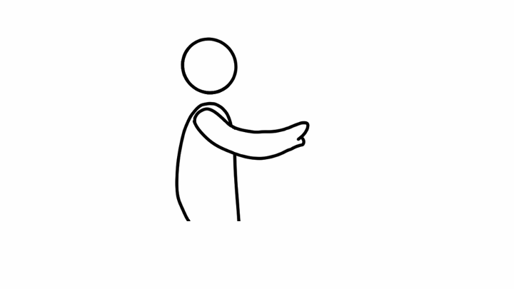
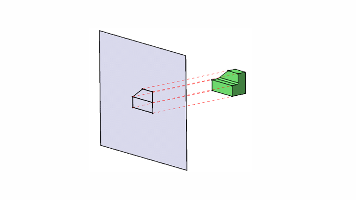

+++
title = "What else to play with in AR CHI? - My Patent"
description = "TL;DR: Regional interaction mappings based on distance"
draft = false

weight = 2

[taxonomies]
tags = ["CHI", "AR", "Patent"]

[extra]
feature_image = "ar_zones1.png"
feature = true
+++

## Previously on Reify.ing

In [a previous blog post](@/blog/AVP-Next-CHI/index.md), I discussed the similarities in human-computer interaction between Vision Pro and the HoloLens series, and pointed out the lingering issues as well as the direction Apple is taking to address them.

As before, the next stop for Vision Pro CHI is on our thumbs. Hand-based interactions will continue to be one of the essential cores of AR human-computer interaction.

## My Patent

In this blog post, I will introduce a patent I have on AR computer-human interaction. I filed this patent in August 2021, and after two and a half years of review, it was finally approved just before this year's Lunar New Year.
Coincidentally, the [Apple patent](https://zhuanlan.zhihu.com/p/363122901?utm_id=0) mentioned in the last post was published in March 2021, roughly the same period.
As far as I remember, I didn't see Apple's patent when writing mine, but even if I had, I wouldn't have had the mindset able to connect Apple's patent with my ideas at that time. In hindsight, if I had seen Apple's patent back then, mine would probably have been even more "interesting".

OK, enough detour, let's bo back to the patent. My patent number is `ZL202110972624.X`, and virtually all the information can be found on the website of China National Intellectual Property Administration. However, the information you find there is mixed with various patent terminologies and all
sorts of "pointers" (e.g., "in embodiment three"), making for a very poor reading experience, no wonder the examiners took so long.
So here, I have basically translated the content of my patent disclosure and added some of my own understanding and thoughts. If there are any programmers who want a more straightforward description, you can fastforward to the [pseudocode](#pseudocode) section.

> What is a patent disclosure?
>
> Patent applications have strict format requirements and specific terminologies, so ordinary people don't write patent applications themselves but instead seek professional patent agencies for assistance. What you need to do is write a patent disclosure in a very free format, essentially
> describing what your patent is (principle, features, advantages, etc.).
> First, let the patent agent understand your patent, and then they will help you translate it into the format of a patent application.

### Starting Point and Purpose {#purpose}

The starting point for this idea is very simple: when using HoloLens 1 and HoloLens 2, I often had to stretch out my arm, whether to drag objects or click on UI. This kind of interaction is fine once or twice, but with daily use, it can be super tiring. So, is there a way to make
interaction more comfortable and allow users to use it for longer?

One observation is that you won't get tired as long as you don't simultaneously stretch out and lift your arms.

The posture in the above picture is probably the limit of what we can maintain comfortably. This posture is often the one we adopt when we want to reach for something, with a slight bend in the elbow. However, if you stretch out your elbow to reach for something, whether standing or sitting, you
will feel uncomfortable in a minute.

But on HoloLens 1 and HoloLens 2, we often have to stretch out our arms, which is very uncomfortable.

So, what is a comfortable posture? My observation is that when standing, as long as the upper arm is basically parallel to the body, the forearm can rotate freely without fatigue. Many people maintain this posture when giving speeches, which is neither tiring nor restricts free hand gestures or
*operating a laser pointer*, etc.
Similarly, when sitting, the principle is the same. Or, as long as the elbow is supported, the forearm can rotate freely. The illustration is the below:

If you notice that "operating a laser pointer" is italicized and remember that one of the interaction methods for HoloLens 2 is a virtual ray, then you can guess a quarter of the content of my patent.

### How

So, our ultimate goal is: to keep users interacting with AR in a comfortable posture as much as possible. But how?

At this point, we need to think in reverse: when will users adopt an uncomfortable posture (i.e., stretching out their arms)?

When an object is within reach, you don't need to stretch out your arm to grab it; when an object is a little further away, you might stretch out your arm slightly; when the distance to the object is >= the length of your arm, you will stretch out your arm to reach it.

Without mind twists, we need to discuss these three scenarios:

1. The object is within reach (comfort zone): "Within reach" is defined as within the range where the forearm can rotate freely.
2. The object is a bit further away (near field): where you need to stretch out your arm slightly to reach.
3. The object is far away (far field): where you need to stretch out your arm to reach.

In the comfort zone, we don't need to complicate anything; we just need hand tracking to allow users to freely interact with virtual objects.

In the near field, we want to maintain the intuition of hand tracking as much as possible, but try to avoid users reaching out. What we thought of is a virtual hand, as shown below:

> The inspiration for the virtual hand comes from a famous experiment in cognitive psychology - [the rubber hand illusion experiment](https://en.wikipedia.org/wiki/Body_transfer_illusion#Rubber_hand_illusion)
>
> Students participating in the experiment (subjects) place their hand on a table, next to another rubber hand. When the rubber hand is pricked, the subjects actually feel pain.
>
> The inspiration for me is that humans are very good at projecting virtual things onto real things, and we can use this projection.
>

When we use hand tracking to synchronize the virtual hand with the user's hand, we further strengthen the rubber hand illusion, allowing users to take in the mapping from hand movement to virtual hand movement with almost no learning cost.

Even the appearance of the virtual hand doesn't need to look like the user's hand, because we humans are very good at anthropomorphizing various objects. The appearance of the virtual hand just needs to conform to human cognitive habits, such as: the virtual hand can be a cat's paw, but users can
still use it to manipulate objects.

> Just a circle + two protrusions, and we can recognize this as a hand.

> The virtual hand can be a cat's paw (or a mangosteen?).

If the virtual hand is no longer shaped like a hand, then this name is not quite appropriate, so we call it a "3D cursor".

In the far field, we need a bit more complication. Recalling the first blog post, we can use a virtual ray to operate distant objects. Of course, eye tracking with gesture recognition can also be used.
When writing the patent, we didn't have eye tracking as precise as Vision Pro, so our patent still uses virtual rays as an example.

This is basically the main content of the patent (75%). Within this three-quarters, there are actually many details left out, such as:

* The algorithm for the movement speed of the far-field virtual ray
* The appearance and movement algorithms and settings of the near-field virtual hand
* How the virtual hand, virtual ray, and hand tracking 3D model can interact with virtual objects
* ······

### How to Evaluate?

Those familiar with writing papers should be no strangers: when proposing a new method, we should also have a reasonable evaluation. So, the remaining quarter of the patent is how we measure the effectiveness, or more accurately, how we assess the level of fatigue that users
experience during interaction.

In [**Starting Point and Purpose**](#purpose), we mentioned that movement of the upper arm causes fatigue, so naturally, we want to measure the movement of the upper arm and use this as a metric. But how to measure the movement of the upper arm is a problem.

We thought that the direct consequence of upper arm movement is the movement of the elbow, so we can measure the movement of the elbow instead. So now, the measured metric becomes the distance the elbow moves in three-dimensional space per unit of time. As long as this quantitative metric is low,
we can consider the user's interaction to be comfortable.
Of course, this metric is a relative value; another quantitative metric in absolute value is the coordinates of the elbow. As long as these coordinates do not deviate from the user's comfort zone, we can consider the user's interaction to be comfortable.

## Pseudocode {#pseudocode}

> The pseudocode is basically consistent with the description above, but some parts are complementary and can be cross-referenced.

Assuming there are N virtual objects O_1 to O_N, scattered in the comfort zone, near field, and far field.

Initialization:

* Create a list L, storing objects the user may interact with
* Create a variable O, to store the object the user will interact with

1. Obtain the user's current posture (such as standing, sitting, etc.)
2. Track the user's hands and reconstruct the 3D model of the user's hands, identifying hand gestures
3. Combine posture and hand position to determine if the user's hands are within the comfort zone
4. For each object O_i
    * If the hand is in the comfort zone and O_i is also within the comfort zone, add O_i to L
    * If the hand is not in the comfort zone but O_i is, skip this object
    * If the hand is in the comfort zone but O_i is not, emit a virtual ray (\*0)
        * If the virtual ray hits O_i or within a certain range (\*1) around O_i, add O_i to L
        * Otherwise, skip this object
    * If the hand is not in the comfort zone and O_i is not either
        * If O_i is within a certain range of the hand, add O_i to L
        * Otherwise, emit a virtual ray
            * If the virtual ray hits O_i or within a certain range around O_i, add O_i to L
            * Otherwise, skip this object
5. Filter (\*2) the objects in L to determine which one the user is most likely to interact with and store it in O
6. Decide whether to display a 3D cursor
    * If the hand is in the comfort zone and O is too
        * If it's a special case (\*3), display the 3D cursor
        * If it's not a special case, do not display the 3D cursor; interact entirely according to method 1
    * If the hand is in the comfort zone but O is not, emit a virtual ray. Note: Users can set whether to display the virtual ray.
        1. Display the 3D cursor at the point where the virtual ray hits
        2. Based on the user's hand gestures, change the shape of the 3D cursor in real-time, i.e., mimic the user's hand movements
    * If the hand is not in the comfort zone and O is not either
        * If O is within the user's reachable range, handle it as "If the hand is in the comfort zone and O is too"
        * Otherwise, handle it as "If the hand is in the comfort zone but O is not"
7. Recognize the user's hand gestures and process the interaction part, which is beyond the scope of this patent

**Notes on the algorithm:**

Steps 5 and 6 can be combined into one step in actual implementation to further optimize performance under specific conditions. For example, when there is only one virtual object in the virtual scene, or when the user has set to always lock onto a certain virtual object, etc.

**Footnotes:**

*0: The direction of the virtual ray is defined as the normal direction of the palm plane, not the existing solutions (HoloLens uses the direction of the user's forearm; Solution 2 uses the direction of the controller)

*1: The range here can be a 3D range or a 2D range on the projection surface. The projection surface can be a plane, a curved surface like a circular arc, etc. Without any other objects blocking, the sufficient and necessary condition for the virtual ray to intersect with the object is that the
perpendicular foot of the virtual ray falls within the projection of the object on the vertical plane of the virtual ray. (Note: That is, there is a plane S, the virtual ray intersects S perpendicularly at point A, and the object's projection on S is P, A must be within P)

As shown in the example, the projection surface is a plane. The nearby range of an object can be defined in 3D space, such as by adding a bounding box around the object, and the inside of the bounding box is the nearby range of the object. Then, detecting whether the virtual ray is within the nearby
range of the object can be done by checking for intersection with the bounding box.

The nearby range of an object can also be defined in 2D projection space. Specifically, first project the 3D object onto the projection surface to get a two-dimensional projection, then define how large a range around this two-dimensional projection is the nearby space. Then, detecting whether the
virtual ray is within the nearby range of the object can be done by checking for intersection with this 2D range.

After defining the nearby space, we can achieve a magnetic snap effect. When the 3D cursor is within the nearby space of a virtual object, we can make the 3D cursor snap to the virtual object, thus reducing the movement of the user's hand.

When the magnetic snap effect is 0, it is the default setting of various AR/VR/MR devices. Another special case is when the (3D or 2D) nearby space of the object is infinitely large, then the 3D cursor will not wander in the empty virtual space but will always snap to the closest virtual object to
the 3D cursor. Depending on the application scenario, the magnetic snap effect, or the nearby range of the virtual object, can be adjusted by the user or the designer to improve the user experience.

*2: The filtering algorithm is beyond the scope of this patent. There are many filtering algorithms, and they are already quite mature.

*3: Special cases include but are not limited to:

* The virtual object designer has set a bounding box for an object and wishes to clearly indicate the presence of the bounding box to the user
    * For example: There is a virtual water body that the user can stir with their hand, but the designer wants to indicate that the user can move the water by moving the bounding box. In this case, when the user plays with the water, the 3D cursor can stick to the bounding box, indicating its
      presence.
* The need to provide feedback.
    * For example, in an AR shooting game, it is possible that the 3D cursor, not the user's hands, is holding the gun. When holding the gun, the 3D cursor is attached to the user's hands, but when shooting, to represent the recoil, the 3D cursor will separate from the user's hands and vibrate with
      the gun handle.

## Conclusion

The patent proposes a new AR computer-human interaction method based on distance zoning, divided into three zones: comfort zone, near field, and far field. In the comfort zone, users can freely interact with virtual objects; in the near field, users can use the virtual hand to operate virtual
objects; in the far field, users can use the virtual ray to operate virtual objects.

As the previous post, we can have all kinds of interaction methods—in different scenarios, we use different interaction methods. This patent is an example of this idea.

## Epilogue

But what does this patent have to do with improving the interaction methods of Vision Pro? Stay tuned please. I will connect the dots in the current two blog posts in the next blog post (soon.... I guess) to propose an improved solution and discuss the significance and application of this solution
in a broader context.

## About Patent Licensing

If you find this patent interesting and useful, feel free to reach out for a coffee chat!

As for licensing, I don't think that's the real issue. The real challenge is to have a platform that implements this interaction method, and the ecosystem of this platform is adapted and optimized for this interaction method—that's the real difficult part.

As for international patents, or more precisely, PCT, I did not apply at the time. So, you can use this interaction method outside of China without licensing, and you can even *potentially* apply for a patent abroad. But as I said, patent licensing itself is not the difficult part.
Moreover, by the time I make this blog post public, the ideas of the patent have already entered the public domain. So even if you apply abroad, it's unlikely to be approved, and if it is approved, it can be invalidated.

## Metadata

Version: 0.1.0

Date: 2024-02-14

License: [CC BY-SA 4.0](https://creativecommons.org/licenses/by-sa/4.0/)

