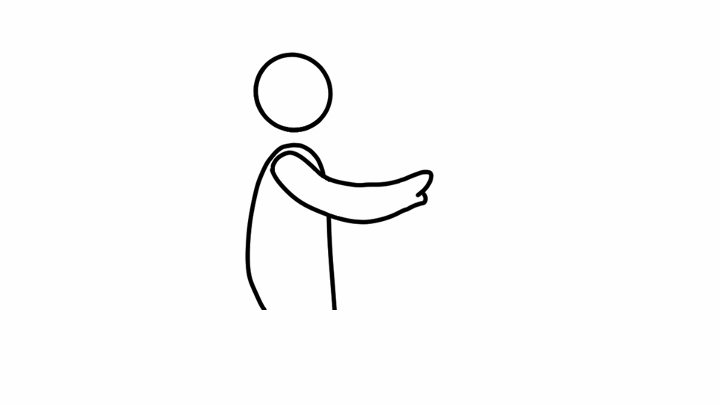
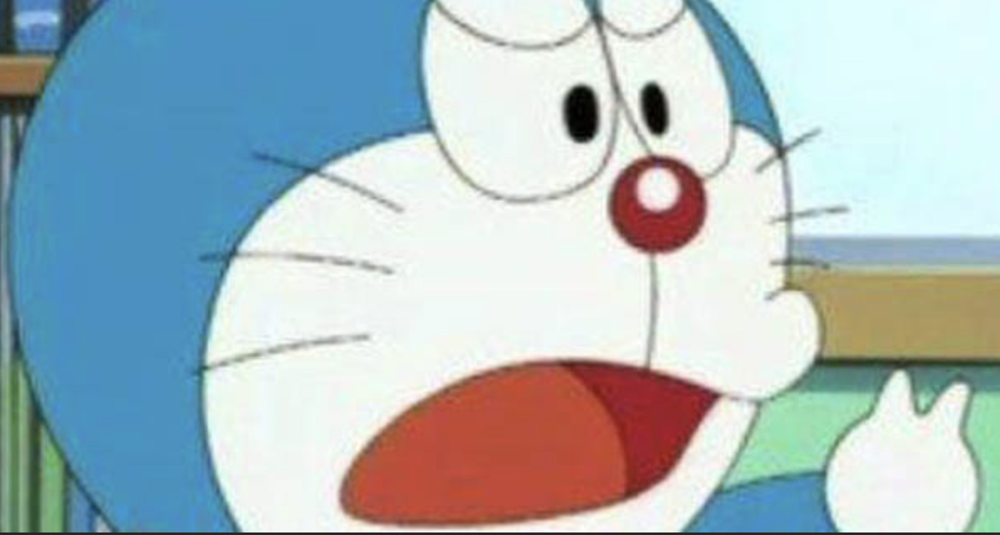
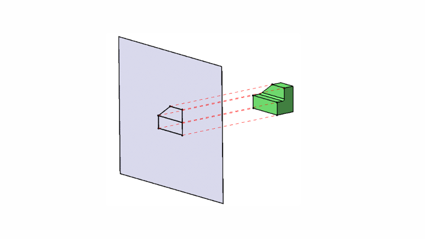

+++
title = "AR 远近距离的交互可以怎么玩儿？ - 我的专利"
description = "太长不看：以距离分区，使用不同的交互映射"
draft = false

weight = 2

[taxonomies]
tags = ["人机交互", "增强现实", "专利"]

[extra]
feature_image = "ar_zones1.png"
feature = true
+++

## 前情提要

在[之前的博客](@/blog/AVP-Next-CHI/index.md)里，我介绍了一下 Vision Pro 和 HoloLens 系列在人机交互上的相似之处，并且指出了遗留的问题和苹果解决这些问题的方向。

正如我之前写的，拇指是 Vision Pro 交互的下一站。而基于手部的交互，将会一直是 AR 人机交互的重要一环。

## 专利

在这篇博客里，我将会介绍一下我在 AR 人机交互上的专利。这个专利是我在 2021 年 8 月申请的，历经两年半的审查，在今年春节前终于通过了。
巧合的是，上一篇博客里提到的[苹果专利](https://zhuanlan.zhihu.com/p/363122901?utm_id=0)是 2021 年 3 月公开的，算是同时期了。
就我记得，我写专利的时候应该没有看到苹果的专利，但就算看到了，其实那个时候也没有能力把苹果的专利和我的想法联系起来。马后炮地说，我要是那个时候看到了苹果的专利，我的专利应该会更“精彩”的。

OK，不多说废话，来看看专利。我的专利号是`ZL202110972624.X`，基本上所有的信息都可以在中国专利局上查到。但是你查到的混杂着各种专利名词，还有各种各样的“指针”（例如：“在实施例三里”），阅读体验非常差，难怪审查员要审这么久。
所以在这里，我基本上是把专利交底书的内容翻译了一遍，然后加了一些我自己的理解和想法。如果有程序员同学想要更加简单直白的描述，可以直接快进到后面[伪代码](#pseudocode)的部分。

> 专利交底书是什么？
>
> 专利申请书有着严格的格式要求和各种特定的术语，所以一般人是不会自己写专利申请书的，而是找专业的专利代理机构来帮忙。你需要做的是写一份专利交底书，格式非常自由，基本上就是描述你的专利是什么（原理、特点、优势等等）。
> 先让专利代理人明白你的专利是什么，然后他们再帮你翻译成专利申请书的格式。

### 出发点和目的 {#purpose}

这个想法的出发点非常简单：我在用 HoloLens 1 和 HoloLens 2 的时候，手臂常常要伸直，不管是为了拖拽物体，还是点击 UI。这样的交互方式一次两次还可以，但是长时间使用，手臂会很累。所以，有没有什么办法，可以让交互更加舒适，可以让用户长时间使用？

我的一个发现是，只要你不要同时伸直、抬起手臂，你就不会累。

上图的姿势应该是我们能够维持舒适的极限了。这个姿势常常是我们想要伸手去拿东西的时候的姿势，手肘有稍微弯曲。而如果你的手肘伸直去拿东西，无论你是站着还是坐着，不到一分钟你就会感到不舒服。

但是，在 HoloLens 1 和 HoloLens 2 上，我们常常要伸直手臂去交互，这是非常不舒服的。

舒服的姿势是什么呢？我的观察是：站立的时候，只要上臂是基本和身体平行的，小臂可以自由转动，不会疲劳。很多人在演讲的时候，都会保持这个姿势，这样既不会累也可以自由地做手势、*操作激光笔*等等。
而坐着的时候，也类似，或者只要肘部有支撑，小臂就可以自由转动。示意图如下

如果你注意到了“操作激光笔”是斜体，并且记起 HoloLens 2 的一种交互方式是虚拟光线，那么你就可以猜到我的专利的四分之一内容了。

### 怎么做？

所以，我们的终极目标是：尽量让用户保持在舒适的姿势下，进行 AR 人机交互。但是怎么做？

这时候我们要反向地思考一下：什么时候用户才会做出不舒适的姿势（也就是伸直手臂）

当物体就在你触手可及的地方，你是不用伸直手臂去拿的；当物体离你稍微远一点，你会稍微伸手；当物体的距离大于等于你的手臂的长度，你就会伸直手臂去够。

所以很自然地，我们要分三种情况来讨论：

1. 物体就在你触手可及的地方（舒适区）：“触手可及”我们定义为小臂可以自由转动的范围内。
2. 物体在稍远的地方（近场）：你需要稍微伸手去够的地方。
3. 物体在远的地方（远场）：你需要伸直手臂去够的地方。

在舒适区，我们就不需要添加复杂度了，只需要手部追踪，让用户可以自由地和虚拟物体交互。

在近场，我们希望尽量保持手部追踪的直觉，但是要尽量避免让用户伸手。我们想到的是虚拟手，如下图：

> 虚拟手的灵感来源是认知心理学里的一个著名实验 - [橡胶手错觉实验](https://www.zhihu.com/question/24522402)
>
> 参加实验的学生（受试者）会把手放在桌子上，桌子上还有另一只橡胶手。真手和橡胶手并列放置。当橡胶手被刺的时候，受试者竟然会感到疼痛。
>
> 这个实验对我的启发是，人类非常擅长把虚拟的东西投射到真实的东西上，而且我们可以利用这种投射。
>

当我们利用手部追踪，把虚拟手和用户的手同步起来的时候，我们进一步加强了橡胶手错觉，从而以最低的学习成本，让用户掌握到手部运动到虚拟手运动的映射。

甚至，虚拟手的外观可能都不需要和用户的手一模一样，因为我们人非常擅长把各种物体拟人化。虚拟手的外观只需要符合人的认知习惯，就可以了，例如：虚拟手可以是猫爪子，但是用户依然可以用它来操作物体。

> 只需要圆形 + 两个凸起，我们就能够认出这是一只手。

> 虚拟手可以是猫爪（也可以是山竹？）

假如说虚拟手不再是手的形状，那么这个名称也不太合适了，所以我们把它叫做“立体光标”。

在远场，我们就需要更复杂一点的做法。结合第一篇博客，我们可以使用虚拟光线来操作远处的物体。当然，也可以使用眼球追踪加上手势识别。
写专利的时候，我们还没有 Vision Pro 这么精准的眼球追踪，所以我们的专利里还是用虚拟光线做例子。

这基本就是专利的主要内容（75%）了，在这四分之三的内容里，其实还有很多细节，例如：

* 远场的虚拟光线的移动速度的算法
* 近场的虚拟手的外观和运动的算法和设置
* 虚拟手、虚拟光线、手部追踪 3D 模型跟虚拟物体之间可以怎么交互
* ······

### 怎么评估？

熟悉写论文的同学应该不陌生了：提出新方法的同时，我们还应该有合理的评估方法。 所以，剩下的四分之一内容就是我们怎么评估这个方法的好坏，准确地来说，我们怎么评价用户在交互中的易疲劳程度。

在 [**出发点和目的**](#purpose) 里，我们提到手臂上臂的移动会造成疲劳，所以很自然地，我们想去测量上臂的移动，并且把移动值作为一个评价指标。但是上臂的移动怎么测量，这是个问题。

我们想到，上臂移动的直接后果就是手肘的移动，所以我们可以测量手肘这一个点的移动。这时候，测量指标就变成了单位时间里，手肘这个点在三维空间的移动距离。只要这个量化指标比较低，我们就可以认为用户的交互是舒适的。
当然，这个指标是一个相对值；另一个绝对值量化指标是手肘的坐标，只要这个坐标不偏离用户的舒适区，我们可以认为用户的交互是舒适的。

## 伪代码 {#pseudocode}

> 伪代码和上文的描述是基本一致的，但是有些地方是互补的，可以相互参考。

假设有 N 个虚拟物体O_1到 O_N，它们散布在舒适区、近场和远场中。

初始化：

* 创建一个列表 L，存放用户可能与之交互的物体
* 创建一个变量 O，用来存放用户将要交互的物体

1. 获取用户目前的姿态（如站姿、坐姿等）
2. 追踪用户双手并且重建用户双手的 3D 模型，识别手部动作
3. 结合姿态与手部位置，判断用户的手是否在舒适区内
4. 对于每一个物体 O_i
    * 如果手在舒适区，O_i 在舒适区，把 O_i 放进 L中
    * 如果手不在舒适区，O_i 在舒适区，跳过此物体
    * 如果手在舒适区，O_i 不在舒适区，发出一道虚拟光线(\*0)
        * 如果虚拟光线击中O_i 或者 O_i 旁边一定范围(\*1)，将 O_i 放入 L 中
        * 否则跳过此物体
    * 如果手不在舒适区，O_i 不在舒适区
        * 如果O_i 在手的一定范围内，将O_i 放入 L 中
        * 否则，发出一道虚拟光线
            * 如果虚拟光线击中O_i 或者 O_i 旁边一定范围，将 O_i 放入 L 中
            * 否则跳过此物体
5. 在 L 中筛选(\*2)出用户最有可能想要与之交互物体，存储于 O 中
6. 决定是否需要显示立体光标
    * 如果手在舒适区，O在舒适区
        * 如果是特殊情况(\*3)，显示立体光标
        * 不是特殊情况，不显示立体光标，完全按照方法 1 进行交互
    * 如果手在舒适区，O不在舒适区，发出一道虚拟光线。附注：用户可以设置是否显示出虚拟光线。
        1. 在虚拟光线击中处显示立体光标
        2. 根据用户的手部动作，实时改变立体光标的形状，也就是复制用户的手部动作
    * 如果手不在舒适区，O不在舒适区
        * 如果 O 在用户的手可触及范围内，按照“如果手在舒适区，O在舒适区”的情况处理
        * 否则，按照“如果手在舒适区，O不在舒适区”的情况处理
7. 识别用户的手部动作，并进行交互部分的处理，这一步和后续步骤不在本专利的范围内

**算法备注：**

第 5 步和第 6 步在具体实现时可以合并为一步，来进一步特定情况下的优化性能。例如虚拟场景内只有一个虚拟物体的情况，或者是用户设定始终锁定某一虚拟物体的情况等。

**脚注：**

*0:  虚拟光线的方向定义为手掌平面的法线方向，而不是现有方案的方向（HoloLens 为用户小臂的指向方向；方案 2 为手柄的指向方向）

*1:  这里的范围既可以是 3D 的范围，也可以是 2D 的投影曲面中的范围。投影曲面可以是平面，也可以是圆弧面等复杂的曲面。在没有别的物体遮挡的情况下，虚拟光线与物体相交的充分必要条件就是虚拟光线的垂点在物体在虚拟光线的垂直平面上的投影内。（附注：也就是有一个平面 S，虚拟光线垂直相交 S 于点 A，物体在 S 上的投影为P，A
必须要在 P 内 ）

如图中例子，投影曲面是一个平面。定义物体的临近范围可以在 3D 空间中定义，例如给该物体加上一个包围盒，包围盒内就是该物体的临近范围。那么检测虚拟光线是否在该物体的临近范围内就可以通过检测是否于包围盒相交来完成。

定义物体的临近范围还可以在 2D 投影空间中定义。具体地，先将 3D 物体投影到投影曲面上，得到一个二维投影，然后定义这个二维投影附近有多大的范围是临近空间。然后，检测虚拟光线是否在该物体的临近范围内就可以通过检测虚拟光线是否与这个 2D 范围相交来完成。

定义了临近空间之后，我们就可以做到类似于磁吸的效果。当立体光标位于一个虚拟物体的临近空间中的时候，我们可以令立体光标吸附在虚拟物体上，从而减少用户手部的移动。

当磁吸效果为 0 的时候，就是目前各种 AR/VR/MR 设备的默认设定。另一个特例就是当物体的 （3D 或者 2D）临近空间为无限大的时候，那么立体光标不会在空荡的虚拟空间中游走，而是会总是吸附于离立体光标最近的虚拟物体上。取决于应用场景的不同，磁吸效果，或者虚拟物体的临近范围可以由用户或者设计师来调整，以改善使用体验。

*2：筛选的算法不在本专利范围内。筛选算法有很多，并且已经比较成熟。

*3：特殊情况包括但不限于：

* 虚拟物体设计师制定了一个物体的包围盒，并且设定希望明显提示用户有包围盒的存在
    * 例如：有一方虚拟水，用户可以用手搅动水，但是设计师希望提示用户可以通过移动包围盒的方式移动水。那么，在用户玩水的时候，立体光标可以贴在包围盒上，提示用户包围盒的存在。
* 提供反馈的需要。
    * 例如在 AR 枪战游戏中，可能的情况是，立体光标在握枪而不是用户的双手在握枪。在握枪的时候立体光标依附于用户双手上，但是在射击时，为了表现后坐力，立体光标将会从用户双手分离，同枪柄一起震动。

## 总结

专利提出了一种新的 AR 人机交互的方法，这种方法是基于距离分区的，分为三个区：舒适区、近场和远场。在舒适区，用户可以自由地和虚拟物体交互；在近场，用户可以使用虚拟手来操作虚拟物体；在远场，用户可以使用虚拟光线来操作虚拟物体。

正如上一篇博客说的，对于交互的方式，我们可以全都要——在不同场景用不同的交互方式。这个专利就是在这个思路下的一种实现。

## 后记

可是这个专利，和改进 Vision Pro 的交互方式有什么关系呢？先别急，我会在[下一篇博客](@/blog/AR-Interaction-Improvement/index.md)里将目前这两篇博客联系起来，提出一个改进的方案，并且讨论这个方案在更大的领域里的意义和应用。

## 关于专利授权

如果你觉得这个专利有意思并且有用，可以和我约个咖啡一起聊聊！

至于授权，我觉得这个不是真正的问题，真正的问题是要有一个承载的平台，并且这个平台的生态都为这种交互方式适配、优化，这个才是真的难的地方。

至于国际专利，准确地说是 PCT，我当时没有申请。所以，你可以在中国以外地区使用这个交互方式，不用授权，甚至 *可以* 在国外申请专利。但是，就像我说的，专利授权本身不是难事。
况且，当我把这篇博客公开的时候，专利的想法已经进入了公共领域。所以就算在国外申请，也是不会通过的，通过了也是可以撤销的。

## 元数据

版本：0.1.0

日期：2024-02-14

版权协议：[CC BY-SA 4.0](https://creativecommons.org/licenses/by-sa/4.0/)

