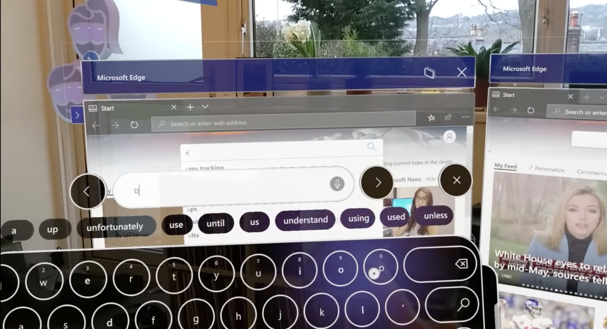
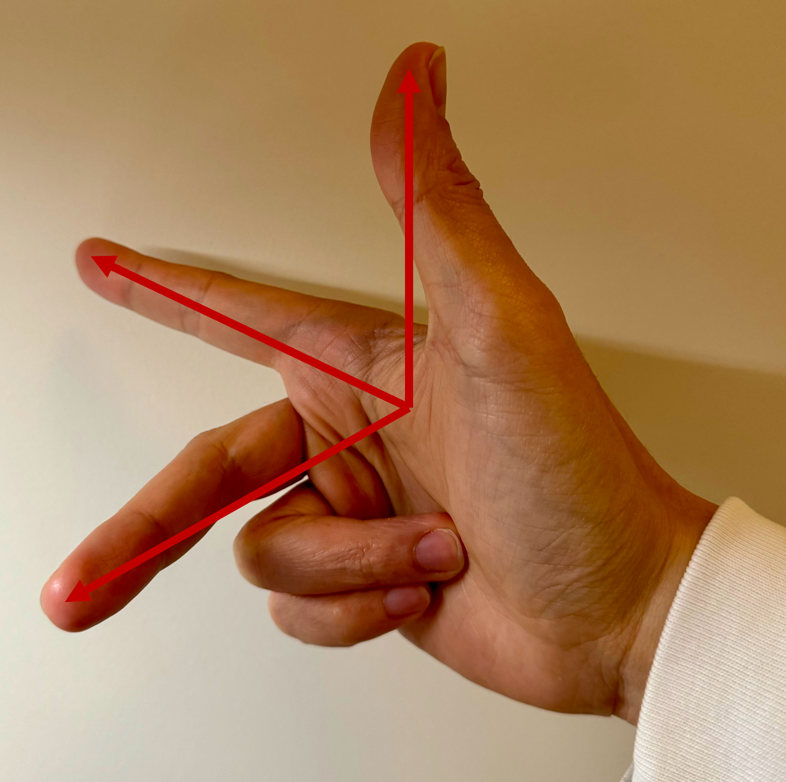
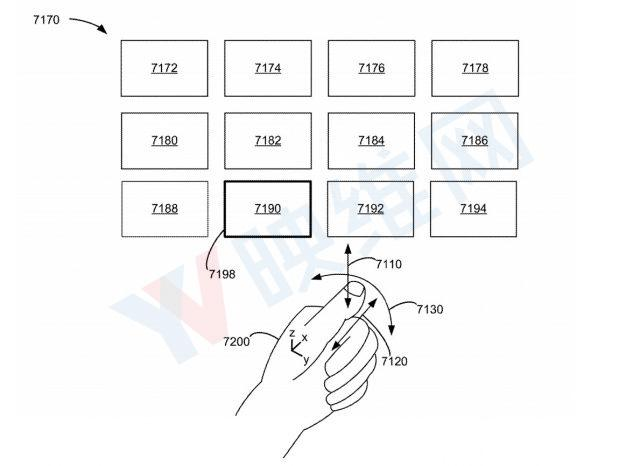
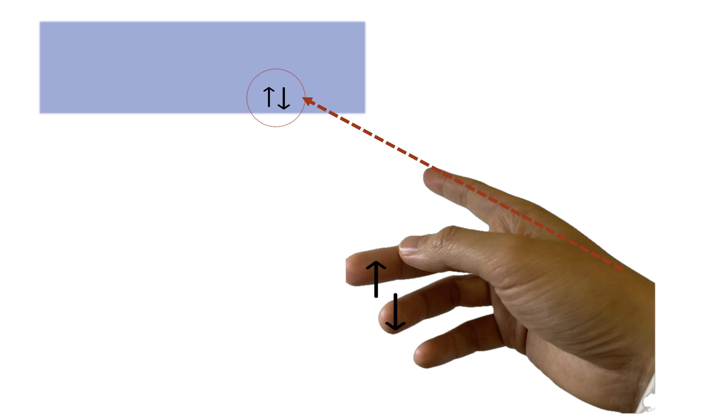
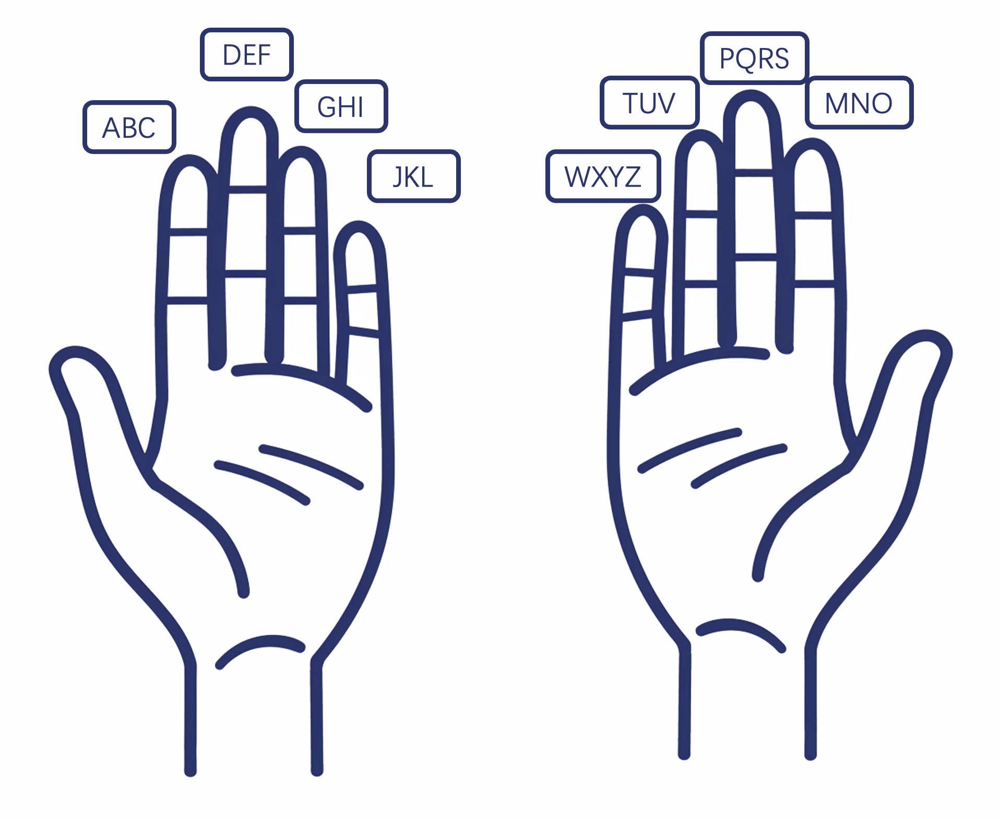

+++
title = "Draft: AR 交互优化——食指和拇指"
description = "太长不看：食指的灵活度远不止按按钮这么简单，AR 的交互除了拇指也要尽可能利用食指"
draft = false

weight = 3

[taxonomies]
tags = ["人机交互", "苹果", "Vision Pro", "增强现实"]

[extra]
feature_image = "coordinates_with_hand.png"
feature = true
+++

## 前情提要

在[《Vision Pro 交互的下一站》](@/blog/AVP-Next-CHI/index.md)里我们说 Vision Pro 交互的下一站在拇指，讨论了目前 Vision Pro 在使用手势输入、控制方面的问题，也解释了苹果的相关专利；
[《AR 远近距离的交互可以怎么玩儿？ - 我的专利》](@/blog/AR-CHI-Patent/index.md) 则介绍了我的专利，是以远近范围来分区，不同区域有不同的手势来和 AR 的物体交互。

这两篇文章似乎是平行的，没有交叉，但是当我们以巧妙一点的方式结合起来，我相信可以创造出一种更加舒适的交互方式。

## 巴兹·奥尔德林和食指

在之前的文章里，我们说拇指很重要，因为拇指是最灵活的手指，并且拇指的各种运动可以轻易映射成不同的含义。
但是，就像没人记得第二个登月的人是谁，我们很少注意到第二灵活的手指，也就是我们的食指。食指的自由度仅次于拇指，而且我们人对于它的运动也赋予了非常多的含义。
比如说，当别人跟你问路的时候，你伸出的手指是哪一根？是食指；（对于程序员朋友来说）别人戳屏幕指代码的时候，他们用的手指是哪一根？是食指；“指着鼻子骂人”用的手指又是哪一根？还是食指；而当我们想要用手指作画，我们也会很自然地用食指勾勒出形状。

食指的指向，被我们很自然地对应上了我们想要关注的方向。但是，在 AR 或者 VR 的交互中，我们似乎忽略了食指。VR 手柄上，食指负责扣动扳机；而 AR 中，食指大多是用来点击，例如点击虚拟按键，或者和拇指相捏，完成点击操作。

> 截图出处：https://youtu.be/t0q8vWLjkyo?si=hbxSfwJuMbnjo1mI

这些功能的映射虽然也很自然，但是我觉得反映了从 PC 和手机时代遗留下来的思维定势。在 PC 和手机时代，食指就是用来点击按键的。但是“一直如此便对吗”？按照上面的例子，显然不对。

## 指路人

学习过计算机图形学或者物理的同学对上面这个手势应该很熟悉了。我们可以用拇指、食指和中指摆成近似相互垂直，指着不同的方向，来模拟三维空间中的笛卡尔坐标系。我们暂且把这个手势起名为“笛卡尔手势”。这其实就是我的灵感来源。

> 图来源：苹果专利图

我们再返回来看苹果的专利示意图，里面用来控制方向的是拇指。拇指虽然非常灵活，但是我们平时指路的时候会用拇指吗？不会的，反而我们会用没有那么灵活的食指。

在这个专利里，使用拇指来指定方向，那么食指就会和拇指冲突，只能保持不动。但是假如我们把拇指换成食指，虽然手指的灵活性降低了，但是手指的指向性还在。当我们用食指来指定方向的时候，我们的手可以比较自然地做出类似笛卡尔手势的动作。
这意味着，当食指在固定指向，充当鼠标的时候，我们最灵活的拇指还可以任意活动。例如拇指可以触碰其余的四根手指；拇指甚至还可以跟中指打个响指。

这些动作都可以映射到不同的含义上，例如：当食指指向的是翻页的 UI 时，拇指点击中指或者无名指可以上下翻页。

或者，当食指指向的是文本框的时候，打个响指可以清除一半文字 😂或者食指指向进度条的时候，拇指在中指指节上滑动可以对应上进度······

在[《Vision Pro 交互的下一站》](@/blog/AVP-Next-CHI/index.md)里我们用下图“实现”了按手指的九宫格输入法，在这里，我们也可以稍作修改，把中指、无名指和小指的一共九块指节作为九宫格，拇指可以点按；

而 Swift 输入法就更加简单了，我们只要追踪食指的轨迹就可以了。

## 分区分功能的手势交互

TODO

## 后记

TODO

## 元数据

版本：0.0.1

日期：2024-03-18

版权协议：[CC BY-SA 4.0](https://creativecommons.org/licenses/by-sa/4.0/)

### 更新日志

2024.03.18: 更新了各种示意图
