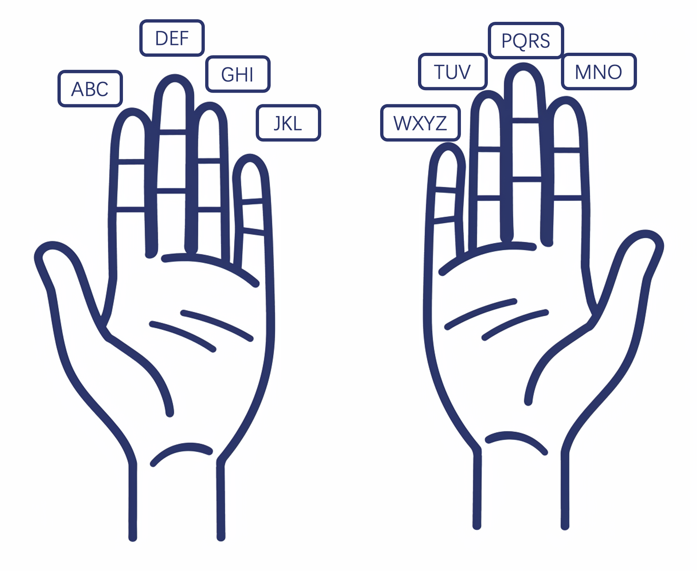

+++
title = "AR interaction with thumbs and index fingers"
description = "TL;DR: Flexibility of index fingers are far more than pressing buttions, which AR interaction should take advantage of"
draft = false

weight = 3

[taxonomies]
tags = ["CHI", "Apple", "Vision Pro", "AR"]

[extra]
feature_image = "coordinates_with_hand.png"
feature = true
+++

## Previously

In our previous discussion, [*Next Frontier for Computer Human Interaction on Vision Pro*](@/blog/AVP-Next-CHI/index.md), we talked about how the future of Vision Pro interaction lies in the thumb,
addressing the current issues with gesture input and control in Vision Pro and explaining Apple's related patents.
Another piece, [*What else to play with in AR CHI? - My Patent*](@/blog/AR-CHI-Patent/index.md), introduces my patent which segments interaction zones based on distance, assigning different gestures for interacting with AR objects in each zone.

Though these two articles seem orthogonal, when cleverly combined, I believe they can create a new interaction that is more comfortable.

## Buzz Aldrin and the Index Finger

In the previous article, we emphasized the importance of the thumb due to its maximum flexibility and the ease with which its movements can be mapped to different meanings. However, much like how the second person to walk on the moon is often forgotten,
we tend to overlook the second most dexterous finger - our index finger. The index finger's degree of freedom is second only to the thumb, and we assign a lot of meaning to its movements.
For instance, which finger do you use to point directions to someone? The index finger. For programmers pointing at code on a screen? The index finger.
The finger used to "point and scold"? Again, the index finger.
And naturally, when we draw with our fingers, we use the index finger to trace shapes.

The direction pointed by our index finger naturally corresponds to the direction of our intention. However, in AR or VR interactions, the index finger seems to be forgotten.
On VR controllers, the index finger is responsible for pulling the trigger; in AR, it's mostly used for tapping, like pressing virtual buttons or pinching with the thumb to perform a click.

> Reference: https://youtu.be/t0q8vWLjkyo?si=hbxSfwJuMbnjo1mI

Although these functions are intuitive, I believe they reflect a mindset inherited from the PC and smartphone era, where the index finger was used for clicking. But "does 'it has always been this way' make it right" (quoting a great great Chinese writer Lu Xun)?
Clearly not, according to the examples above.

## The Guide

Those familiar with computer graphics or physics might recognize well the gesture above. We can simulate a three-dimensional Cartesian coordinate system by positioning the thumb, index, and middle finger approximately perpendicular to each other, pointing in different directions.
Let's call this the “Cartesian gesture”, from which my inspiration comes.

> Reference: Illustration from Apple patent

Looking back at Apple’s patent illustration, it uses the thumb to control direction. Do we use our thumb to point directions in real life? No, we use our index finger instead, which is, in contrast, less dexterous.

In this patent, using the thumb for direction means the index finger would conflict with the thumb and thus should remain immobile. However, if we switch from the thumb to the index finger, though with less dexterity, the ability to point directions remains.
When we use the index finger to point directions, our hand can naturally perform like the Cartesian gesture. This means while the index finger is fixed pointing, acting as a cursor, our most dexterous thumb can still move freely.
For example, the thumb can touch the other four fingers; it can even snap with the middle finger.

These actions can map to different meanings, such as flipping through pages on UI by thumb touching the middle or ring finger when the index finger points at them.

Or, when the index finger points at a text box, snapping fingers could delete half the text 😂 or when pointing at a progress bar, sliding the thumb over the middle finger joint could adjust the progress, etc.

In [*Next Frontier for Computer Human Interaction on Vision Pro*](@/blog/AVP-Next-CHI/index.md), we “implement” a nine-grid input method based on finger positioning like the following illustration.
Here, we could slightly modify it, using the nine sections formed by the middle, ring, and little fingers for a nine-grid, with the thumb performing the tapping.

As for Swift Keyboard, we just need to track the trajectory of the index finger instead of the thumb.

## Different Gestures by Zone and Scenario

When we combine the idea of zoning by distance from [my patent](@/blog/AR-CHI-Patent/index.md), it becomes a more complete interaction scheme:

1. When AR objects are within the comfortable zone, we use hand tracking, which is the most natural.
2. When objects are beyond the comfort zone but still within reach (near-field), we use a virtual hand (or 3D cursor) as a proxy to interact with objects.
3. When objects are out of reach (far-field), we use the aforementioned interaction method, with the index finger for pointing and the thumb initiating the interaction.

This scheme perfectly matches human intuition: when an object is within reach, we simply grab it; if slightly out of reach, we extend our hand or use a tool as a proxy; even further, we might direct someone else to help us.

Of course, we can further refine this by scenario, such as when sitting at a desk, although screens (virtual or physical ones) are within our near-field, we might prefer a mouse-like experience, hence favoring index finger pointing and thumb interaction.

This interaction scheme could realize a smoother experience. Imagine playing an immersive game with Vision Pro: your eyes focusing on the enemy, your right hand wielding a sword in combat; peripherally, you notice an energy pack to your left.
You could easily use your left index finger to locate and point to the energy pack and thumb to click, bringing the pack right into your palm. This experience is unprecedented in previous interaction methods.

Compared to previous interaction schemes, this one has several advantages:

* Flexible direction: your index finger's dexterity determines the flexibility of direction.
* Direction without needing to look: similar to how the mouse cursor doesn't have to be where you're looking, the index finger's pointing location doesn't have to be your focus.
* Supports highly flexible typing.

## Reimagine AR Interaction

I believe AR and MR, compared to VR, are more interesting because they allow interaction with reality. This experience could be magical, but it was previously hindered by unnatural and unintuitive interactions.

For example, I want to create a virtual switch to turn off a light without opening an app, speaking to an AI assistant, or pressing a physical button. I just need to snap my fingers without shifting my focus, and the light I want to turn off does so.
However, this experience can't be realized with any current AR/MR glasses.
With HoloLens, I need to extend my palm, shift my gaze and focus to where the virtual ray from my hand points, then pinch with thumb and index finger. This doesn’t even consider the low accuracy of HoloLens gesture recognition.
With Vision Pro, I obviously need to focus my gaze on the virtual switch, regardless of its location. If using Apple's patent method, I could indeed position the cursor with my thumb, but since the thumb also initiates interaction,
I need to fix the cursor somehow before clicking with the thumb. This switch requires attention.

Using our scheme, with the index finger for directing the cursor and the thumb for interaction, the division of labor is very clear, similar to using a mouse where the palm moves the cursor and the fingers click, without the need for mode switching, thus reducing cognitive load.

Expanding from this example to broader applications beyond AR/MR glasses, we see more possibilities and space for optimization.

Take ambient computing or ubiquitous computing, for example. The biggest issue I think is how we interact with various devices in the environment.

Many emphasize automation and AI in ambient computing. The issue with automation is that when it works well and meets expectations, it’s perfect; but when it fails or behaves unexpectedly, it requires a hundredfold more effort to adjust or fix.
The problem with AI is that you need to explicitly communicate with it, diverting some attention. The result of AI + automation can be either heavenly or hellish.

Applying intuitive interactions to the environment might allow us to achieve computing that aligns with user habits. Returning to the switch example: when moving to a new home and unfamiliar with the location of every room's light switch,
you would need to take some effort to find the switch even when exhausted upon returning home at night.
However, once you're accustomed to your home, the location of switches becomes second nature, allowing you to turn on lights without searching or diverting your attention.
In analogy, with our interaction scheme, you initially might need to pay attention to where your index finger is pointing to ensure it's aiming at the virtual switch, but with familiarity, pointing with the index finger and clicking with the thumb can become seamless, smooth and subconscious.

When we apply the environment of ambient computing to more specific scenarios, such as the interior of a car, we might create new experiences.
In the era of electric vehicles, many miss the physical buttons in gasoline cars and criticize the buttons on touch screens of electric cars as hard to use.
Their complaints have merit, but not for the superficial reasons often cited. They miss an intuition, a type of interaction that physical buttons could provide, akin to adjusting the air conditioning temperature while driving without looking.
This intuition is similar to turning on your home's lights without looking.
So, supporters of electric vehicles need not rush to refute but consider if you had to turn on an iPad first and then tap the screen to turn on a light when you get home, you might also miss physical buttons, especially when you are exhausted.

Transferring the light switch example to car interactions, perhaps we could improve the car interface experience with our "point and click" interaction scheme. For instance, instead of pressing buttons to control the air conditioning or touching the screen,
simply pointing the index finger at the air vent or a custom location and tapping the middle finger joint with the thumb could turn the air conditioning on or off.
I believe this method could bring back the original intuition. The first time you get in the car, you might need to look at the air conditioning's location, but once familiar, you could operate it without looking.

> **What about hand tracking?**
>
> Good question! I deliberately omitted it earlier. If hand tracking is inaccurate, then our interaction scheme, which is based on hand movements, wouldn't stand, whether at home or in a car.
> However, we have a precedent in Vision Pro as a role model. Accurate gesture recognition is achievable, and the investment is worth the outcome.
>
> The "worth" here needs to be quoted because it's impractical to deploy several cameras in every room of our house to track hand movements, unless we can wear Vision Pro all day.
> But it's different in a car. In a car, our position is relatively fixed, and the space inside the car is smaller and more controllable. The difficulty of interconnecting components inside a car is also lower than interconnecting home appliances.
> In the car environment, we don't need AR glasses to achieve a magic-like experience of augmented reality.
>
> Some say electric cars are just large smartphones. But I disagree. Considering the counter-example of screen buttons of electric car, we can't directly copy and paster interaction schemes of smartphones to car interfaces.
> In this regard, I believe smart cockpits are a limited version of AR glasses. The limitations lie in the fixed position of people and the confined space of the car. But these are also advantages over AR glasses, which we can take.

## Conclusion

In this blog, we slightly modified the interaction method from [Apple's patent](https://zhuanlan.zhihu.com/p/363122901?utm_id=0) and combined the interaction schemes from [*Next Frontier for Computer Human Interaction on Vision Pro*](@/blog/AVP-Next-CHI/index.md)
and [*What else to play with in AR CHI? - My Patent*](@/blog/AR-CHI-Patent/index.md), resulting in a new scheme. This scheme not only utilizes the thumb but also maximizes the use of the index finger, matching human intuition and increasing interaction efficiency.
The zoning by distance also reduces interaction fatigue.

Building on top of this scheme, we explored new possibilities for AR interaction in the context of ambient computing, car experiences, and smart cockpits.

## Metadata

Version: 0.1.0

Date: 2024-03-18

License: [CC BY-SA 4.0](https://creativecommons.org/licenses/by-sa/4.0/)

### Changelog

2024.03.19: Finish translation of v0.1.0