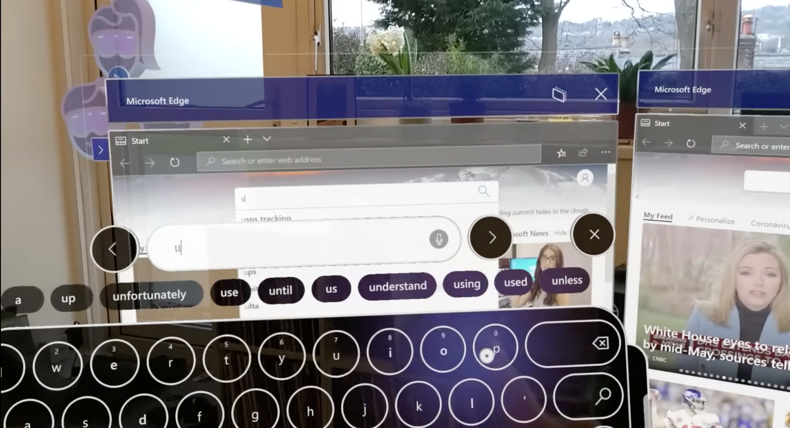
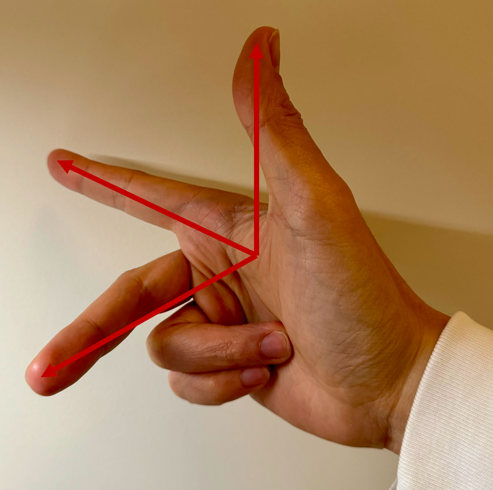
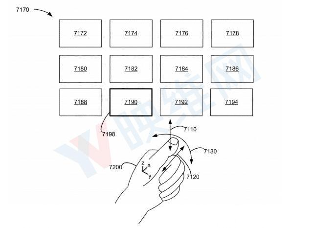
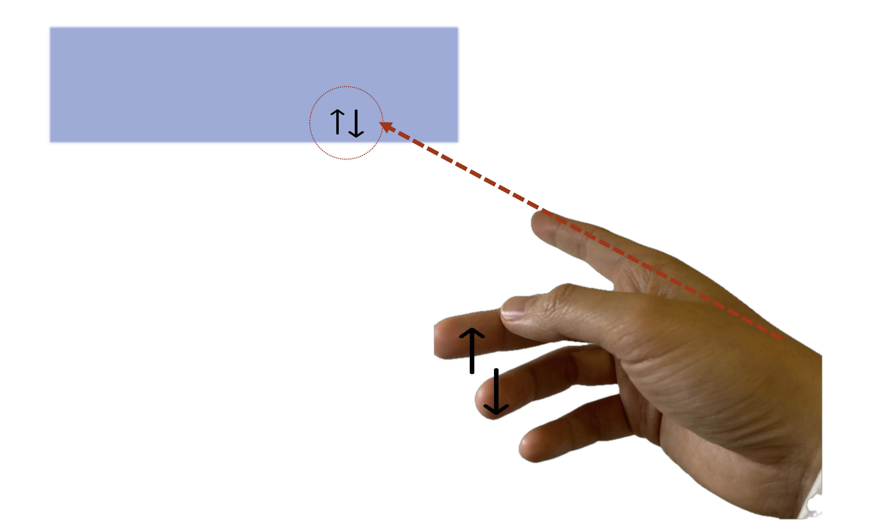
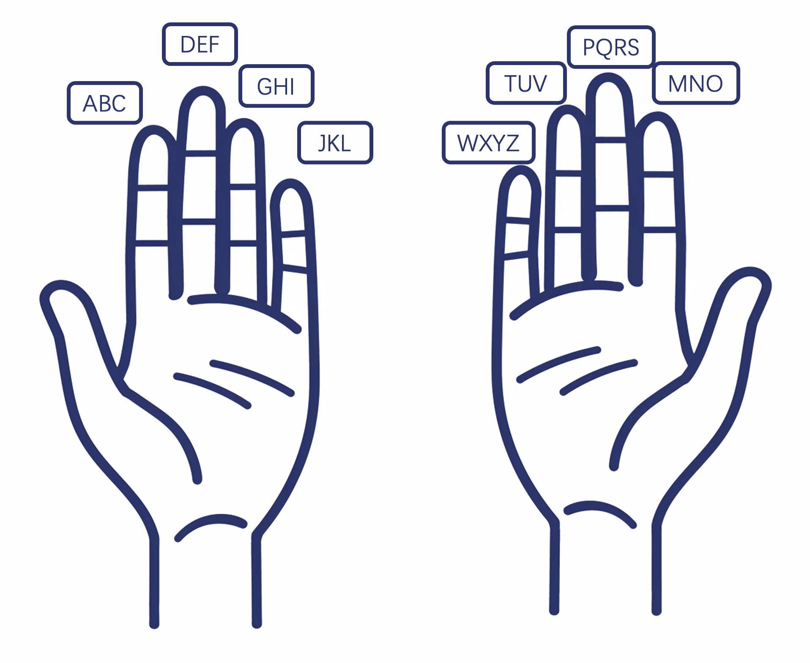

+++
title = "AR 交互优化——食指和拇指"
description = "太长不看：食指的灵活度远不止按按钮这么简单，AR 的交互除了拇指也要尽可能利用食指"
draft = false

weight = 3

[taxonomies]
tags = ["人机交互", "苹果", "Vision Pro", "增强现实"]

[extra]
feature_image = "coordinates_with_hand.png"
feature = true
+++

## 前情提要

在[《Vision Pro 交互的下一站》](@/blog/AVP-Next-CHI/index.md)里我们说 Vision Pro 交互的下一站在拇指，讨论了目前 Vision Pro 在使用手势输入、控制方面的问题，也解释了苹果的相关专利；
[《AR 远近距离的交互可以怎么玩儿？ - 我的专利》](@/blog/AR-CHI-Patent/index.md) 则介绍了我的专利，是以远近范围来分区，不同区域有不同的手势来和 AR 的物体交互。

这两篇文章似乎是平行的，没有交叉，但是当我们以巧妙一点的方式结合起来，我相信可以创造出一种更加舒适的交互方式。

## 巴兹·奥尔德林和食指

在之前的文章里，我们说拇指很重要，因为拇指是最灵活的手指，并且拇指的各种运动可以轻易映射成不同的含义。
但是，就像没人记得第二个登月的人是谁，我们很少注意到第二灵活的手指，也就是我们的食指。食指的自由度仅次于拇指，而且我们人对于它的运动也赋予了非常多的含义。
比如说，当别人跟你问路的时候，你伸出的手指是哪一根？是食指；（对于程序员朋友来说）别人戳屏幕指代码的时候，他们用的手指是哪一根？是食指；“指着鼻子骂人”用的手指又是哪一根？还是食指；而当我们想要用手指作画，我们也会很自然地用食指勾勒出形状。

食指的指向，被我们很自然地对应上了我们的意图的方向。但是，在 AR 或者 VR 的交互中，我们似乎忽略了食指。VR 手柄上，食指负责扣动扳机；而 AR 中，食指大多是用来点击，例如点击虚拟按键，或者和拇指相捏，完成点击操作。

> 截图出处：https://youtu.be/t0q8vWLjkyo?si=hbxSfwJuMbnjo1mI

这些功能的映射虽然也很自然，但是我觉得反映了从 PC 和手机时代遗留下来的思维定势。在 PC 和手机时代，食指就是用来点击按键的。但是“一直如此便对吗”？按照上面的例子，显然不对。

## 指路人

学习过计算机图形学或者物理的同学对上面这个手势应该很熟悉了。我们可以用拇指、食指和中指摆成近似相互垂直，指着不同的方向，来模拟三维空间中的笛卡尔坐标系。我们暂且把这个手势起名为“笛卡尔手势”。这其实就是我的灵感来源。

> 图来源：苹果专利图

我们再返回来看苹果的专利示意图，里面用来控制方向的是拇指。拇指虽然非常灵活，但是我们平时指路的时候会用拇指吗？不会的，反而我们会用没有那么灵活的食指。

在这个专利里，使用拇指来指定方向，那么食指就会和拇指冲突，只能保持不动。但是假如我们把拇指换成食指，虽然手指的灵活性降低了，但是手指的指向性还在。当我们用食指来指定方向的时候，我们的手可以比较自然地做出类似笛卡尔手势的动作。
这意味着，当食指在固定指向，充当鼠标的时候，我们最灵活的拇指还可以任意活动。例如拇指可以触碰其余的四根手指；拇指甚至还可以跟中指打个响指。

这些动作都可以映射到不同的含义上，例如：当食指指向的是翻页的 UI 时，拇指点击中指或者无名指可以上下翻页。

或者，当食指指向的是文本框的时候，打个响指可以清除一半文字 😂或者食指指向进度条的时候，拇指在中指指节上滑动可以对应上进度······

在[《Vision Pro 交互的下一站》](@/blog/AVP-Next-CHI/index.md)里我们用下图“实现”了按手指的九宫格输入法，在这里，我们也可以稍作修改，把中指、无名指和小指的一共九块指节作为九宫格，拇指可以点按。

而 Swift 输入法就更加简单了，我们只要追踪食指的轨迹就可以了。

## 分区分场景的手势交互

当我们把[我的专利](@/blog/AR-CHI-Patent/index.md)里按照距离分区的思想结合起来，就变成了一个更加完整的交互方案：

1. 当 AR 物体在人的舒适区里的时候，我们用最自然的手部追踪
2. 当物体离开了舒适区但是还是伸手可及的地方（也就是近场）的时候，我们用虚拟手（或者叫立体光标）作为人手的代理，代我们和物体交互
3. 当物体在伸手不可及的地方（远场）的时候，我们使用上面所说的交互方式，用食指定向，用拇指主导交互

这个方案其实可以完美对应上人的直觉：当物体就在手边，那么就直接拿；如果稍远，我们需要伸手或者借助手边的工具（也就是代理）；更远一点，我们可能会指使别人帮我们。

当然，我们也可以在场景这个维度上更加细分，例如：坐着办公的时候，虽然屏幕（或虚拟或实体）在我们的近场，但是我们会更熟悉类似鼠标的体验，所以会更倾向于使用食指定向、拇指交互。

这个交互方案可以实现更丝滑的体验。想象你用 Vision Pro 在玩沉浸式的游戏：你的眼睛在聚焦着敌人，你的右手握着一把剑，在和敌人打斗；你的余光看到左边远处有个能量包，你完全可以用左手食指定位能量包，然后拇指点击，突然间能量包就飞到了掌心。
这种体验是之前的交互方式都做不到的。

对比之前的交互方式，这个方案的优点是：

* 定位很灵活：你的食指有多灵活，定位就可以多灵活
* 定位不需要注视：就像鼠标指向的地方不一定是眼睛注视的地方，食指指向的定位点不一定是你专注的方向
* 支持非常灵活的打字方式

## AR 交互的新想象

我觉得 AR 和 MR 相比 VR 更加有意思的地方就是，我们可以和现实交互。这种体验可以变成魔法，但是之前是被不自然、不符合直觉的交互阻碍。

举个例子：我想做一个虚拟开关，我想关灯的时候，不需要打开 App，也不需要和 AI 助手说话，更不需要按动实体按键，我只需打个响指，不需要转移我的注意力，我想关的灯就关了。但是这种体验，在目前所有的 AR/MR 眼镜上都做不到。
用 HoloLens，我需要伸出手掌，转移我的视线和注意力，看手掌发出的虚拟光线投射到了哪里，然后拇指食指相捏。这还没考虑到 HoloLens 手势识别的低精确度。
而用 Vision Pro，很明显我需要把我的视线聚焦到虚拟开关上，不管这个虚拟开关放在哪里。如果是苹果专利里的做法，我确实可以用拇指定位光标，但是拇指又充当了启动交互的角色，所以我需要以特定的方法固定好光标，然后再使用拇指点击。这种切换是需要注意力的。

而使用我们这个方案，食指定位光标，拇指启动交互，分工非常明确，就像我们使用鼠标，手掌负责移动光标，手指负责点击，没有模式切换，心智负担也就更少。

当我们从这个例子出发，将目光往更大的地方看，而不局限于 AR/MR 眼镜，我们可以看到更多的可能以及优化空间。

举个例子，环境计算（Ambient Computing）或者泛在计算（Ubiquitous Computing）。在环境计算里，我觉得存在的最大问题就是我们如何与环境里的各种设备交互。

很多人会在环境计算里强调自动化以及 AI。 自动化的问题是，它工作得好好的时候，符合预期，那一切完美；但是当它不符合预期，或者工作出错的时候，那人要花百倍的精力来调整或者修复。
而 AI 的问题是，你需要和它直接交流，你需要分散一点注意力给它。而 AI + 自动化的结果，要么是天堂，要么就是地狱。

当我们把符合直觉的交互应用到环境里，很可能我们就可以实现符合用户习惯的计算。还是举开关的例子：当你搬到新家，还不熟悉每一个房间的电灯开关在哪。这时候，就算你晚上回到家全身疲惫，你也需要花费精力找一下开关在哪。
但是当你住了很久，开关的位置已经在你的潜意识里了，回到家，你不需要摸索，也不用分散注意力，就可以打开灯。
使用我们的交互方式，一开始你可能还需要注意一下你的食指指向的地方是不是虚拟开关的位置，但是熟悉之后，食指指向、拇指点击这两个动作可以一气呵成。

当我们把环境计算的环境放到一个更加细分的场景里，我们没准能够创造出一些新的体验。这个环境就是汽车座舱。
在电动车时代，很多人怀念汽油车上的实体按键，并且批评电动车上的屏幕按键难用。其实，我觉得他们的意见是有道理的，但不是这些表观理由。他们怀念的是一种直觉，一种实体按键能够实现的符合直觉的交互方式。
例如，有实体按键的话，开车的时候不用看也可以调整空调温度。这种直觉，和你不用看也能开家里的电灯的直觉是一样的。
所以电动车的拥护者也不用急着反驳，可以想一下，假如说你回到家，开灯需要先点亮一个 iPad 然后再在屏幕上点击开灯，我觉得你也会怀念实体按键，至少在你浑身疲惫的时候。

我们把开灯的例子迁移到车机交互上，那没准我们可以用指哪打哪的这种交互方式来改善车机体验呢？比如说，我们不用按按钮控制空调，也不用按屏幕，只要食指指向空调出风口或者自定义的位置，拇指点按中指指节，那就可以开关空调。我觉得这种方式可以带回原有的直觉。
第一次上车的时候，你需要看一下空调位置在哪，但是熟悉之后，你不需要注视，也能操作空调。

> **手势识别怎么办？**
>
> 这是个好问题！我在上文特意省略了。假如说手势识别不准确，那无论是在家里，还是在车上，我们这种基于手部动作的交互方式都不成立。
> 但是我们有珠玉在前，也就是 Vision Pro 作为榜样。准确的手势识别是可以做到的，而且投入产出比也是值得的。
>
> 这里的“值得”其实需要打上引号，因为我们不可能在自己的房子里，每个房间都部署几个追踪手部的摄像头。除非，我们能够一整天戴着 Vision Pro。
> 但是，在车子上不一样，在车上，我们人的位置是相对固定的，而且车里的空间也是比较小而且可控的。车内部件互通的难度更是比家里电器互通的难度低了一级。
> 在车里的环境，我们不需要 AR 眼镜，也能做到增强现实的魔法体验。
>
> 有人说，电动车就是大号的智能手机。但是我觉得不是。想想电动车屏幕按键的反例，在车机上，我们不能照搬手机的交互方式。在这个层面上，我觉得智能座舱是局限版的 AR 眼镜。就像上文说的，局限的地方在于人的位置、车里的空间。但是这也是相对于 AR 眼镜的优势。

## 总结

在这篇博客里我们稍微修改了[苹果专利](https://zhuanlan.zhihu.com/p/363122901?utm_id=0)里的交互方式，并且把[《Vision Pro 交互的下一站》](@/blog/AVP-Next-CHI/index.md)和[《AR 远近距离的交互可以怎么玩儿？ - 我的专利》](@/blog/AR-CHI-Patent/index.md)里的交互方式结合起来，
变成了一个新的方案。这个方案不仅仅利用了拇指，也最大限度利用了食指，也能匹配人的直觉，提高交互效率。按照距离分区的方式，也能减少交互的疲劳度。

在这个方案的基础上，我们以环境计算和车机体验、智能座舱为例子，讨论了 AR 交互新的想象空间。

## 元数据

版本：0.1.0

日期：2024-03-18

版权协议：[CC BY-SA 4.0](https://creativecommons.org/licenses/by-sa/4.0/)

### 更新日志

2024.03.18：更新了各种示意图

2024.03.19：写完了第一版
