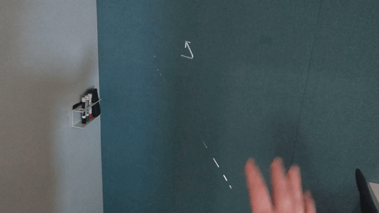
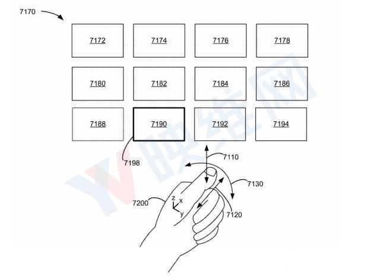
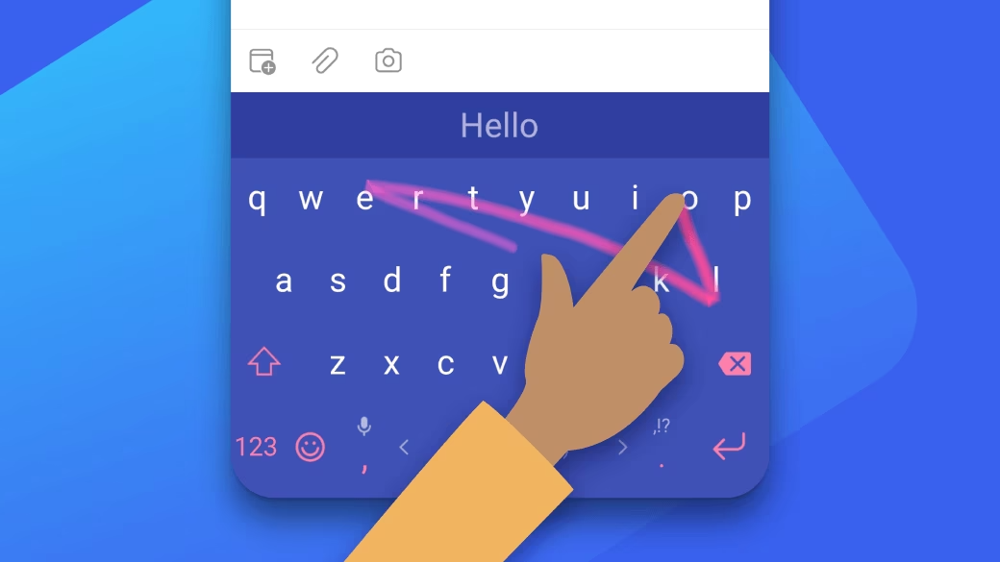

+++
title = "Next Frontier for Computer Human Interaction on Vision Pro"
description = "TL;DR: It's at our thumbs! And Apple knows it."
draft = false

weight = 1

[taxonomies]
tags = ["CHI", "Apple", "Vision Pro", "AR"]

[extra]
feature_image = "nice.png"
feature = true
+++

**"Where is the Next Frontier for Computer Human Interaction on Vision Pro"**

Many might have pondered more or less the same question, and I've been thinking about this since when I watched the
first hands-on videos for Apple Vision Pro in which they highlighted two major pain points:

1. The virtual keyboard in AVP is quite inconvenient, mostly used for passwords. Frequent typists are advised to
   invest in a Magic Keyboard and Magic Trackpad.

2. AVP requires users to precisely focus on the UI they wish to interact with (e.g., buttons, switches) to operate it
   with gestures, meaning the experience like using a mouse blindly is gone for good.

As one of the early experimenters with HoloLens 1 and HoloLens 2, these issues feel all too familiar to me. If Apple doesn't
want to repeat history, Vision Pro should do better.

> Hold on, you might say, let's first ask if it's that so before asking what to do about it.

Indeed, Apple has invested a lot of effort in interaction on Vision Pro, which is evident to all of us. However, my view is that
Vision Pro's interaction isn't good enough yet, at least not revolutionary in the way that the transition from physical
keys to touch screens was. But where should Vision Pro's interaction head next? I think even if Apple doesn't know the
definitive answer, they seem to have a direction. And that direction lies at our thumbs.

## Flashback: The Nokia of MR/AR

Without a doubt, the Nokia of MR/AR were HoloLens 1 and HoloLens 2. I don't mean to belittle these devices or
Microsoft—after all, I played with HoloLens 1 in the lab and spent a great fraction of my scholarship on HoloLens 2.

The basic human-computer interaction of HoloLens 1 is simple: the cursor is always at the center of the AR field of
view, and windows float in the world coordinate system. You can take the cursor of HoloLens 1 as the crosshair of a
scope. To interact with the UI, like clicking a button in a floating window, you have to turn your head to aim the "
crosshair" at the button, then pinch your thumb and index finger together. Once the gesture is recognized, your command
is "fired."

In 2015, such a design was understandable. After all, eye-tracker back then was a large box that couldn't fit into a
headset. And at that time, the accuracy of gesture recognition was barely usable. Most people would be cursing after
half
an hour of using this interaction experience.

> Screenshot from https://youtu.be/4DbppcFIDMw?si=k5MzlMTN7aMRkJTT&t=320

HoloLens 2 overhauled human-computer interaction, with cursor positioning now a choice between eye-tracking, virtual
rays, or hand tracking. Limited by the hardware of the time, eye-tracking was just barely operational on HoloLens 2.
Depending on the
distance of virtual objects, you can interact directly with your hands or use virtual rays to interact with distant
objects. Within reach, you can click and drag objects with your hands; further away, you could imagine yourself as
Spider-Man, emitting a virtual ray from the base of your palm. The ray would hit the object, and then you can make a
two-finger tap or light pinch gesture to perform telekinesis-like magic.

> Image from https://learn.microsoft.com/en-us/dynamics365/mixed-reality/guides/authoring-gestures-hl2

Hand interaction is very natural, with almost no learning curve, but the experience of using virtual rays is quite
the opposite. Simply put, imagine holding a long stick with the index finger and thumb of each hand, trying to
control a touchscreen two to three meters away.

> Screenshot from https://youtu.be/t0q8vWLjkyo?si=hbxSfwJuMbnjo1mI

## No Touch Screen Moment on Vision Pro Yet

So, which of the two mentioned above does Vision Pro belong to?

We can see that Vision Pro actually blends the best of both approaches. The cursor is positioned with eye-tracking,
which
is very precise; hand tracking is also very accurate, allowing you to manipulate objects with your hands. But to operate
distant objects, you need to focus on the interaction points (like the stretch UI in the bottom right corner) and then
make the corresponding gestures.

But has Vision Pro solved the problems of HoloLens 1 and HoloLens 2? Not quite:

* Moving the cursor now only requires moving the eyes, no longer the head; but the issue of blind operation remains
  unsolved.

* Hand tracking is precise and has a wide recognition range; but the virtual keyboard is almost identical to that of
  HoloLens 2, and the inconvenience of typing persists.

This is why I say that Vision Pro's interaction isn't good enough yet, at least not revolutionary like the shift from
keys to touch screens. Even 100% accurate eye-tracking and gaze prediction can't solve the problem of blind operation;
perfect hand tracking can't solve the inconvenience of typing.

> The above image is the keyboard of HoloLens 2. The keyboard of Vision Pro is almost the same, just with a more refined
> UI and much more accurate hand tracking.
>
> Screenshot from https://youtu.be/t0q8vWLjkyo?si=hbxSfwJuMbnjo1mI

But if we don't solve these problems, we'll need Magic Keyboard and Magic Trackpad, and AR/MR/XR glasses will be at most
like an iPad or iPhone with 3D display.

Just like in the era of button phones, people said: How can you send messages or emails without buttons? You still need
buttons. So, can Vision Pro enable efficient typing and working without Magic Keyboard and Magic Trackpad?

I believe Apple already knows the answer, even if they don't have it precisely, they have a direction to head to.

## The Revolution at Our Thumbs

The thumb is our most flexible finger, and we are very adept at mapping various thumb movements to different meanings.
Think of the most common action today: when you slide your thumb on a glass screen, you expect the content on the screen
to move with your thumb. The speed of content movement can be fast or slow, but it's a mapping from thumb movement to
content movement. Another example is the game controller, where the most important joystick is controlled by the thumb,
and in shooting games, we can easily link the movement of the joystick to the movement of the character and the
crosshair. This isn't an idea that comes up from nowhere; it's part of our human instinct. Even though touch
screens have taken over button phones, we still use our thumbs to operate smartphones.

> CHI patterns come and go, but thumbs stay.

So, what can thumbs do in the era of AR/MR/XR?

> Image from Apple patent illustration

Two years ago, I was thrilled to see one of Apple's [patents](https://zhuanlan.zhihu.com/p/363122901?utm_id=0),
thinking "This is the damn right future!" Two years later, I still find the patent very fascinating, but more than that,
I'm surprised
why Vision Pro hasn't implemented this type of interaction. I guess there might still be some technical challenges, or
maybe Apple isn't in a hurry to roll it out?

But we can guess the future direction, and you can too, with just the following movement and a pinch of 🤏🏻 imagination:

1. Hold your fist upright gently, with the hollow of the fist perpendicular to the ground.
2. Place your thumb on top of the first joint of your index finger.
3. Gently lift your thumb and open your fist, no need to grip tightly.

Now imagine there's a canvas, perpendicular to the ground, standing right in front of your eyes. There's a circular
cursor on the canvas. How would you want to move the cursor?

Currently on Vision Pro, you can move the cursor by shifting your gaze, but what if we could control the cursor by
moving our thumb? The cursor moves up when the thumb moves up, and slides down when the thumb slides down. If you're
familiar with SwiftKey, you know what comes next.

> Image from [SwiftKey Official Website](https://www.microsoft.com/en-us/swiftkey)

On Vision Pro, efficient English typing only needs a thumb and the plain simple SwiftKey, not a 3D fancy virtual
keyboard. What about Chinese? Chinese can also do SwiftKey, or do we have even more fun ways to play?

We have ten fingers, two of which are thumbs; and there's a type of Chinese pinyin keyboard called the nine-grid that
groups A-Z into nine grids. Now
look at your hands (assuming you've kept the same posture), the thumb can press the other four fingers, so could we
create a two-by-four grid pinyin input method? When the thumbs press other fingers, it's inputting the corresponding
Pinyin combination. With corresponding UI, humans can learn this mapping very quickly, and it doesn't require your eyes
staring at your hands.

In Apple's patent, the illustrations already show that pressing different fingers with the thumb can correspond to
different operations or control different UIs. So it's not that Apple doesn't know, it's that they haven't implemented
or demonstrated it on Vision Pro.

> Image from Apple patent illustration

In the direction of thumb interaction, there's still much more interesting exploration to be done, but I'll leave a
cliffhanger here. In the next blog posts, I'll share my thoughts on improving this patent and the broader implications of
my improvements.

## Epilogue

Yes, you're right to ask, interaction isn't just about text input, so what about other aspects? I'll split the answer
into two folds: one will be in my next blog post, and the other is quite simple: kids make choices, grown-ups
want everything. There are many scenarios for interaction, and it can't be just one solution. Why can't we have it all?

## Metadata

Version: 0.2.1

Date: 2024-02-09

License: [CC BY-SA 4.0](https://creativecommons.org/licenses/by-sa/4.0/)

### Changelog

2024.02.11: Updated various illustrations

2024.02.12: Updated TL;DR and English translation

2024.02.14: Updated few wordings