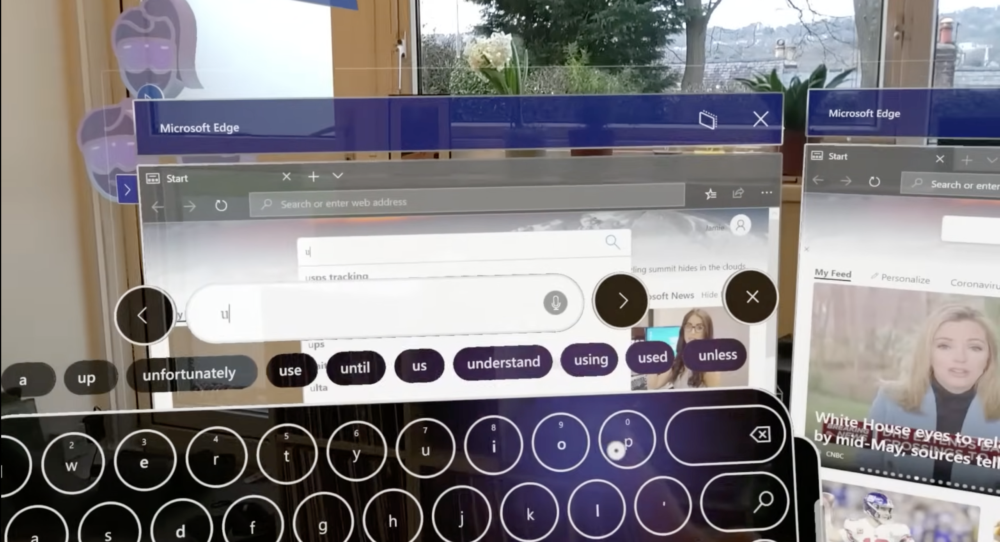

+++
title = "Vision Pro 交互的下一站"
description = "太长不看：Vision Pro 交互的下一站在拇指；而且苹果知道！"
draft = false

weight = 1

[taxonomies]
tags = ["人机交互", "苹果", "Vision Pro", "增强现实"]

[extra]
feature_image = "nice.png"
feature = true
+++

**“Apple Vision Pro 交互的下一站在哪里？”**

很多人应该或多或少想过这同一个问题，我思考这个问题的起因是，前两天我在看 Apple Vision Pro 的第一批上手视频，里面说到两个痛点：

1. AVP 里虚拟键盘很不方便，日常使用最多输入密码。经常需要打字，推荐入手 Magic Keyboard 和 Magic Trackpad

2. AVP 需要用户时刻精准注视着想要交互的 UI（例如按钮、开关）才能用手势来操作 UI，也就意味着盲操鼠标的体验一去不复返了

作为最早体验 HoloLens 1 和 HoloLens 2 的一批人，我觉得这两个问题似曾相识。如果苹果不想重蹈覆辙，Vision Pro 应该做得更好才对。

> 诶等下，你可能会说，先问有没有，再问怎么办

确实，Vision Pro 在交互上下了非常大的力气，我们有目共睹，可是，我的看法是：Vision Pro
的交互做得还不够好，至少不是颠覆思维的好，不是从按键转向触摸屏的好。但是Vision Pro
交互的下一站往哪里走？我觉得苹果即使不知道标准答案，但也有方向了。方向就在我们的大拇指上。

## 回顾历史：MR/AR 的按键机

我觉得 MR/AR 的按键机毫无疑问是 HoloLens 1 和 HoloLens 2。我没有看不起大家（这两台和微软）的意思，毕竟我在实验室里玩过
HoloLens 1，也用了我一个学期的奖学金买了 HoloLens 2。

HoloLens 1 的基本人机交互很简单：光标是一直处于 AR 视野的正中间，而窗口是悬浮在世界坐标系里的。你可以把 HoloLens 1
的光标当成瞄准镜的准心。而如果你要和 UI 交互，例如点击一个悬浮窗口里的按钮，你要先转动你的头，把 “准心”
瞄准按钮，然后拇指和食指相捏，手势识别成功，你的指令就“发射”了。

在 2015 年，这样的设计情有可原。毕竟，眼球追踪还需要一个大盒子，塞不进头显。而当时，手势识别的准确率也是聊胜于无。这种交互体验，大部分人用了半个小时，就要骂骂咧咧了。

> 截图出处：https://youtu.be/4DbppcFIDMw?si=k5MzlMTN7aMRkJTT&t=320

HoloLens 2 大改了人机交互，定位光标的方法变成了眼球追踪、虚拟光线或者手部追踪三选一。受限于当时的硬件，眼球追踪在 HoloLens
2上也是聊胜于无。根据虚拟物体远近的不同，你可以直接用手，或者虚拟光线和虚拟物体交互。在触手可及的地方，你可以用手点击、拖拽物体；在更远的地方，你可以把自己想象成蜘蛛侠，手掌根部会发出一道光线。光线会击中物体，这个时候，你可以做出双指点击或者轻捏的手势，隔空取物就完成了。

> 图片来源：https://learn.microsoft.com/en-us/dynamics365/mixed-reality/guides/authoring-gestures-hl2

伸手交互非常自然，几乎没有学习成本，但是虚拟光线的体验就非常骨感了。简单来说，你可以想象一下，你用双手的食指和拇指各捏着一根长竹竿，想要操控两三米之外的触控屏。

> 截图出处：https://youtu.be/t0q8vWLjkyo?si=hbxSfwJuMbnjo1mI

## Vision Pro 没有做到触控屏革命

那么，Vision Pro 属于以上两种的哪一种呢？

我们可以看到，Vision Pro 其实是在两种方案中取长补短。光标是用眼球追踪来定位的，而且眼球追踪非常精确；手部追踪也非常精准，你可以伸手操控物体，但是操作远处的物体，你需要看准交互定位点（例如右下角的拉伸
UI）然后做出相应的手势。

但是，Vision Pro 解决了 HoloLens 1和 HoloLens 2 的问题吗？解决了也没完全解决：

* 移动光标现在只需要转动眼球了，再也不用转动头来定位了；但是盲操的问题没解决。

* 手部追踪识别精准而且识别范围很大；但是虚拟键盘跟 HoloLens 2 的虚拟键盘几乎一模一样，按键不方便的问题还在。

这就是我说的，Vision Pro 的交互做得还不够好，至少不是颠覆思维的好，不是从按键转向触摸屏的好。100%
精准的眼球追踪甚至注视预测也不能解决盲操的问题；完美的手部追踪也解决不了输入不方便的问题。

> 上图是 HoloLens 2 的键盘。Vision Pro 的键盘几乎一样，只是 UI 精致了不少，手部追踪准确了很多。
>
> 截图出处：https://youtu.be/t0q8vWLjkyo?si=hbxSfwJuMbnjo1mI

但是不解决这些问题，我们就需要Magic Keyboard 和 Magic Trackpad，AR/MR/XR 眼镜最多是带着 3D 显示的 iPad 或者 iPhone。

就像在按键机时代，人们说：手机不带按键，怎么发信息发邮件？还得是带上按键。那么，Vision Pro 不带上 Magic Keyboard 和 Magic
Trackpad 就不能高效输入、高效工作了吗？

我觉得苹果已经知道了，即使不知道标准答案，但也有方向了。

## 拇指革命

拇指是我们最灵活的手指，而我们也非常擅长把拇指的各种运动映射成不同的含义。想想当代最习以为常的动作，当你用拇指在玻璃屏幕上滑动时，你的期望是屏幕的内容会随着你的拇指滑动而运动。内容运动的速度可快可慢，但是这是一种映射——拇指滑动到内容运动的映射。另一个例子是手柄，手柄上最重要的拨杆是拇指来操控的，而我们在射击游戏可以很容易把拨杆的运动和人物的运动、准心的运动联系起来。这不是设计师拍脑袋想出来的，这是我们作为人的天赋。即使触摸屏革了按键机的命，我们一样是用拇指操作手机。

> CHI patterns come and go, but thumbs stay.

所以，拇指在 AR/MR/XR 时代可以做什么呢？

> 图来源：苹果专利图

两年前，我看到苹果的一项[专利](https://zhuanlan.zhihu.com/p/363122901?utm_id=0)，感觉非常激动，我想 “这 TM 才是未来！”
两年后，我再看这个专利，依然觉得非常先进，但更多的是诧异，诧异为什么 Vision Pro 没有实现这种交互方式。我猜可能还有什么技术难题，或者苹果还不急着推出？

但是未来的大方向是可以猜到的，你们也可以猜到，只需要跟我做下面的动作还有🤏🏻一点点想象力：

1. 轻轻竖着握拳，也就是拳头的空口垂直地面
2. 把大拇指叠在食指的一节上
3. 轻轻抬起大拇指，并且张开拳头，不用握紧

现在想象一下有一张画布，垂直地面，立着展示在你的眼前。画布上有圆形光标。这个时候，你想怎么移动光标？

目前在 Vision Pro 上，你可以移动注视点从而移动光标，但是，假如说我们可以通过移动拇指来操纵光标呢？拇指向上光标就向上，拇指向下滑光标就向下滑。如果有朋友熟悉
Swift 输入法，那么已经可以猜到下一步是什么了。

> 图来源：[Swift 官网](https://www.microsoft.com/en-us/swiftkey)

在 Vision Pro 上，高效的英文输入只需要拇指和平面的 Swift 输入法，不需要 3D 立体的炫酷的虚拟键盘。那中文怎么办？其实中文也可以做
Swift 输入法，或者我们还有更好玩儿的玩法？

我们有十根手指，其中两根是拇指；而中文拼音键盘有一种叫九宫格。现在看看你的双手（假设你的双手的姿势还保持着），拇指可以按到另外四根手指，那么我们是不是可以做一种二乘四宫格拼音输入法呢？双手拇指点按另外的手指的时候就是在输入对应的拼音组合。对应上
UI，人类可以非常快速地学习到这种映射，而且不需要注视。

在苹果的这项专利里，配图已经展示了拇指点按不同手指的时候可以对应不同的操作或者控制不同的 UI，所以不是苹果不知道，而是苹果没有在
Vision Pro 上实现、展示出来。

> 图来源：苹果专利图

在拇指这个方向上，我们还可以做更多有意思的探索，但是这里先挖个坑。在之后的博客里，我会写一下我改进这个专利的想法，以及我的改进在更广的视野里的意义。

## 后记

对，你问得没错，交互不仅仅只有文字的输入，那其他方面怎么办？答案我会分两部分，一部分留到[下一篇博客](@/blog/AR-CHI-Patent/index.md)，而另一个部分的答案就很简单：小朋友才做选择，大人当然是全都要。交互有很多场景，解决的方案不只有一个，为什么不能全都要呢？

## 元数据

版本：0.2.1

日期：2024-02-09

版权协议：[CC BY-SA 4.0](https://creativecommons.org/licenses/by-sa/4.0/)

### 更新日志

2024.02.11: 更新了各种示意图

2024.02.12: 更新了太长不看和英语翻译

2024.02.14: 更新了少许措辞

