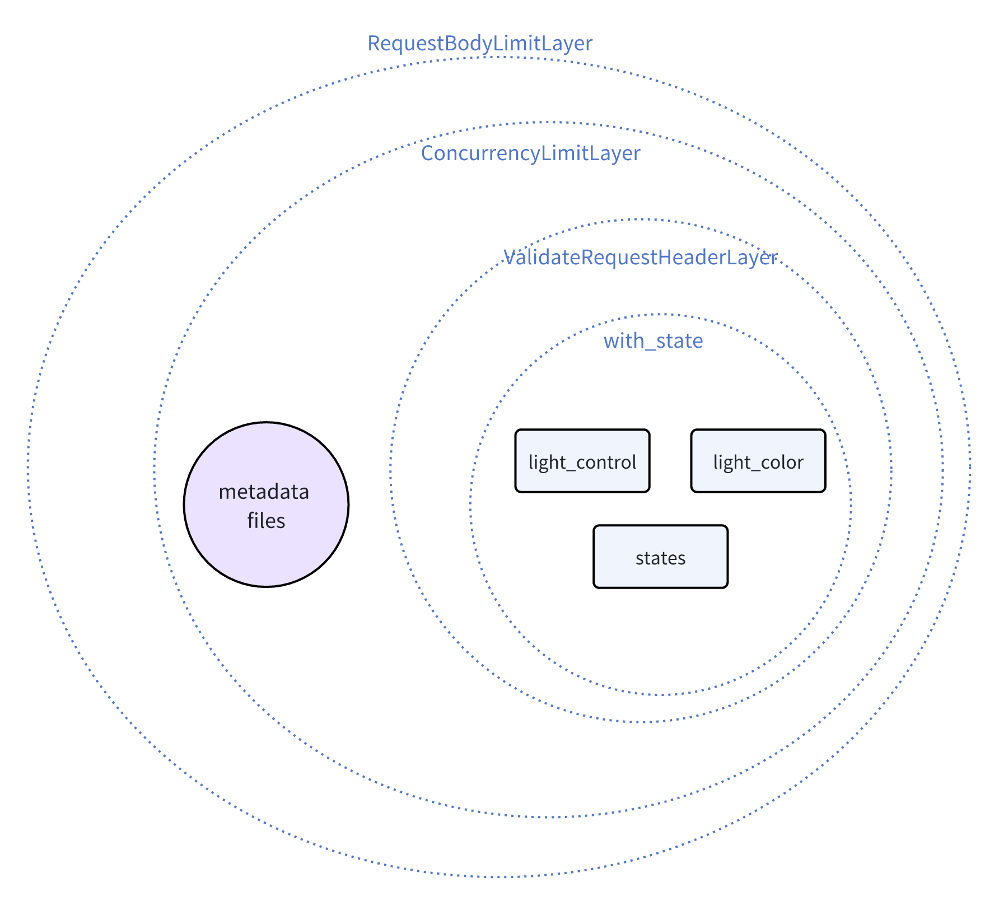

+++
title = "Writing a GPT Plugin in Rust, and Lost Gems"
description = "Writing a GPT plugin in Rust for OpenAI GPTs, LobeChat, Dify, etc., and my thoughts on Rust web development"
draft = false

weight = 5

[taxonomies]
tags = ["Rust", "Web", "OpenAI"]

[extra]
feature_image = "robot_with_gems.png"
feature = true
+++

> 中文版请见[链接](@/blog/GPT-plugin-rust-and-lost-gems/index.md)

I was playing around with [LobeChat](https://github.com/lobehub/lobe-chat) and want to write a GPT plugin, tired of Python after a long day of work.
And I recently came across this nice [introduction to Pavex](https://youtu.be/cMea6IMRk2s?si=LOfrinOI7OTXHYjA), which not only details the web backend framework itself but also some thoughts on Rust web development.
The thoughts makes quite a lot of sense to me, but I haven't tried to develop a web backend in Rust yet. It was like "yea......makes sense" but not like "I've been there!".

So, I decided to "feel the pain" and write a backend for a GPT plugin in Rust. I share my code, experience and thoughts here.

## A bit of Background

For those who are not familiar with LLMOps platforms, they are scaffolds for building Large Language Model(LLM) powered applications.
You may have seen many GPT agents on OpenAI's GPTs, which can use different tools/plugins to help people solve problems.

Quoting from [dify's README](https://github.com/langgenius/dify?tab=readme-ov-file#feature-comparison) with a few modifications:

|                 Feature                 |      Dify.AI       |  LangChain   |   Flowise    | OpenAI Assistants API / GPTs |   LobeChat   |
|:---------------------------------------:|:------------------:|:------------:|:------------:|:----------------------------:|:------------:|
|          Programming Approach           | API + App-oriented | Python Code  | App-oriented |         API-oriented         | App-oriented |
|             Supported LLMs              |    Rich Variety    | Rich Variety | Rich Variety |         OpenAI-only          | Rich Variety |
|               RAG Engine                |         ✅          |      ✅       |      ✅       |              ✅               |      ❌       |
|                  Agent                  |         ✅          |      ✅       |      ✅       |              ✅               |      ✅       |
|                Workflow                 |         ✅          |      ❌       |      ✅       |              ❌               |      ❌       |
|              Observability              |         ✅          |      ✅       |      ❌       |              ❌               |      ❌       |
| Enterprise Feature (SSO/Access control) |         ✅          |      ❌       |      ❌       |              ❌               |      ❌       |
|            Local Deployment             |         ✅          |      ✅       |      ✅       |              ❌               |      ✅       |

If you haven't heard of LLMs, try one! Say, OpenAI's ChatGPT or Anthropic's Claude.

As for GPT plugins, they are tools that can be used by LLMs. From the perspective of a software developer, they are microapps that are used by LLMs to solve problems. GPT plugins have a frontend and a backend.
The frontend is usually hosted **by** LLMOps platforms, and the backend is a web server that provides APIs for the frontend to call.

So, we not only need to write a backend for the GPT plugin, but also need to comply with the API requirements of LLMOps platforms so that the frontend of them can call our backend.

## Features

In summary, we are going to write the following in Rust:

* A stateful backend
    * A RESTful API
    * Basic access control
* Metadata for LLMOps platforms
    * Plugin name, description, etc.

These are intentionally left out to reduce code complexity and cognitive load:

* A customized frontend for use in LobeChat
* Complex access control
* Complex data persistence
* Auto generated OpenAPI documentation: see [Aide](https://crates.io/crates/aide) for this
* Advanced tracing features

The only prerequisite is basic understanding of HTTP requests. If you want to actually deploy the code, you will also need a public IP and a domain.

In the end, I will share with you the code as the template for your own GPT plugin backend.

## Use Case: Light Control

The example has a simple use case, i.e., light control. We'd like GPT to be able to control a light for us. Kind of like "Javis, turn on the light for me".

More precisely, we want GPT to be able to:

* Check the status of a light, including:
    * Whether it is on or off
    * The color of the light
* Turn on and off the light
* Change the color of the light

These easily map to the following RESTful API endpoints:

* `GET /states`: Get the status of the light
* `POST /light_control`: Turn on or off the light
* `POST /light_color`: Change the color of the light

## Open API

Without actually diving into the code, we also need some metadata that are needed for LLMOps platforms to recognize our plugin. These are:

* OpenAPI specification: essentially a valid `openapi.yaml` or `openapi.json` file
* (For LobeChat) Assets and metadata of the plugin:
    * Logo: an image file
    * Legal information: a text file
    * A special `ai-plugin.json`, which we will see later

So, in addition to the functional routes, we also need routes for these metadata:

* `GET /openapi.json`: Get the OpenAPI specification
* `GET /logo.png`: Get the logo
* `GET /legal`: Get the legal information
* `GET /.well-known/ai-plugin.json`: Get the special `ai-plugin.json`
    * This path follows an old convention, but you can use any path you like

For `openapi.json`, the specification file details the input, output, errors, authorization, etc., for your APIs. If you don't know every detail of the specification, it's fine. You can just ask ChatGPT or Github Copilot to help you. 
I copied `src/control.rs`, `src/states.rs` and `src/main.rs` to ChatGPT, and asked 
```text
Please based on the above files, write a openapi.json for me for "/light_control", "/light_color" and "/states". 
You should include error codes and necessary bearer authorization.
```

Noteworthy is that ChatGPT won't usually write `description` field of a parameter for you, but it is necessary for LLMOps platforms to provide a better context for LLMs to understand the API. 
Here is an example from a snippet.
```text
        "properties": {
          "action": {
            "type": "string",
            "description": "The action to perform to control the light power state", // This is necessary
            "enum": [
              "TurnOn",
              "TurnOff"
            ]
          }
        }
```

As for `ai-plugin.json`, it contains metadata of the plugin as shown below, which is self-explanatory:

```json
{
  "schema_version": "v1",
  "name_for_human": "Light Control System",
  "name_for_model": "Light Control System",
  "description_for_human": "Control a light in your home",
  "description_for_model": "Control a light in the user's home",
  "auth": {
    "type": "service_http",
    "authorization_type": "bearer",
    "verification_tokens": {
      "openai": "leave_this_empty_or_anything, value not checked"
    }
  },
  "api": {
    "type": "openapi",
    "url": "http://localhost:12345/openapi.json" // TODO: Replace with the actual URL of the OpenAPI spec
  },
  "logo_url": "http://localhost:12345/logo.png", // TODO: Replace with the actual URL of the logo
  "contact_email": "fl@reify.ing",  // TODO: Replace with the actual contact email
  "legal_info_url": "http://localhost:12345/legal"  // TODO: Replace with the actual URL of the legal information
}
```

## Code time

Now that we have the big picture, let's start coding!

### Backend Stack

Useless you want to dig into the networking stack, we need a framework to help us with the backend. I chose [axum](https://github.com/tokio-rs/axum) for random reasons. You can choose any other framework you like.

> When I thought of a backend framework, the first came to my mind is [Hyper](https://github.com/hyperium/hyper) for reasons that are only known to my random neuron activations. In its README, `axum` and `warp` are recommended.
> `axum` feels similar for me, who previously got use to simple `Flask`. So I picked `axum`.

So the first dependencies are:

```toml
# in Cargo.toml
[dependencies]
# Async runtime
tokio = { version = "1", features = ["full"] }
# Web framework
axum = "0.7"
```

These seem sufficient for our backend (for now).

### States

The first thing is to define states of the light. We use the following structs:

```rust
// in src/states.rs
use serde::{Deserialize, Serialize};

#[derive(Debug, Clone, Copy, PartialEq, Eq, Serialize, Deserialize)]
pub enum LightColor {
    Red,
    Green,
    Blue,
    White,
}

#[derive(Debug, Clone, Copy, PartialEq, Eq, Serialize, Deserialize)]
pub enum LightStatus {
    On,
    Off,
}

#[derive(Debug, Clone, Copy, PartialEq, Eq, Serialize, Deserialize)]
pub struct LightStates {
    pub color: LightColor,
    pub status: LightStatus,
}

impl Default for LightStates {
    fn default() -> Self {
        LightStates {
            color: LightColor::White,
            status: LightStatus::Off,
        }
    }
}
```

Since we need to serialize the states to JSON, we derive `Serialize` and `Deserialize` from `serde` for them. So, we need to add `serde` and `serde_json` to our dependencies:

```toml
# in Cargo.toml
[dependencies]
# ...
# For serialization
serde = { version = "1.0", features = ["derive"] }
serde_json = "1"
```

### Requests

We'd better also define the actions that can be taken on the light and the requests that can be sent to the server:

```rust
// in src/control.rs
use serde::{Deserialize, Serialize};

#[derive(Debug, Clone, Copy, Serialize, Deserialize)]
pub enum ColorAction {
    ToRed,
    ToGreen,
    ToBlue,
    ToWhite,
    Reset,
}

#[derive(Debug, Clone, Copy, Serialize, Deserialize)]
pub struct LightColorRequest {
    pub action: ColorAction,
}

#[derive(Debug, Clone, Copy, Serialize, Deserialize)]
pub enum LightAction {
    TurnOn,
    TurnOff,
}

#[derive(Debug, Clone, Copy, Serialize, Deserialize)]
pub struct LightControlRequest {
    pub action: LightAction,
}
```

### Handlers

For each route, we need a handler to process the request and return a response. In `axum`, simple handlers can be async functions that have certain arguments and return types.

Here is a simple handler for the `GET /states` route:

```rust
// in src/states.rs
use axum::extract::State;
use axum::Json;
use crate::utils::SharedLightStates;

// ... previous code

pub async fn light_states(State(states): State<SharedLightStates>) -> Json<LightStates> {
    Json(states.read().await.clone())
}
```

The `SharedLightStates` is defined in `src/utils.rs`:

```rust
// in src/utils.rs
use std::sync::Arc;
use tokio::sync::RwLock;

pub type SharedLightStates = Arc<RwLock<LightStates>>;
```

`SharedLightStates` provides shared states for all server handlers that **need** to access the states. It is a `RwLock` wrapped in an `Arc` to make it thread-safe and shareable.

But how can a handler claim the need for the states? This is done by the `State` extractor in `axum` as shown in the argument type of the handler, i.e., `State<SharedLightStates>`.

As for `-> Json<LightStates>`, it means the handler returns a JSON response with the light states. The object will be automatically serialized to JSON by `axum`.

Below we implement the handlers for `POST /light_control` and `POST /light_color`:

```rust
// in src/control.rs
use axum::extract::State;
use axum::Json;
use crate::states::{LightColor, LightStatus};
use crate::utils::SharedLightStates;

pub async fn handle_light_color_request(State(states): State<SharedLightStates>,
                                        Json(request): Json<LightColorRequest>) -> String {
    let mut state = states.write().await;
    match request.action {
        ColorAction::ToRed => {
            state.color = LightColor::Red;
            "Light color set to red".to_string()
        }
        ColorAction::ToGreen => {
            state.color = LightColor::Green;
            "Light color set to green".to_string()
        }
        ColorAction::ToBlue => {
            state.color = LightColor::Blue;
            "Light color set to blue".to_string()
        }
        ColorAction::ToWhite => {
            state.color = LightColor::White;
            "Light color set to white".to_string()
        }
        ColorAction::Reset => {
            state.color = LightColor::White;
            "Light color reset to white".to_string()
        }
    }
}

pub async fn handle_light_control_request(State(states): State<SharedLightStates>,
                                          Json(request): Json<LightControlRequest>) -> String {
    let state = states.read().await; // read first
    let status = state.status;
    drop(state);  // release the lock to avoid deadlock later
    match (request.action, status) {
        (LightAction::TurnOn, LightStatus::On) => "The light is already on".to_string(),
        (LightAction::TurnOff, LightStatus::Off) => "The light is already off".to_string(),
        (LightAction::TurnOn, LightStatus::Off) => {
            let mut state = states.write().await;
            state.status = LightStatus::On;
            "Light turned on".to_string()
        }
        (LightAction::TurnOff, LightStatus::On) => {
            let mut state = states.write().await;
            state.status = LightStatus::Off;
            "Light turned off".to_string()
        }
    }
}
```

Note that `Json` is also used to extract the request JSON body from the request and parse it into the corresponding struct with proper validation.
When a client sends a non-JSON request, the server will return a 400 Bad Request error.

### Main Function

Now we can put everything together in the `main` function. The main function constructs the shared states, binds the routes to the handlers, set up signal handler for graceful shutdown, and starts the server.

```rust
// in src/main.rs
use std::sync::Arc;
use axum::http::Method;
use axum::Router;
use axum::routing::{get, post};
use clap::Parser;
use tokio::net::TcpListener;
use tokio::sync::RwLock;
use crate::states::light_states;
use crate::utils::{Args, get_or_default_light_states, handle_signal};
use crate::control::{handle_light_color_request, handle_light_control_request};

mod utils;
mod control;
mod states;

async fn legal_info() -> &'static str {
    "This is a sample server for the GPT Plugin tutorial"
}

#[tokio::main]
async fn main() {
    let args = Args::parse();
    let shared_light_states = Arc::new(RwLock::new(get_or_default_light_states().await));
    let app = Router::new()
        .route("/light_color", post(handle_light_color_request))
        .route("/light_control", post(handle_light_control_request))
        .route("/states", get(light_states))
        .with_state(shared_light_states.clone()) // for routes that need shared light states
        .route("/legal", get(legal_info));

    let listener = TcpListener::bind(format!("0.0.0.0:{}", args.port)).await.unwrap();
    let server = axum::serve(listener, app);
    let graceful = server.with_graceful_shutdown(handle_signal(shared_light_states));
    if let Err(e) = graceful.await {
        error!("Server error: {}", e);
    }
}
```

Of special interest is the `with_state` method, which attaches the shared states to the routes that are bound beforehand, which are `"/light_color"`, `"/light_control"`, and `"/states"` in our case. The routes that are bound after `with_state` will not have access to the shared states.

In `src/utils.rs`, we define the `Args` struct and the `get_or_default_light_states` function:

```rust
// in src/utils.rs
// ... previous code

use clap::Parser;

const LIGHT_STATES_FILE_PATH: &str = "./storage/light_states.json";

#[derive(Parser, Debug)]
#[command(version, about)]
pub struct Args {
    #[arg(long, default_value_t = 12345)]
    pub port: u16,
}

pub async fn get_or_default_light_states() -> LightStates {
    match tokio::fs::read_to_string(LIGHT_STATES_FILE_PATH).await {
        Ok(json) => match serde_json::from_str(&json) {
            Ok(states) => return states,
            Err(e) => todo!("warning")
        }
        Err(e) => todo!("warning")
    }
    return LightStates::default();
}

pub async fn handle_signal(shared_light_states: SharedLightStates) {
    if let Err(e) = tokio::signal::ctrl_c().await {
        todo!("warning");
    } else {
        let states = shared_light_states.read().await;
        let json = serde_json::to_string(&*states).unwrap();
        match tokio::fs::write(LIGHT_STATES_FILE_PATH, json).await {
            Ok(_) => (), // do nothing for now
            Err(e) => todo!("warning"),
        }
    }
}
```

In the signal handler, we save the states to a file when the server is shut down. This is to ensure that the states are not lost when the server is restarted.

Note that you can also run the server without `with_graceful_shutdown`, but when you press `Ctrl+C`, even if the server is not stateful, no data loss in shutdown, the program will exit with a non-zero code, which annoyed me a lot.

### Serving Files

As mentioned before, we need to serve metadata files for LLMOps platforms. For legal information, we for now don't need a lawyer, so we just return a dummy string as in the `legal_info` function. But for other metadata, we do need to serve files.

So, how can we serve files _in an `axum` handler_? This seems to be a right question to ask, but it turns out that the answer to this very question is just complicated. Try search yourself or ask the same question to ChatGPT.
I did before, and I got a very lengthy answer, which felt not right for me. In retrospect, in a sense, I asked a wrong question, but it's not my fault.

Skipping my research, here is a simple answer that feels just right for me:

```rust
// in src/main.rs
use tower_http::services::ServeFile;
use axum::routing::get_service;

#[tokio::main]
async fn main() {
    // ... previous code
    let app = Router::new()
        .route("/light_color", post(handle_light_color_request))
        .route("/light_control", post(handle_light_control_request))
        .route("/states", get(light_states))
        .with_state(shared_light_states.clone()) // for routes that need shared light states
        .route("/legal", get(legal_info))
        // serving files
        .route("/logo.png", get_service(ServeFile::new("src/backend/metadata_files/logo.png")))
        .route("/openapi.json", get_service(ServeFile::new("src/backend/metadata_files/openapi.json")))
        .route("/.well-known/ai-plugin.json", get_service(ServeFile::new("src/backend/metadata_files/ai-plugin.json")));
    
    // ... previous code
}
```

`axum` is built on top of `tower`, which is a powerful library for building network services. So you can use many `tower` components with `axum`. `tower-http` provides a `ServeFile` service that can serve files from the file system.
We just need to provide the path to the file to the `ServeFile` constructor and bind it to a route with `get_service`.

> Wait, what is a service in `tower` or `axum` anyway?

### Basic Access Control, Security, and Middlewares

Since this plugin controls a light in your house, you may want to add some basic access control. Beside, you should be aware of some basic security issues to keep your server functioning when you publish an API on the internet, like Denial of Service (DoS) attacks.

So, we'd like to add some middlewares to protect our server with protection like:

* Authorization: only allow requests with a valid token in the `Authorization` header to access the server
* Request Body Size Limit: limit the size of the request body to prevent DoS attacks that blow up the server's memory
* Concurrent Request Limit: limit the number of concurrent requests to prevent DoS attacks that exhaust the server's resources
* (Optional) if you have a million-dollar light or a million-dollar server, consult a security expert!

> **Wooa, what's a middleware?**
>
> Middlewares are middlemans that can intercept requests and responses. They can modify the requests and responses, or do some other things like logging, authentication, etc.
>
> In this simple example, you don't have to use middlewares if you'd like to do authorization, request body size limit, etc. in the handlers. But in a real-world application, middlewares can help you reuse the code and keep your codebase clean.

OK, then, how can we write a middleware in `axum`? _Wrong_ question again! If you ask this question to ChatGPT, you will again get a very lengthy answer.
For newcomers, sometimes asking where to find what we need is more productive than asking how to implement what we need. It turns out that we have these middlewares we need somewhere else other than in `axum`.

After a bit of research, I found in `tower` and `tower-http`, we have:

* `tower::limit::ConcurrencyLimitLayer` for concurrent request limiting
* `tower_http::limit::RequestBodyLimitLayer` for request body size limiting
* `tower_http::validate_request::ValidateRequestHeaderLayer` for validating request headers

With these, we wrap layers of middlewares around the handlers:

```rust
use tower_http::validate_request::ValidateRequestHeaderLayer;
use tower_http::limit::RequestBodyLimitLayer;
use tower::limit::ConcurrencyLimitLayer;

#[tokio::main]
async fn main() {
    // ... previous code
    let app = Router::new()
        .route("/light_color", post(handle_light_color_request))
        .route("/light_control", post(handle_light_control_request))
        .route("/states", get(light_states))
        .with_state(shared_light_states.clone()) // for routes that need shared light states
        .layer(ValidateRequestHeaderLayer::bearer(AUTH_STR)) // for routes that require authorization, simple bearer checking
        .route("/legal", get(legal_info))
        // serving files
        .route("/logo.png", get_service(ServeFile::new("src/backend/metadata_files/logo.png")))
        .route("/openapi.json", get_service(ServeFile::new("src/backend/metadata_files/openapi.json")))
        .route("/.well-known/ai-plugin.json", get_service(ServeFile::new("src/backend/metadata_files/ai-plugin.json")))
        // for all routes, simple defense against DoS attacks
        .layer(ConcurrencyLimitLayer::new(128))
        .layer(RequestBodyLimitLayer::new(1024 * 1024)); // 1MB
    
    // ... previous code
}
```

The order of the layers **matters**. The layer that is applied last is the first to intercept the request and the last to intercept the response, so we have an onion-like structure. Here is the visualization of the layers (including `with_state`) and handlers.



> For further details, see [the middleware documentation](https://docs.rs/axum/latest/axum/middleware/index.html) of `axum`.

> Note that `ConcurrencyLimitLayer` is per handler/service, so requests to different handlers/services are limited separately, so requests flooding to metadata files will not cause DoS attacks to the main routes.

### Misc: Cross-Origin Resource Sharing (CORS) and Tracing

We are almost done! But we need to handle CORS if we want to access the plugin server from a different domain, which is often the case. So, we need to add another layer/middleware for CORS:

```rust
use tower_http::cors::{Any, CorsLayer};

#[tokio::main]
async fn main() {
    // ... previous code
    let app = Router::new()
        // ... zip
        .layer(CorsLayer::new()
            .allow_methods([Method::GET, Method::POST])
            .allow_origin(Any)); 
    
    // ... previous code
}
```

With the aforementioned protective middlewares, dubious, malicious or wrong requests will be blocked. Also recall that `axum::Json` as a response extractor and parser will return a 400 Bad Request error when the request body is not a valid JSON.
These blocking behaviors are by default silent, so you may want to add some logging to know what's happening. To do that, instead of conventional logging, we need tracing.

> **Why tracing?**
>
> The answer can go lengthy. For details, please see [the documentation of crate `tracing`](https://docs.rs/tracing/latest/tracing/). For me as a newbie, the practical reason is that we have better and convenient utilities.
> Without diving into details, you can consider tracing as advanced logging.

To do `tracing`, we need to add the following dependencies:

```toml
# in Cargo.toml
[dependencies]
# For tracing
tracing = "0.1"
tracing-subscriber = "0.3"
```

`tracing` defines the interfaces while `tracing-subscriber` provides the implementation that subscribes to the tracing events and logs them.

Then, we can add tracing to our server:

```rust
// in src/main.rs
#[tokio::main]
async fn main() {
    // ... previous code
    
    tracing_subscriber::fmt().with_max_level(Level::DEBUG).init(); // NEW: init tracing_subscriber
    let app = Router::new()
        // ... zip
        .layer(TraceLayer::new_for_http()); // NEW: add tracing layer
        
    // ... previous code
}
```

This initializes the tracing subscriber with the `fmt` formatter and sets the maximum log level to `DEBUG`. The `TraceLayer` is added to the `app` to trace the HTTP requests and responses. You will see what requests are blocked and returned status codes.

If you'd like to log arguments that are passed to the handlers, one convenient way is to use the `tracing::instrument` macro:

```rust
// in src/control.rs
use tracing::instrument;

#[instrument]
pub async fn handle_light_control_request(State(states): State<SharedLightStates>,
                                          Json(request): Json<LightControlRequest>) -> String {
    // ... zip
}
```

Now you can see the supplied states and incoming requests of `handle_light_control_request` in the logs.

### Source Code

The complete source code is available on [GitHub](https://github.com/ifsheldon/gpt_plugin_template_rs). That completes the tutorial for writing a GPT plugin backend in Rust.

## Lost Gems

In my experience and in retrospect, I feel like I was digging into icebergs that have interconnected portals and collecting gems that are lost in the icebergs. `axum` is great, but I don't think it's self-contained enough.
When I started from `axum`, sometimes I stepped into `tower` and then sometimes I got ported to `tower-http`. These, as individual crates, are great, but they are gigantic icebergs to newbies like me.
If you tried to depth-first search my references when reading this walkthrough, you would share my feelings.

ChatGPT was not so helpful, not only because it gave answers based on staled knowledge, but also because it didn't correct my "wrong" questions. It told me how to dig deeper, but actually on the surface of another iceberg, there's a gem I need.

My experience echos with the lecturer of [introduction to Pavex](https://youtu.be/cMea6IMRk2s?si=LOfrinOI7OTXHYjA). Loosely coupled components are great, but to expand the user base of Rust Web Development, we need to rethink web development experience in Rust.

I hope the gems I collected in this walkthrough can help you not only build a GPT plugin backend in Rust, but also navigate the icebergs to bootstrap bigger ideas.

## Metadata

Version: 0.0.1

Date: 2024.05.06

License: [CC BY-SA 4.0](https://creativecommons.org/licenses/by-sa/4.0/)

