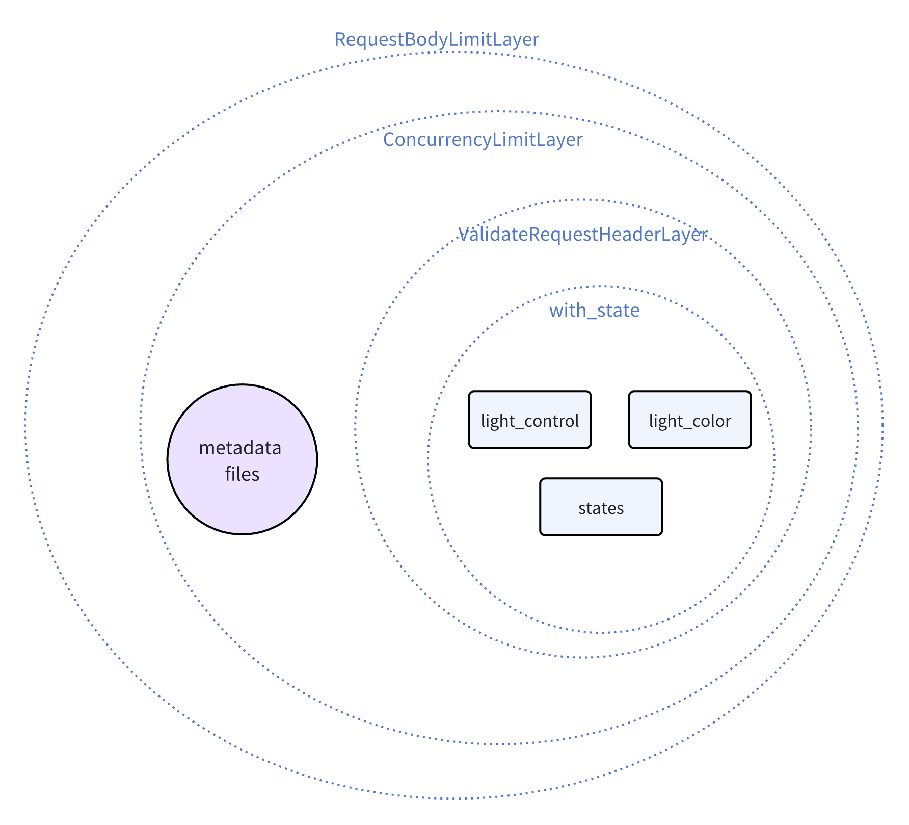

+++
title = "用 Rust 写 GPT 插件后端，还有一些遗珠"
description = "用 Rust 写 GPT 插件后端，适配 OpenAI GPTs，LobeChat 和 Dify，还有我的一点感想"
draft = false

weight = 5

[taxonomies]
tags = ["Rust", "Web", "OpenAI"]

[extra]
feature_image = "robot_with_gems.png"
feature = true
+++

我最近在玩 [LobeChat](https://github.com/lobehub/lobe-chat)，想写一个 GPT 插件。但是工作了一整天后对 Python 有些厌倦，所以不想用 Python 写。恰好最近看到了一个关于 Pavex 的很好的[介绍](https://youtu.be/cMea6IMRk2s?si=LOfrinOI7OTXHYjA)，不仅详细介绍了这个 Web 后端框架本身，还有一些关于 Rust Web 开发的思考。
这些思考对我来说很有启发，只是我还没有尝试用 Rust 开发过 Web 后端。我听完的感觉就像是“嗯……有道理”，但并不是那种 “我懂你！”的心情。

所以，我决定亲身踩一下坑，用 Rust 写一个 GPT 插件的后端，并且分享一下代码、经验和想法。

## 背景简介

对于那些不熟悉 LLMOps 平台的人来说，它们是脚手架，用于构建大型语言模型（LLM）驱动的应用程序。
你可能在 OpenAI 的 GPTs 上看到过许多 GPT 智能体，它们可以使用不同的工具/插件来帮助人们解决问题。

下表引用自 [dify 的 README](https://github.com/langgenius/dify?tab=readme-ov-file#feature-comparison) 并稍作修改：

|       特性       |  Dify.AI   | LangChain | Flowise | OpenAI 助手 API / GPTs | LobeChat |
|:--------------:|:----------:|:---------:|:-------:|:--------------------:|:--------:|
|      编程方式      | API + 应用导向 | Python 代码 |  应用导向   |        API 导向        |   应用导向   |
|    支持的 LLM     |     各种     |    各种     |   各种    |      仅限 OpenAI       |    各种    |
|     RAG 引擎     |     ✅      |     ✅     |    ✅    |          ✅           |    ❌     |
|       代理       |     ✅      |     ✅     |    ✅    |          ✅           |    ✅     |
|      工作流       |     ✅      |     ❌     |    ✅    |          ❌           |    ❌     |
|      可观察性      |     ✅      |     ✅     |    ❌    |          ❌           |    ❌     |
| 企业功能（SSO/访问控制） |     ✅      |     ❌     |    ❌    |          ❌           |    ❌     |
|      本地部署      |     ✅      |     ✅     |    ✅    |          ❌           |    ✅     |

如果你还没有听说过 LLM，可以去试试！比如 OpenAI 的 ChatGPT 或 Anthropic 的 Claude。

至于 GPT 插件，它们是 LLM 可以使用的工具。从软件开发者的角度看，它们是由 LLM 用来解决问题的微应用。GPT 插件有前端和后端。
前端通常由 LLMOps 平台托管，后端是一个提供 API 的 Web 服务器。

因此，我们不仅需要为 GPT 插件编写后端，还需要遵守 LLMOps 平台的 API 要求，以便它们的前端可以调用我们的后端。

## 功能

总结来说，我们将用 Rust 编写以下内容：

* 一个有状态的后端
    * 一个 RESTful API
    * 基本访问控制
* LLMOps 平台的元数据
    * 插件名称、描述等

为了减少代码复杂性和认知负担，下面这些就省略了：

* 适配 LobeChat 的个性化前端
* 复杂的访问控制
* 复杂的数据保存机制
* OpenAPI 文档自动生成：见 [Aide](https://crates.io/crates/aide)
* 高级日志/追踪功能

唯一的要求是对 HTTP 请求有基本的了解。如果想实际部署代码，你还需要一个公共 IP 和一个域名。

最后，代码会开源，可以作为模板，开发你自己的 GPT 插件的后端。

## 用例：灯光控制

这个例子很简单，就是灯光控制。我们想让 GPT 可以控制一盏灯。类似“贾维斯，帮我打开灯”这种。

准确地说，我们希望 GPT 能够：

* 检查灯的状态，包括：
    * 它是开着还是关着
    * 灯的颜色
* 打开和关闭灯
* 改变灯的颜色

这些要求很容易转化成以下 RESTful API 端点：

* `GET /states`：获取灯的状态
* `POST /light_control`：打开或关闭灯
* `POST /light_color`：更改灯的颜色

## OpenAPI

在实际深入代码之前，我们还需要一些元数据，这些元数据是 LLMOps 平台识别我们插件需要的，包括：

* OpenAPI 规范：本质上是一个合规范的 `openapi.yaml` 或 `openapi.json` 文件
* （对于 LobeChat）插件的资产和元数据：
    * Logo：一个图像文件
    * 法律信息：一个文本文件
    * 一个特殊的 `ai-plugin.json`，我们稍后会看到

因此，除了功能性路由外，我们还需要这些元数据的路由：

* `GET /openapi.json`：获取 OpenAPI 规范
* `GET /logo.png`：获取 logo
* `GET /legal`：获取法律信息
* `GET /.well-known/ai-plugin.json`：获取特殊的 `ai-plugin.json`
    * 这个路径是一个旧惯例，你可以使用其他的路径

`openapi.json` 写了你的 API 的详细调用信息，包括路径、方法、参数、鉴权方式等。你不一定要完全掌握 OpenAPI 的规范。你可以直接问 ChatGPT 或者 Github Copilot，让它帮你写。
我复制了 `src/control.rs`， `src/states.rs` 和 `src/main.rs` 给 ChatGPT，然后问

```text
请基于上面的代码，写一个 openapi.json 文件，适用于 "/light_control", "/light_color" 和 "/states" 这三个路由。文件里记得包含错误码和必要的 bearer 验证。
```

要注意的是，ChatGPT 通常不会帮你写一个参数的 `description`，但是这个是很有必要的，可以让 LLMOps 平台提供更多的信息给 LLM 让它更好地明白怎么使用你的插件。以下是一个例子，代码片段：

```text
        "properties": {
          "action": {
            "type": "string",
            "description": "The action to perform to control the light power state", // This is necessary
            "enum": [
              "TurnOn",
              "TurnOff"
            ]
          }
        }
```

至于 `ai-plugin.json`，它写了插件的元数据，如下，意思应该比较直观

```json
{
  "schema_version": "v1",
  "name_for_human": "Light Control System",
  "name_for_model": "Light Control System",
  "description_for_human": "Control a light in your home",
  "description_for_model": "Control a light in the user's home",
  "auth": {
    "type": "service_http",
    "authorization_type": "bearer",
    "verification_tokens": {
      "openai": "随便写，只要有值就行"
    }
  },
  "api": {
    "type": "openapi",
    "url": "http://localhost:12345/openapi.json" // TODO: 替换成实际的 URL
  },
  "logo_url": "http://localhost:12345/logo.png", // TODO: 替换成实际的 URL
  "contact_email": "fl@reify.ing", // TODO: 替换成实际的邮箱
  "legal_info_url": "http://localhost:12345/legal" // TODO: 替换成实际的 URL
}
```

## 写代码

现在我们有了大概的概念，可以开始写代码了！

### 后端技术栈

除非你想深挖网络栈，我们需要一个框架来帮助我们处理后端。我随机选了 [axum](https://github.com/tokio-rs/axum)，当然你也可以选择其他框架。

> 当想到后端框架时，其实我首先想到的是 [Hyper](https://github.com/hyperium/hyper)，原因只有我的随机神经激活知道。在 README 里，它推荐了 `axum` 和 `warp`。
> `axum` 对我来说感觉很熟悉，我之前习惯了简单的 `Flask`。所以我选 `axum`。

所以，最初的依赖是：

```toml
# in Cargo.toml
[dependencies]
# 异步运行时
tokio = { version = "1", features = ["full"] }
# Web 框架
axum = "0.7"
```

这些对我们的后端来说足够了，暂时。

### 状态

首先，我们需要定义灯的状态。我们使用以下结构体：

```rust
// in src/states.rs
use serde::{Deserialize, Serialize};

#[derive(Debug, Clone, Copy, PartialEq, Eq, Serialize, Deserialize)]
pub enum LightColor {
    Red,
    Green,
    Blue,
    White,
}

#[derive(Debug, Clone, Copy, PartialEq, Eq, Serialize, Deserialize)]
pub enum LightStatus {
    On,
    Off,
}

#[derive(Debug, Clone, Copy, PartialEq, Eq, Serialize, Deserialize)]
pub struct LightStates {
    pub color: LightColor,
    pub status: LightStatus,
}

impl Default for LightStates {
    fn default() -> Self {
        LightStates {
            color: LightColor::White,
            status: LightStatus::Off,
        }
    }
}
```

由于我们需要把状态序列化为 JSON，我们要从实现 `serde` 的 `Serialize` 和 `Deserialize`。所以，要添加 `serde` 和 `serde_json` 到依赖里：

```toml
# in Cargo.toml
[dependencies]
# ...
# 用于序列化
serde = { version = "1.0", features = ["derive"] }
serde_json = "1"
```

### 请求

我们最好还是定义一下对灯进行的操作，以及可以发送到服务器的请求：

```rust
// in src/control.rs
use serde::{Deserialize, Serialize};

#[derive(Debug, Clone, Copy, Serialize, Deserialize)]
pub enum ColorAction {
    ToRed,
    ToGreen,
    ToBlue,
    ToWhite,
    Reset,
}

#[derive(Debug, Clone, Copy, Serialize, Deserialize)]
pub struct LightColorRequest {
    pub action: ColorAction,
}

#[derive(Debug, Clone, Copy, Serialize, Deserialize)]
pub enum LightAction {
    TurnOn,
    TurnOff,
}

#[derive(Debug, Clone, Copy, Serialize, Deserialize)]
pub struct LightControlRequest {
    pub action: LightAction,
}
```

### 处理程序

对于每个路由，我们要写一个处理程序来处理请求并返回响应。在 `axum` 里，简单的处理程序可以是具有特定参数和返回类型的异步函数。

这是 `GET /states` 路由的一个简单处理程序：

```rust
// in src/states.rs
use axum::extract::State;
use axum::Json;
use crate::utils::SharedLightStates;

// ... 之前的代码

pub async fn light_states(State(states): State<SharedLightStates>) -> Json<LightStates> {
    Json(states.read().await.clone())
}
```

`SharedLightStates` 在 `src/utils.rs` 中定义了：

```rust
// in src/utils.rs
use std::sync::Arc;
use tokio::sync::RwLock;

pub type SharedLightStates = Arc<RwLock<LightStates>>;
```

`SharedLightStates` 为所有需要访问状态的处理程序提供共享的状态。它是一个包装在 `Arc` 里的读写锁，线程安全、可共享。

但是处理程序怎么声明说它需要状态呢？这是通过 `axum` 中的 `State` 提取器在处理程序的参数类型中完成的，即 `State<SharedLightStates>`。

至于 `-> Json<LightStates>`，这意味着处理程序返回一个带有灯光状态的 JSON 响应。这个对象会被 `axum` 自动序列化为 JSON。

下面我们实现 `POST /light_control` 和 `POST /light_color` 的处理程序：

```rust
// in src/control.rs
use axum::extract::State;
use axum::Json;
use crate::states::{LightColor, LightStatus};
use crate::utils::SharedLightStates;

pub async fn handle_light_color_request(State(states): State<SharedLightStates>,
                                        Json(request): Json<LightColorRequest>) -> String {
    let mut state = states.write().await;
    match request.action {
        ColorAction::ToRed => {
            state.color = LightColor::Red;
            "Light color set to red".to_string()
        }
        ColorAction::ToGreen => {
            state.color = LightColor::Green;
            "Light color set to green".to_string()
        }
        ColorAction::ToBlue => {
            state.color = LightColor::Blue;
            "Light color set to blue".to_string()
        }
        ColorAction::ToWhite => {
            state.color = LightColor::White;
            "Light color set to white".to_string()
        }
        ColorAction::Reset => {
            state.color = LightColor::White;
            "Light color reset to white".to_string()
        }
    }
}

pub async fn handle_light_control_request(State(states): State<SharedLightStates>,
                                          Json(request): Json<LightControlRequest>) -> String {
    let state = states.read().await; // 先读取
    let status = state.status;
    drop(state);  // 释放锁以避免死锁
    match (request.action, status) {
        (LightAction::TurnOn, LightStatus::On) => "The light is already on".to_string(),
        (LightAction::TurnOff, LightStatus::Off) => "The light is already off".to_string(),
        (LightAction::TurnOn, LightStatus::Off) => {
            let mut state = states.write().await;
            state.status = LightStatus::On;
            "Light turned on".to_string()
        }
        (LightAction::TurnOff, LightStatus::On) => {
            let mut state = states.write().await;
            state.status = LightStatus::Off;
            "Light turned off".to_string()
        }
    }
}
```

注意，`Json` 也可以用于从请求中提取请求 JSON 正文，并把正文解析为相应的结构体，并进行验证。
当客户端发送非 JSON 请求时，服务器将返回 400 Bad Request 错误。

### 主函数

现在我们可以在 `main` 函数中把所有内容放在一起。主函数构建共享状态，把路由绑定到处理程序，设置信号处理程序以优雅地关停，然后启动服务器。

```rust
// in src/main.rs
use std::sync::Arc;
use axum::http::Method;
use axum::Router;
use axum::routing::{get, post};
use clap::Parser;
use tokio::net::TcpListener;
use tokio::sync::RwLock;
use crate::states::light_states;
use crate::utils::{Args, get_or_default_light_states, handle_signal};
use crate::control::{handle_light_color_request, handle_light_control_request};

mod utils;
mod control;
mod states;

async fn legal_info() -> &'static str {
    "This is a sample server for the GPT Plugin tutorial"
}

#[tokio::main]
async fn main() {
    let args = Args::parse();
    let shared_light_states = Arc::new(RwLock::new(get_or_default_light_states().await));
    let app = Router::new()
        .route("/light_color", post(handle_light_color_request))
        .route("/light_control", post(handle_light_control_request))
        .route("/states", get(light_states))
        .with_state(shared_light_states.clone()) // 给需要共享光状态的路由
        .route("/legal", get(legal_info));

    let listener = TcpListener::bind(format!("0.0.0.0:{}", args.port)).await.unwrap();
    let server = axum::serve(listener, app);
    let graceful = server.with_graceful_shutdown(handle_signal(shared_light_states));
    if let Err(e) = graceful.await {
        error!("Server error: {}", e);
    }
}
```

值得注意的是 `with_state` 方法，它把共享状态附加到事先绑定的路由，这些路由在我们的例子里是 `"/light_color"`、`"/light_control"` 和 `"/states"`。在 `with_state` 之后绑定的路由不能访问共享状态。

在 `src/utils.rs` 中，我们定义了 `Args` 结构和 `get_or_default_light_states` 函数：

```rust
// in src/utils.rs
// ... previous code

use clap::Parser;

const LIGHT_STATES_FILE_PATH: &str = "./storage/light_states.json";

#[derive(Parser, Debug)]
#[command(version, about)]
pub struct Args {
    #[arg(long, default_value_t = 12345)]
    pub port: u16,
}

pub async fn get_or_default_light_states() -> LightStates {
    match tokio::fs::read_to_string(LIGHT_STATES_FILE_PATH).await {
        Ok(json) => match serde_json::from_str(&json) {
            Ok(states) => return states,
            Err(e) => todo!("warning")
        }
        Err(e) => todo!("warning")
    }
    return LightStates::default();
}

pub async fn handle_signal(shared_light_states: SharedLightStates) {
    if let Err(e) = tokio::signal::ctrl_c().await {
        todo!("warning");
    } else {
        let states = shared_light_states.read().await;
        let json = serde_json::to_string(&*states).unwrap();
        match tokio::fs::write(LIGHT_STATES_FILE_PATH, json).await {
            Ok(_) => (), // 暂时不做任何事
            Err(e) => todo!("warning"),
        }
    }
}
```

在信号处理程序中，我们在服务器关闭时把状态保存到文件中。这是为了确保在服务器重新启动时状态不会丢失。

当然，你也可以在不使用 `with_graceful_shutdown` 的情况下运行服务器，但当你按下 `Ctrl+C` 时，即使服务器是无状态的、直接关闭也不会丢失数据，程序都会以非零代码退出。让我看着很不爽。

### 提供文件

上面说了，我们需要为 LLMOps 平台提供元数据文件。对于法律信息，我们现在还不需要律师，所以我们只返回一个字符串，如 `legal_info` 函数里的内容。但对于其他元数据，我们确实需要分发文件。

那么，我们怎么在 `axum` 处理程序中分发文件呢？这感觉是一个对的问题，但事实证明，这个问题的答案非常复杂。你可以尝试自己搜索或向 ChatGPT 提出相同的问题。
我之前做过，得到了一个非常长的答案，总感觉不对。事后看来，从某种意义上说，我问了错误的问题，但这不是我的锅。

跳过我的曲折，这里是感觉对头的简单答案：

```rust
// in src/main.rs
use tower_http::services::ServeFile;
use axum::routing::get_service;

#[tokio::main]
async fn main() {
    // ... previous code
    let app = Router::new()
        .route("/light_color", post(handle_light_color_request))
        .route("/light_control", post(handle_light_control_request))
        .route("/states", get(light_states))
        .with_state(shared_light_states.clone()) // 给需要共享光状态的路由
        .route("/legal", get(legal_info))
        // 分发文件
        .route("/logo.png", get_service(ServeFile::new("src/backend/metadata_files/logo.png")))
        .route("/openapi.json", get_service(ServeFile::new("src/backend/metadata_files/openapi.json")))
        .route("/.well-known/ai-plugin.json", get_service(ServeFile::new("src/backend/metadata_files/ai-plugin.json")));
    
    // ... previous code
}
```

`axum` 建立在 `tower` 的基础上，而 `tower` 是一个用于构建网络服务的库。所以，你可以在 `axum` 里用很多 `tower` 组件。`tower-http` 提供了一个 `ServeFile` 服务，可以从文件系统分发文件。
我们只要把文件的路径提供给 `ServeFile` 构造函数，然后用 `get_service` 把它绑定到路由。

> 等一下，`tower` 或 `axum` 中的服务到底是什么？

### 基本访问控制、安全性和中间件

因为这个插件控制着你家里的一盏灯，你可能想添加一些基本的访问控制。另外，当在互联网上公开一个 API 时，你应该意识到然后排除一些基本的安全隐患，保持你的服务器正常工作，比如说拒绝服务（DoS）攻击。

所以，我们添加一些中间件来保护我们的服务器，例如：

* 授权：只允许带有有效令牌的 `Authorization` 头的请求访问服务器
* 请求体大小限制：限制请求体的大小，以防止 DoS 攻击使服务器内存爆满
* 并发请求限制：限制并发请求的数量，以防止 DoS 攻击耗尽服务器资源
* （可选）如果你有价值百万美元的灯或价值百万美元的服务器，就去咨询网安专家吧

> **等下，什么是中间件？**
>
> 中间件是可以拦截请求和响应的中间人。它们可以修改请求和响应，或者做一些其他事情，如日志记录、身份验证等。
>
> 在这个简单的例子里，如果你想在处理程序中进行授权、请求体大小限制的话，你可以不用中间件。但在实际应用中，中间件可以帮你重用代码并且保持代码整洁。

OK，那我们怎么在 `axum` 中编写中间件呢？又**问错**了！如果你问 ChatGPT 这个问题，你又会得到一段非常长的答案。
对于新手来说，有时候，问去哪可以找到我们需要的东西比询问怎么实现我们需要的东西更快更有效。事实证明，除了 `axum` 之外，在其他地方，有我们需要的这些中间件。

一番查找之后，我在 `tower` 和 `tower-http` 中找到了：

* `tower::limit::ConcurrencyLimitLayer` 用于限制并发请求
* `tower_http::limit::RequestBodyLimitLayer` 用于限制请求体大小
* `tower_http::validate_request::ValidateRequestHeaderLayer` 用于验证请求头

有了这些，我们可以把处理程序包上中间件层：

```rust
use tower_http::validate_request::ValidateRequestHeaderLayer;
use tower_http::limit::RequestBodyLimitLayer;
use tower::limit::ConcurrencyLimitLayer;

const AUTH_STR: &str = "asdfghjkl_light_control";

#[tokio::main]
async fn main() {
    // ... previous code
    let app = Router::new()
        .route("/light_color", post(handle_light_color_request))
        .route("/light_control", post(handle_light_control_request))
        .route("/states", get(light_states))
        .with_state(shared_light_states.clone()) // 给需要共享光状态的路由
        .layer(ValidateRequestHeaderLayer::bearer(AUTH_STR)) // 给需要授权的路由，简单的 bearer 检查
        .route("/legal", get(legal_info))
        // 分发文件
        .route("/logo.png", get_service(ServeFile::new("src/backend/metadata_files/logo.png")))
        .route("/openapi.json", get_service(ServeFile::new("src/backend/metadata_files/openapi.json")))
        .route("/.well-known/ai-plugin.json", get_service(ServeFile::new("src/backend/metadata_files/ai-plugin.json")))
        // 给所有路由，简单的防御 DoS 攻击
        .layer(ConcurrencyLimitLayer::new(128))
        .layer(RequestBodyLimitLayer::new(1024 * 1024)); // 1MB
    
    // ... previous code
}
```

层/中间件的顺序**很重要**。最后应用的层是第一个获取请求和最后一个得到响应的层，所以我们有一个类似洋葱的结构。这里是层（包括 `with_state`）和处理程序的示意图。



> 有关详细信息，请参阅 `axum` 的[中间件文档](https://docs.rs/axum/latest/axum/middleware/index.html)。

> 请注意，`ConcurrencyLimitLayer` 是给每个处理程序/服务单独设置的，因此对不同处理程序/服务的请求是分别限制的，因此对元数据文件的恶意请求不会导致对主路由的 DoS 攻击。

### 其他：跨源资源共享（CORS）和跟踪

差不多了！但如果我们想从不同的域名访问插件服务器，这个很常见，我们要处理一下 CORS。所以，我们需要为 CORS 添加另一个层/中间件：

```rust
use tower_http::cors::{Any, CorsLayer};

#[tokio::main]
async fn main() {
    // ... previous code
    let app = Router::new()
        // ... zip
        .layer(CorsLayer::new()
            .allow_methods([Method::GET, Method::POST])
            .allow_origin(Any)); 
    
    // ... previous code
}
```

有了前面提到的保护性中间件，可疑的、恶意的或错误的请求会被阻隔。同时回想一下，`axum::Json` 作为响应提取器和解析器会在请求体不是有效 JSON 的情况直接返回 400 Bad Request 错误。
这些阻断行为默认是静默的，所以你可能想加一些日志来看到底发生了什么。为此，我们需要追踪 Tracing，而不是传统的日志记录。

> **为什么用追踪 Tracing？**
>
> 答案可能很长。有关的详细信息可以看 [`tracing` 包的文档](https://docs.rs/tracing/latest/tracing/)。对我这样的新手来说，只是因为我们有更好、更方便的工具。
> 在不赘述的情况下，你可以把追踪 Tracing 看作是高级的日志记录。

要追踪运行情况，我们要添加以下依赖：

```toml
# in Cargo.toml
[dependencies]
# 用于跟踪
tracing = "0.1"
tracing-subscriber = "0.3"
```

`tracing` 定义了接口，而 `tracing-subscriber` 提供了实现，可以订阅跟踪事件并且记录这些事件。

然后，我们可以在我们的服务器中开启追踪：

```rust
// in src/main.rs
#[tokio::main]
async fn main() {
    // ... previous code
    
    tracing_subscriber::fmt().with_max_level(Level::DEBUG).init(); // 新代码: 初始化 tracing_subscriber
    let app = Router::new()
        // ... zip
        .layer(TraceLayer::new_for_http()); // 新代码: 添加追踪层
        
    // ... previous code
}
```

这里用 `fmt` 格式化程序初始化追踪订阅者，并将最大日志级别设置为 `DEBUG`。`TraceLayer` 会添加到 `app` 中，来追踪 HTTP 请求和响应。你会看到哪些请求被阻断了，还有返回的状态码。

如果你想记录传递给处理程序的参数，一种方便的方法是用 `tracing::instrument` 宏：

```rust
// in src/control.rs
use tracing::instrument;

#[instrument]
pub async fn handle_light_control_request(State(states): State<SharedLightStates>,
                                          Json(request): Json<LightControlRequest>) -> String {
    // ... zip
}
```

现在可以在日志里看到 `handle_light_control_request` 传入的状态和请求了。

### 源代码

完整的代码可在 [GitHub](https://github.com/ifsheldon/gpt_plugin_template_rs) 上找到。用 Rust 编写 GPT 插件后端的教程就结束了。

## 找到遗珠

根据我的经验和反思，我感觉之前自己像是在挖冰山，而且还是有传送门的冰山，在冰山之间跳转，收集那些遗失在深山里的宝贝。`axum` 很好，只是我觉得它还不够完备。
当我从 `axum` 开始写，有的时候我会突然跳到 `tower` 的资料，然后有时我会传送到 `tower-http` 这个冰山上。这些作为单独的库来说都很好，但是对我这样的新手来说，它们就是一座座冰山。
如果你读这个文章的时候，试过深度优先搜索我给你的链接，你就会有同感。

这个过程里，ChatGPT 也没那么有用，不仅因为它会基于过时的知识给出答案，还因为它没有纠正我的“错误”问题。它会告诉我怎么挖得更深，但其实在另一个冰山的表面，就有我需要的宝贝。

我的经历与 [Pavex 介绍](https://youtu.be/cMea6IMRk2s?si=LOfrinOI7OTXHYjA) 里讲者的观点相呼应。松耦合的组件很好，但要拓展 Rust Web 开发的用户群，我要重新思考 Rust 的 Web 开发体验。

希望我在这次漫游中收集的宝贝不仅能帮你用 Rust 构建 GPT 插件后端，还能帮助你在冰山中导航，去实现更大的想法。

## 元数据

版本：0.0.1

日期：2024.05.06

版权协议：[CC BY-SA 4.0](https://creativecommons.org/licenses/by-sa/4.0/)


