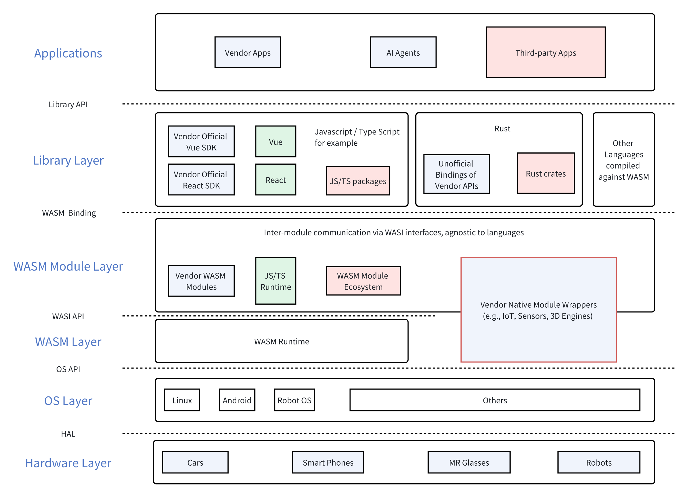
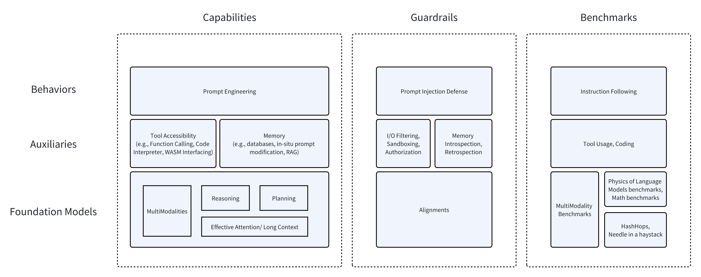

+++
title = "Thoughts on Agent Tech Stacks"
description = "In AI product development, uncertainty is the new sea. To ship a product, we swim, boat and make bridges."
draft = false

weight = 8

[taxonomies]
tags = ["AI", "Product Dev"]

[extra]
feature_image = "stack.png"
feature = true
+++

> 中文版请见[链接](@/blog/agents-stacks/index.md)

This article stems from a discussion with two friends. One friend is developing a foundational software framework for agents, enabling them to interact with various applications and be embedded within them. The other is contemplating what constitutes an agent.

## Agent Software Foundation Framework

In terms of designing and planning software foundation frameworks, the industry highly respects Apple's capabilities. However, except for a few companies that excel in vertically integrating both software and hardware, everyone knows that following Apple is a dead end.
Apple may have been late to the game in generative AI, but that hasn't denied that fact that they have been preparing the related foundational software frameworks early on.

For instance, [App Intents](https://developer.apple.com/documentation/appintents/) was originally designed to empower Spotlight and Siri, allowing app developers to provide public interfaces so that Spotlight and Siri can directly call the capabilities within the apps.
Now, with the advent of LLMs, App Intents can naturally transform into a function for Function Calling. This is a unique advantage of Siri and Apple Intelligence.

But what is the cost or the preparation work behind this advantage? It's akin to putting an elephant into a refrigerator:

1. Create a best-selling product.
2. Build an ecosystem around this product, motivating developers to contribute to it.
3. Define interoperable protocols within this ecosystem, which is essentially the second App Intents.

This perspective views the framework and ecosystem as relatively closed or fully controlled, but perhaps there's a more open (and cheaper) solution?

I think WASM and WASI offer a potential approach. More specifically, [WASI 0.2](https://bytecodealliance.org/articles/WASI-0.2) is the key.

> **What is WASM? What is WASI?**
>
> Detailed introductions can be found online, but here’s a brief overview:
>
> WASM stands for WebAssembly, which can be understood as a low-level bytecode. WASM bytecode can run on WASM runtimes, covering various OS and browsers. Many languages (such as JavaScript, Rust, Go, C/C++) can be compiled into WASM bytecode, allowing programs written in different languages to run in various environments.
>
> WASI stands for WebAssembly System Interface. In version 0.1, it defined the interface for WASM programs, runtimes, and OS interoperability. In version 0.2, it defines the interface for interaction between WASM programs. Theoretically, programs compiled with WASI 0.2 support can call each other, even if they are written in different languages.

Essentially, App Intents is an interoperability layer. Now, if we use WASI 0.2 as the interoperability layer, interactions between App, Agent, OS, and hardware can all be defined using the same interoperability layer.

Imagine a humanoid robot:

* Its facial expressions and UI are defined by an app written in React, but the app itself is compiled into a WASM module.
* When the LLM makes function calls, it calls functions defined by WASI, allowing the LLM to directly raise the robot's hand, even if the hand controller program is written in C++.
* When the robot interacts with smart home appliances, it calls WASI functions, even if the appliance control program is written in C.
* You can add a camera module to the robot, with control code written in Go.
* For the humanoid robot manufacturer, as long as all the robot's APIs are defined using WASI, developers can use any language to develop the robot.

## Agent Capability Framework

Currently, many people speak highly of agents, as if they can solve numerous problems, even AGI. However, I believe agents are just a combination of three major components:

1. Foundational Model: Capabilities may include multimodal abilities, reasoning and planning abilities, and effective attention mechanisms or long context.
2. Auxiliaries: For example, the ability to access and call various tools and APIs, as well as long-term memory, whether through database storage, in-situ modification of seen context by the model, or RAG.
3. Behavior: This is where prompt engineering comes into play.

Based on these three major components, we implement guardrails and benchmark each component:

1. Foundation Model: Various alignments and benchmarks.
    * Notably, benchmarks include [HashHop](https://github.com/magicproduct/hash-hop) and various metrics proposed by Zeyuan Allen Zhu in _Physics of Language Models_.
2. Auxiliaries:
    * For tool usage, there are various engineering safety practices (such as authorization, sandboxing, etc.) and relevant benchmarks.
    * For memory, we can directly introspect the content of the memory or allow the model to retrospect; however, benchmarks for memory seems to be still immature.
3. Behavior: Mainly to prevent prompt injection; benchmarking the ability to follow instructions.

## Metadata

Version: 0.0.1

Date: 2024.09.01

License: [CC BY-SA 4.0](https://creativecommons.org/licenses/by-sa/4.0/)

