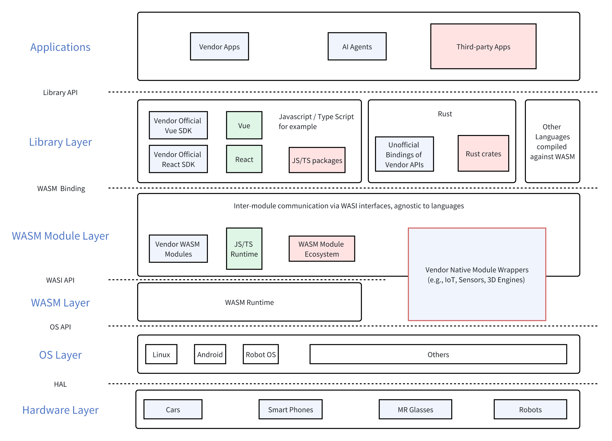

+++
title = "Agent 技术栈畅想"
description = "畅想未来的 Agent 技术栈"
draft = false

weight = 8

[taxonomies]
tags = ["LLM", "Random Thoughts"]

[extra]
feature_image = "stack.png"
feature = true
+++

这篇畅想源自和两个朋友的讨论。一个朋友在为 Agent 开发软件基础框架，让 Agent 能够跟各种应用交互，也能够嵌入到各种应用里面；而另一个朋友在思考何为 Agent。

## Agent 软件基础框架

在软件基础框架的设计、规划能力上，业内都很佩服苹果的能力，但是除了少数软硬兼备的厂商，大家都知道追随苹果的脚步是死路一条。
苹果在生成式 AI 上算是赶了个晚集，但是这不妨碍苹果起了个大早，把相关的软件基础框架都准备好了。

举个例子， [App Intents](https://developer.apple.com/documentation/appintents/) 原本是为了 Spotlight 和 Siri 赋能的，让 App 开发者提供开放的接口，这样 Spotlight 和 Siri 就可以直接调用 App 里的能力。
而现在，有了 LLM，App Intents 就很自然地可以转化为 Function Calling 的一个函数。这是 Siri 和 Apple Intelligence 的一个独特的优势。

可是优势背后的代价，或者需要的准备工作是什么呢？这和把一个大象装进冰箱差不多：

1. 造一个大卖的产品
2. 围绕这个产品，造一个生态，让开发者有动力为这个生态添砖加瓦
3. 在这个生态里，定义互通的协议，这个互通的协议就是第二个 App Intents

这是以比较封闭，或者说全权掌控的视角来看框架和生态的问题，但是没准有更加开放（而且省钱）的解法呢？

我觉得 WASM 和 WASI 是一个思路。准确来说，应该所 [WASI 0.2](https://bytecodealliance.org/articles/WASI-0.2) 是关键。

> **WASM 是什么？WASI 是什么？**
>
> 详细的介绍可以自己查，简要的概述如下：
>
> WASM 全称是 WebAssembly，可以理解为一种 Low-level 的字节码。WASM 字节码可以在 WASM 运行时上运行，覆盖了各种 OS 还有浏览器。很多语言（如 Javascript, Rust, Go, C/C++）可以编译为 WASM 字节码，这样各种语言写的程序就可以跑在各种不同的环境里。
>
> WASI 全称是 WebAssembly System Interface。在 0.1 版本里，它定义了 WASM 程序、运行时和 OS 互操作的接口；而在 0.2 版本里，它定义了 WASM 程序之间交互的接口。理论上，编译支持 WASI 0.2 的程序，它们之间可以相互调用，即使它们是用不同的语言写的。

其实 App Intents 相当于一个互操作层，而现在，如果我们把 WASI 0.2 作为互操作层，那么 App, Agent, OS 和硬件之间两两配对的交互都能够用同一个互操作层定义。

想象一下，有一个人形机器人：

* 它的脸部表情、UI 是用 React 写的 App 来定义的，但是 App 本身编译为了一个 WASM 模块
* LLM 在做函数调用的时候，调用的是 WASI 定义的函数，这样 LLM 可以让机器人直接抬起手，即使手部控制器的程序是用 C++ 写的
* 机器人和智能家电做交互的时候，调用的是 WASI 函数，即使家电的控制程序是 C 写的
* 你可以在机器人上添加一个摄像头模块，这个模块的控制代码使用 Go 写的
* 对于人形机器人生产商来说，只要把机器人所有的 API 都用 WASI 定义，这样开发者想用什么语言开发机器人都可以

## Agent 的能力框架

现在 Agent 被很多人说的神乎其神，似乎能够解决很多问题，甚至 AGI，但是我觉得 Agent 只是三个大组件的组合：

1. 基础模型：具备的能力可能有多模态能力、分析能力、推理和规划能力，以及有效的注意力机制或者说有效的长上下文
2. 周边能力：比如能够接入和调用各种工具、API，还有长时记忆，不管是数据库存储，还是模型能够直接修改它看到的上下文，还是 RAG
3. 行为定义：这个就是提示词工程需要做的事情

基于这三个大组件，我们会给每一个组件都做安全护栏以及跑分：

1. 基础模型：做各种各样的对齐，也有各种各样的跑分
    * 最值得注意的是跑分项是 [HashHop](https://github.com/magicproduct/hash-hop) 以及朱泽园在 _Physics of Language Models_ 里提出的各种指标
2. 周边能力：
    * 对于工具使用，有各种各样工程的安全实践（例如授权、沙箱等），也有各种跑分
    * 对于记忆力，我们可以直接监测记忆的内容，也可以让模型自我反省；但是似乎对于记忆力的跑分还不是很成熟
3. 行为定义：主要防范的是提示词注入；跑分测试的是遵循指令的能力

## 元数据

版本：0.0.1

日期：2024.09.01

版权协议：[CC BY-SA 4.0](https://creativecommons.org/licenses/by-sa/4.0/)

