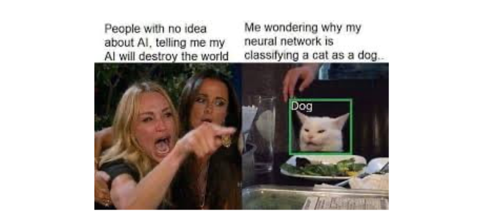
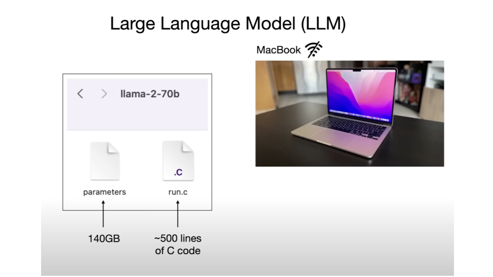
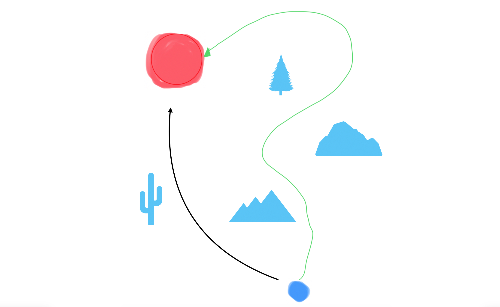

+++
title = "AI 产品开发：不确定性和新航海时代"
description = "开发AI技术和产品像是在航海、架桥，而开发基于传统技术的产品像是在开路。差别是什么呢？是不确定性。不确定性就像大海"
draft = false

weight = 7

[taxonomies]
tags = ["AI", "Product Dev"]

[extra]
feature_image = "baymax_surfing.png"
feature = true
+++

作为一个 AI 开发者也是曾经的研究者，别人经常问我的问题是“这件事 AI 能不能帮我做？”，我的回答经常是“我感觉可以，我/你要先试试”。
通常提问人听到这个回答都不太满意，要么撇撇嘴走开了，要么继续追问“你觉得这能成吗？”，我就回答“我知道方法，但是要试一下，不保证能行”。
有少数人还会继续追问“为什么别人已经做到了？”那我也只能无奈地说“你给我 20 个人，半年，我也可以做到” 这一般可以比较圆满地结束这一段对话。

上面只是自嘲，但是实际上，我想要解释的东西已经在我脑子里想了半年了，也就是“不确定性”。

AI 技术开发、产品开发中，不确定性是天然存在的，没有什么办法能够完全把不确定性去掉。
这句话很正确，但是很苍白，是正确的废话。内行的人听到了会说“哦，对啊”，外行的人会说“哦，所以呢？”。

直到今天，我想到了一个非常好的比喻，易懂又比较准确：

> 开发AI技术和产品像是在航海、架桥，而开发基于传统技术的产品像是在开路。差别是什么呢？是不确定性，不确定性就像大海。
> 很多人在理解AI原生的产品的时候，用的都是老思路。看见了桥（AI 产品），看见了桥做得有多漂亮，看见了桥上的风景（产品体验），看见了桥的终点（用户需求）。
> 这种分析看起来足够了，桥也是路（产品），路上的风景和路的终点也很重要。但是，是不是忘了什么？桥下的海。海的水温怎么样？海是平静还是汹涌？海就是 AI 本身的不确定性。

如果你需要 AI 来总结这篇文章，那不必了，上面这一段就已经足够归纳全文。如果你对这个比喻还感兴趣，那么下面我会基于这个比喻展开讲：

* 不确定性指什么
* AI 的不确定性对于产品开发意味着什么
* 生成式 AI 对于内容创作者意味着什么
* AI 的不确定性对于组织（公司、社会等等）意味着什么

> 说来也巧，最近我有三件事就和大海有关：
>
> * 一是我去看了《泳者之心》这部电影。《泳者之心》里说要绕远路借助洋流的力量才能穿越英吉利海峡，其实我觉得 AI 产品开发也是如此，后面会展开说。
>
> * 二是我去参加了暗涌公众号的一个活动。“暗涌”这个名字就起得很好，我估计原意是指“商业暗流涌动”的意思；但是在 AI 时代，暗流涌动的不仅仅是商业，商业落地时，也要面对暗流涌动的不确定性之海。后面我会展开说，如何在不确定性中寻找确定性，不至于刻舟求剑。
>
> * 三是最近深中通道通车，我在地图上看到了深中通道和粤港澳大桥，都是用高超的工程技术，在大海中搭出了稳固的路。
>

> 防杠：对于内行人，我再说多一句。本文里说的 AI 默认都是指基于深度学习的 AI 模型，不指代传统机器学习模型或者基于规则的模型。

## 什么是不确定性

在我们开始将不确定性从哪里来之前，我们先要定义好“不确定性”到底指什么。

相信用过 GPT 的同学都发现了：不一样的输入，GPT 的回答在字面上常常是不同的。而就算问一模一样的问题，GPT 给的回复都不一定是一模一样的。虽然它回答的主要意思可能大差不差，但是用词会稍稍改变。
而熟悉 Stable Diffusion 的同学也应该经常遇到类似的情况。同一段提示词，出来的图片就不会是像素级相同的，有可能是局部曲线变了一点，也有可能是整张图的构图、色彩都变了。
这是一种不确定性，姑且叫做 “生成随机性”。

另一种不确定性会更加微妙一点：AI 的理解和人的理解不一定是对齐的。这种我叫“语义潜在偏差”，大白话就是“不在同一个频道上”。

举个例子，最近有一个问题比较火 “9.11 和 9.8 哪个更大”。 很多人拿这个问题问不同的大模型，发现对于这么简单的问题，很多大模型竟然答“错”了，也就是回答 “9.11 比 9.8 更大”。
有的人发现，对于同一个大模型，问两次可能就有正确和错误的两种答案，这种属于上文的生成随机性。
而有的人问 GPT 这样答的原因，发现 GPT 把这两个数字当成了版本号。在语义化版本规范（Semantic Versioning）里，9.11 确实是要比 9.8 更大的（指版本比较新）。这种是误会，只要跟 GPT 说清楚我们要比较纯数字，它也能得出正确的答案。

另一个例子是，在计算机视觉里，对图片做人眼分辨不出的改动，就可能把 AI 的判断完全颠覆，比如说把猫识别成狗。当然也有更加危险的例子，有自动驾驶的研究发现，在雪糕筒上打印特殊的符号，就可能让自动驾驶 AI 忽略这些障碍物。这些研究统称为 Adversarial Attack

> 图中的问题可能是源于 Adversarial Attack，也可能是下文说的第三种情况

最后一个例子是最近的一项研究，[Vision language models are blind](http://www.arxiv.org/abs/2407.06581)，说明 GPT-4 类似的多模态大模型不一定看到了我们想让它们看到的事物，是“盲”的，仅仅是基于它们模糊的感知来猜测答案。

语义潜在偏差这种不确定性会引申出一个非常难回答的问题——如果 AI 和人的感知、理解可能是不一样的，那么我们怎么去相信它们的回答呢？

> 这个问题其实和 “人与人之间会有真正的相互理解吗” 也没什么区别。以实用主义的角度看，就像那句话：“还能怎么着？将就着过呗！”

第三种不确定性是让无数 AI 研究员掉头发的，我称之为“挖井难题”。上文两种不确定性发生在 AI 产品开发的推理/部署阶段，也就是 AI 训练完成了，在使用阶段有不确定性；然而挖井难题发生在 AI 的训练阶段，在于 “怎么样设计、训练 AI 让它实现我们的需求”。

在 Andrej Karpathy 的 [Intro to Large Language Models](https://www.youtube.com/watch?v=zjkBMFhNj_g&t=159s) 里，他说了一句非常有名的话: "(LLM is) only these two files" 大语言模型就只是两个文件而已。

这两个文件，一个是模型的结构（怎么设计 AI），区区 500 行左右的代码；另一个是模型的参数，有 140 GB，这是模型训练之后的成果。

然而，怎么设计 AI、怎么训练 AI 一直以来都没有金科玉律，只能靠不断地尝试。
最终 AI 模型的效果不好，可能是设计得不够好，也可能是训练的方法不对，也可能是训练的时间不够长。
什么时候应该继续投入，什么时候应该另寻他法，这也是让人挣扎的决定。就像是挖井，没准再挖一米就有水了，但是也可能方向错了；没准换个地就能挖到水源了，但是之前已经付出了这么多。

ChatGPT 的横空出世其实让很多 AI 从业者后悔。有的人后悔当初没有看到 GPT 这个方向的潜力，而有的人后悔没有在这个方向上再坚持一会儿，再多一点投入。
这是挖井难题，没准再坚持就柳暗花明，没准再坚持就万劫不复，或者别的方向会更好？没有标答。

这三种不确定性的难度是递进的。当我们使用现有的最好的 AI 模型时，我们往往只需要关心生成随机性，减少生成错误结果的概率；
语义潜在偏差可能会发生，但是随着模型的智商不断增强、使用者提示词写得越来越完善、AI 研究者对 Adversarial Attack 的了解越来越多，对于使用者来说问题不大；
但是当我们要触及模型的微调、训练时，挖井难题是难以避免的，只不过成熟的、已经走通的方法能够减少很多弯路。这也是 ChatGPT 发布后，突然间各种 GPT 都开发成功的原因。

> **不训练 AI 模型是不是就能减少很多痛苦？**
>
> 是也不是。如果现有的 AI 模型能够满足需求，那就珍惜自己的头发。
>
> 如果现有的 AI 模型不足以满足需求，你已经了陷入挖井难题：是等更强大的 AI 出现？还是继续优化提示词？还是要训练自己的 AI 模型？
>
> 有选择，而且每个选择你都不能确信一定能够跑通，那挖井难题就成立了。而且有一句话说得好 “不选择也是选择”。 Good luck!

## 不确定性对产品开发意味着什么

沿用我们的比喻，开发AI技术和产品像是在航海、架桥，而开发基于传统技术的产品像是在开路，但是“航海”“架桥”和“开路”的区别到底是什么？又意味着什么呢？

我们先简单总结一下基于传统技术的产品开发，从阶段来讲大概可以分为：

1. 需求分析 / 创意构思：这个阶段确定的是 “目标用户是什么”和“目标用户要去哪里”。毕竟路是给人走的，没人走的路就变成了荒路。虽然可能一开始框定的终点会比较模糊，但是至少方向有了。
2. 概念验证 (Proof of Concept) 或者 Demo：这个阶段的作用是探路。先确定路的起点，选定一开始的技术栈，然后探出一条路。可能这条路有点绕，技术实现麻烦，也有可能这条路坑坑洼洼，用户体验不完美，但是它都能抵达终点，也就是需求。
3. 上线：这包括上线前的迭代，也包括正式上线。这个时候，一条比较顺畅的路应该搭好了，虽然这条路不一定会跟随探路的轨迹。可能小范围的用户也在上面试车了。
4. 迭代：上线之后就会有用户在这条路上不受控地开车了。理想情况下，他们会抵达终点。更多情况不会这么理想，不管是开出了预设的轨道，还是半途而废，或者他们在中途改变了目的地。这时候，产品（也就是路）更好的情况也有，太多的用户在使用这个产品，那么路就要拓宽了。

## 元数据

版本：0.0.1

日期：2024.07.12

版权协议：[CC BY-SA 4.0](https://creativecommons.org/licenses/by-sa/4.0/)

### 更新日志

2024.07.16：写完了 “什么是不确定性” 这一章节

