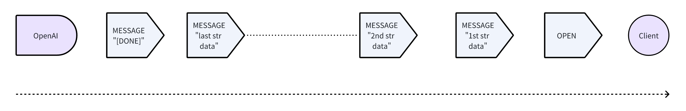
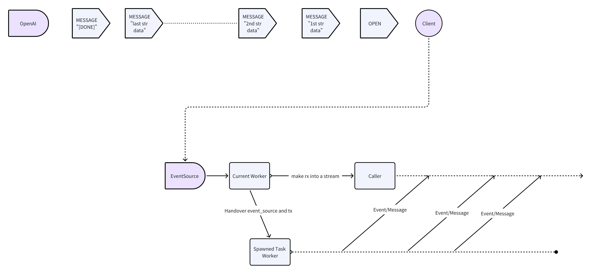

+++
title = "async-openai-wasm 发布🎉以及 WASM 化和使用 Stream 的经验"
description = "在 WASM 上异步地与 OpenAI 的 API 交互以及怎么让异步 Rust 适配 WASM"
draft = false

weight = 4

[taxonomies]
tags = ["Rust", "WebAssembly", "OpenAI"]

[extra]
feature_image = "crab_and_robot_hand.png"
feature = true
+++

[`async-openai-wasm`](https://github.com/ifsheldon/async-openai-wasm) 发布啦 🎉

`async-openai-wasm` 是 [`async-openai`](https://github.com/64bit/async-openai/) 的一个分叉，现在它已经稳定支持 WebAssembly。你可以用它调用 OpenAI 的 API，在你的 WebAssembly 项目中使用它。它面向的是 `wasm32-unknown-unknown`，所以基本上你可以在任何 WebAssembly 项目中使用它。
例如，你现在可以发布只有前端的应用，这些应用程序可以拥有 AI 能力，而无需后端服务器。你还可以开发在边缘服务器上运行的 AI 智能体，例如如 Cloudflare Workers。

>
> 如果你有兴趣贡献，请查看 [GitHub 仓库](https://github.com/ifsheldon/async-openai-wasm)。
>
> 目前，最需要的是恢复支持用于指数退避请求的 [`backoff`](https://crates.io/crates/backoff)。因为用了 `tokio`/`async-std` 的函数，它不兼容 `wasm32-unknown-unknown`。

以上基本是全部公告内容了，但这只说了**是什么**，我们下面说说**为什么**和**怎么做**。

## 为什么是 `async-openai-wasm`

[`async-openai`](https://github.com/64bit/async-openai/) 是一个很好的 crate，可以让你在异步 Rust 里与 OpenAI 的 API 交互。但是，它对 WebAssembly 的支持不稳定。我一直在维护它的一个实验分支，在这个分支里，支持 WebAssembly 是一个可选特性。这意味着要在 WASM 项目中使用它，你要指定 git
仓库和分支，在你的 `Cargo.toml` 里下载 crate。你也不能把依赖于 `async-openai` WASM 特性的项目发布到 [crates.io](https://crates.io)。

## 怎么把 `async-openai` wasm 化

当异步 Rust 和 WebAssembly 结合时，首要的问题通常是异步运行时，如 `tokio`，它们通常对 WebAssembly 没有支持，或者支持非常有限。

在 `async-openai` 里，`tokio` 的依赖最终归结为一个函数 `stream`，它把一个 `EventSource` 转换为流 `Stream`。

```rust
/// 请求响应 SSE。
pub(crate) async fn stream<O>(
    mut event_source: EventSource,
) -> Pin<Box<dyn Stream<Item = Result<O, OpenAIError>> + Send>>
where
    O: DeserializeOwned + std::marker::Send + 'static,
{
    let (tx, rx) = tokio::sync::mpsc::unbounded_channel();

    tokio::spawn(async move {
        while let Some(ev) = event_source.next().await {
            match ev {
                Err(e) => {
                    if let Err(_e) = tx.send(Err(OpenAIError::StreamError(e.to_string()))) {
                        // rx dropped
                        break;
                    }
                }
                Ok(event) => match event {
                    Event::Message(message) => {
                        if message.data == "[DONE]" {
                            break;
                        }

                        let response = match serde_json::from_str::<O>(&message.data) {
                            Err(e) => Err(map_deserialization_error(e, message.data.as_bytes())),
                            Ok(output) => Ok(output),
                        };

                        if let Err(_e) = tx.send(response) {
                            // rx dropped
                            break;
                        }
                    }
                    Event::Open => continue,
                },
            }
        }

        event_source.close();
    });

    Box::pin(tokio_stream::wrappers::UnboundedReceiverStream::new(rx))
}
```

OpenAI 使用 [Server-Sent Events (SSE)](https://developer.mozilla.org/en-US/docs/Web/API/Server-sent_events/Using_server-sent_events#event_stream_format) 来流式传输响应。概念上，消息的流转像这样：



OpenAI 首先发送一个 `OPEN` 事件来表示流的开始，然后发送一系列 `MESSAGE` 事件，每个事件都包含一个表示响应的 JSON 字符串。最后，它发送一个带有字符串 `"[DONE]"` 的 `MESSAGE` 事件来表示流的结束。

API 用户通常用循环，像下面这样消耗一个流：

```rust
while let Some(chunk) = stream.next().await {
    match chunk {
        Ok(response) => {
            // 用响应做一些事情
        }
        Err(e) => log::error!("OpenAI 错误：{:?}", e),
    }
}
```

惯例是流以 `Some(O)`（其中 `O` 是从字符串反序列化的）持续下去，并以 `None` 结束。

总体逻辑很简单，但实现有点复杂。在原始实现中，使用 `tokio` 来启动一个任务，监听 SSE 流并将响应发送到一个频道。然后将频道接收器 `rx` 转换为可以由调用者消耗的 `Stream`。从概念上讲，有两个并发的“线程”如下：



本质上，该函数只是从 `EventSource` 到 `Stream` 的转换，所以我们可以写一个结构体，实现 `Stream`，轮询 `EventSource` 并生成响应。

这是我魔改后的代码：

```rust
use futures::{stream::StreamExt, Stream};
use futures::stream::Filter;
use reqwest_eventsource::{Event, EventSource, RequestBuilderExt};
use std::future;
use std::marker::PhantomData;
use std::pin::Pin;
use std::task::{Context, Poll};
use pin_project_lite::pin_project;

pin_project! {
     pub struct OpenAIEventStream<O> {
        #[pin]
        stream: Filter<EventSource, future::Ready<bool>, fn(&Result<Event, reqwest_eventsource::Error>) -> future::Ready<bool>>,
        // 泛型的需要，对 Stream 特性来说是必要的，以便自定义输出类型。
        _phantom_data: PhantomData<O> 
    }
}

impl<O> OpenAIEventStream<O> {
    pub(crate) fn new(event_source: EventSource) -> Self {
        Self {
            stream: event_source.filter(|result|
                // 过滤掉第一个事件，总是 Event::Open
                future::ready(!(result.is_ok()&&result.as_ref().unwrap().eq(&Event::Open)))
            ),
            _phantom_data: PhantomData
        }
    }
}

impl<O: DeserializeOwned + Send + 'static> Stream for OpenAIEventStream<O> {
    type Item = Result<O, OpenAIError>;

    fn poll_next(self: Pin<&mut Self>, cx: &mut Context<'_>) -> Poll<Option<Self::Item>> {
        let this = self.project();
        let stream: Pin<&mut _> = this.stream;
        match stream.poll_next(cx) {
            Poll::Ready(response) => {
                match response {
                    None => Poll::Ready(None), // 流的结束
                    Some(result) => match result {
                        Ok(event) => match event {
                            Event::Open => unreachable!(), // 过滤掉了
                            Event::Message(message) => {
                                if message.data == "[DONE]" {
                                    Poll::Ready(None)  // 流的结束，由 OpenAI 定义
                                } else {
                                    // 反序列化数据
                                    match serde_json::from_str::<O>(&message.data) {
                                        Err(e) => Poll::Ready(Some(Err(map_deserialization_error(e, &message.data.as_bytes())))),
                                        Ok(output) => Poll::Ready(Some(Ok(output))),
                                    }
                                }
                            }
                        }
                        Err(e) => Poll::Ready(Some(Err(OpenAIError::StreamError(e.to_string()))))
                    }
                }
            }
            Poll::Pending => Poll::Pending
        }
    }
}
```

> 你可以看到有很多 `pin`，但我在这不赘述了。关于 `pin` 和 futures，这里有一个很好的 [博客](https://blog.adamchalmers.com/pin-unpin/)。

`OpenAIEventStream<O>` 存了封装 `EventSource` 的 `Filter`。但现在我们先看 `poll_next` 方法。代码看起来有点长，但不需要 `tokio`。

当我们轮询封装好的 event source 时，如果它准备好并返回 `None`，那么流就耗尽了，我们返回 `None` 表示流的结束。同样的，根据 OpenAI 的 API，如果数据是 `"[DONE]"`，我们也应该返回 `None`。
如果我们得到的消息不是 `"[DONE]"`，我们尝试反序列化它并返回反序列化的值，或者别的错误。这些结果应该被包装在 `Poll::Ready` 中，因为 event source 确实准备好了，而且给了我们一个响应。

稍微复杂的分支是 `Event::Open => ...`。
假设 event source 准备好并给我们一些结果，我们应该返回 `Poll::Pending` 还是 `Poll::Ready`？如果我们返回 `Poll::Pending`，流会被延后轮询，这不是我们想要的。
我也确实尝试过，但是不行，因为响应延迟了很多。那么，我们应该返回 `Poll::Ready` 吗？然后我们需要返回一些东西，但返回什么呢？`None`？但这不是流的结束。那么 `Some` 似乎可以，但我们还没有有用的消息。

如果我们跳出上面的坑，我们应该过滤掉 `Event::Open`，因为流的用户不关心。所以，我们使用 `EventSource` 实现的 `StreamExt::filter` 来过滤掉 `Event::Open` 事件。
这个方法会返回一个恐怖的 `Filter<EventSource, future::Ready<bool>, fn(&Result<Event, reqwest_eventsource::Error>) -> future::Ready<bool>>`，但我们还是存在 `OpenAIEventStream` 里。

现在有了新的 `OpenAIEventStream`，我们不需要另一个生成的任务来监听 event source。我们可以直接轮询它，它的执行是嵌入到调用者的异步任务里的。

> 如果你好奇，还可以深入研究 `futures::stream::Filter` 的 `Stream` 实现，看看它是怎么工作的。
> 简单地说，在 `poll_next` 方法中，它**不停地**在一个 `loop` 中轮询内部流，并继续寻找满足条件的结果，直到找到一个合适的，或者流耗尽。
>
> 如果我们不想在 `OpenAIEventStream` 中存储 `Filter`，我们当然可以自己实现 `Filter` 的功能，但代码会变得非常长并且难以理解。

第二个问题跟文件 I/O 相关，更容易解决。在原始实现中，`tokio` 也用于读写文件。但在 `wasm32-unknown-unknown` 上，我们不能直接使用文件 I/O，
因为编译后的二进制文件可能在浏览器或 Serverless 环境中运行。在这些环境里我们不能用文件 I/O。所以，我们删除了所有文件 I/O 相关的代码，添加了接受原始字节的 API。我没写这部分的代码。
或者更准确地说，我只做了”删库跑路“这部分。我删了所有与文件 I/O 相关的代码。感谢这位贡献者的 [PR](https://github.com/64bit/async-openai/pull/154)，我们才有了这部分裸字节 API。

## 结语

希望这篇文章能给你一点将异步 Rust 库 wasm 化的启发。不是很难，但需要一些对异步编程和 Rust 生态系统的理解。

如果你觉得你有更好的解决上述问题的方案，也记得告诉我！

## 元数据

版本：1.0.0

日期：2024.04.16

版权协议：[CC BY-SA 4.0](https://creativecommons.org/licenses/by-sa/4.0/)


