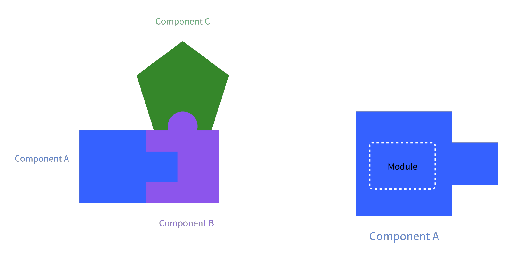
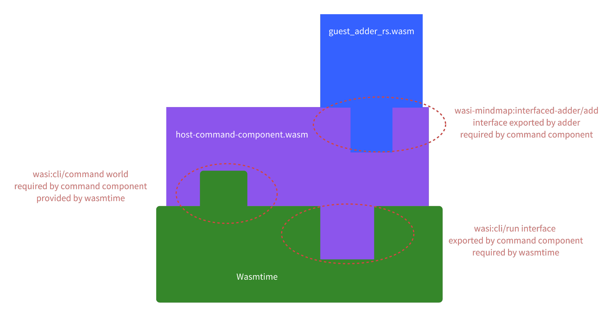
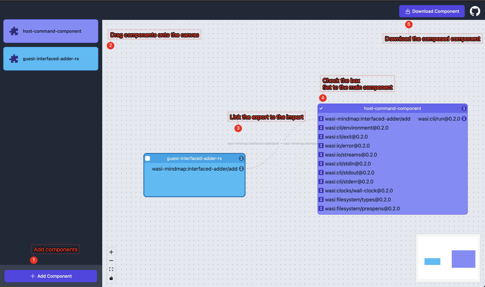

+++
title = "A Complete Guide to WASIp2 for Rust and Python Programmers"
description = "A guide to a true universal runtime"
draft = false

weight = 10

[taxonomies]
tags = ["Rust", "WebAssembly", "WASI"]

[extra]
feature_image = "bottled_rust.png"
feature = true
+++

Since long time ago, programmers have dreamed of a universal runtime that unifies all the languages and platforms. Any programs targeting this runtime can be run on any platform without any modification. One (virtual) machine to run them all.
For me, the first "universal runtime" that comes to mind is Java Virtual Machine (JVM). If you come from different backgrounds, you might think of .NET Runtime, Beam VM, or even Javascript runtimes. Yes, they are successful and widely used, but they are still not that universal.
For example, JVM is primarily designed for Java, so a garbage collector is built in, but not all languages need it. My favorite Rust does not need it either, while my another favorite, Python, does garbage collection a bit differently from Java.
As web browsers and web technologies are everywhere, how about just writing JS programs? That would be possible (take a look at Electron and Node.js), but we all know JS is a bit slow compared to compiled languages like C/C++/Rust.
But the direction is roughly right, so we have a new and yet another solution: WebAssembly (WASM).

WASM is only part of the story of this blog. Here I am going to introduce WebAssembly System Interface Preview 2 (WASIp2). As the name suggests, WASIp2 is about the interface of WASM.
In this guide, I will show you how to compile Rust and Python programs to WASIp2 components (special WASM modules), compose them into a more powerful component, and how to run these components in Rust, Python and Wasmtime (_the_ standard WASM runtime).
For the code in this guide, you can find the complete code in [wasi_mindmap](https://github.com/ifsheldon/wasi_mindmap) repository.

> **Copyrights and References**
>
> Before we start, first and foremost, I want to make it clear that this guide is the combination of official documents and my experiences when stumbling through the tutorials in the official documents and various GitHub issues.
> In contrast to the official documents, I want to make this guide self-contained from concepts to implementations but I don't want make crappy summaries of some well-written documents, so I will just copy and paste some content from the official documents.
> When I copy and paste, I will end the very paragraphs with symbol ↪ to link the reference, avoiding excessive reading distraction. When I want to highlight some quotes, I will just use quote marks and quote sections.
>
> Here are the references:
> - Mostly from [The WebAssembly Component Model documentation](https://component-model.bytecodealliance.org/introduction.html) (hereafter "**WACMDoc**" for short), licensed under [CC-BY-4.0](https://github.com/bytecodealliance/component-docs/blob/main/LICENSE.md).
> - [README and documentation](https://github.com/bytecodealliance/wit-bindgen) of `wit-bindgen`, licensed under [Apache-2.0](https://github.com/bytecodealliance/wit-bindgen/blob/main/LICENSE-APACHE) and [MIT](https://github.com/bytecodealliance/wit-bindgen/blob/main/LICENSE-MIT).
> - [Documentation](https://github.com/bytecodealliance/wasmtime) of Wasmtime, licensed under [Apache-2.0](https://github.com/bytecodealliance/wasmtime/blob/main/LICENSE).
> - Related GitHub issues: I will link them explicitly in-situ.
>
> This guide is also licensed under [CC BY-SA 4.0](https://creativecommons.org/licenses/by-sa/4.0/) which is compatible with the licenses of the references.

## WASM

Before we dive into WASIp2, let's first take a look at WASM.

Quoting from [Wikipedia](https://en.wikipedia.org/wiki/WebAssembly):

> WebAssembly (Wasm) defines a portable binary-code format and a corresponding text format for executable programs as well as software interfaces for facilitating communication between such programs and their host environment.
>
> The main goal of WebAssembly is to facilitate high-performance applications on web pages, but it is also designed to be usable in non-web environments.
> It is an open standard intended to support any language on any operating system, and in practice many of the most popular languages already have at least some level of support.

The very last sentence in the quote block is the key for us. WASM does not only support languages like C/C++/Rust, but also supports languages like Python, JavaScript, etc. Programs can be compiled as WASM _modules_ and run in any environment that supports WASM.

Just to summarize, the key points are:

- "Any language" can be compiled to WASM.
- WASM modules can be run in any environment that supports WASM.

If you are interested in various use cases of WASM and why WASM is getting momentum, [WASM in the Wild series](https://www.jakobmeier.ch/wasm-road-0) is a good starting point.

## Concept: WASIp2

OK, now that we have "the one" virtual machine, is it the end of the story? Not quite.

For a simple program, it is often enough to just compile it as a WASM module and run it on a WASM runtime. By "simple", I mean a program that can be written in a single language, say Rust, C or Python. But more complexity arises from a curious and practical question:
Since these programs are compiled to a common assembly language as modules, can we compose them into a more powerful program?

> If you come from compiled languages, you might know something about [linking/linker](https://en.wikipedia.org/wiki/Linker_(computing)) and [application binary interfaces (ABIs)](https://en.wikipedia.org/wiki/Application_binary_interface),
> which do roughly the same, except that the common assembly is something specific to processors, for example, x86 assembly.

To do the **composition** of WASM modules, we need to define a standard for the interfaces of WASM modules. This is where WASIp2 comes in.

> WASM module + WASIp2 interface specs ≈ WASIp2 component

For brevity, in the following sections, I will just call:

- WASM module ⇒ module
- WASIp2 component ⇒ component

A visualized analogy is Lego blocks. Below we have three blocks (i.e., components) and each block has a different shape. Consider that the shape of a block/component is defined by its WASIp2 interface specs. The core logic of a component is still inside a module, though.



>
> Component A has an export that is compatible with Component B's import. Component C requires an import satisified by Component B's export.
>
> Zooming in, Component A has a module as its core.

### Basics

There are 5 basic concepts in WASIp2: components, interfaces, worlds, WIT and packages.

**Components**, as we know, are building blocks. Logically, components are containers for modules or other components, which express their interfaces and dependencies via WIT. Conceptually, components are self-describing units of code that interact only through interfaces.
"self-describing" means components have interface descriptions inside. Physically, a component is a specially-formatted WebAssembly file. Internally, the component could include multiple traditional ("core") WebAssembly modules, and sub-components, composed via their imports and exports.
So, for instance, the composed file of Component A, B and C is also a component. [↪](https://component-model.bytecodealliance.org/design/components.html)

An **interface** describes a single-focus, composable contract, through which components can interact with each other and with hosts. Interfaces describe the *types* and *functions* used to carry out that interaction.  [↪](https://component-model.bytecodealliance.org/design/interfaces.html)

A WIT **world** is a higher-level contract that describes a component's capabilities and needs. On one hand, a world describes the shape of a component - it says which interfaces the component exposes for other code to call (its exports), and which interfaces the component depends on (its imports).
A world *only* defines the surface of a component, not the internal behaviour. On the other hand though, a world defines a hosting environment for components. An environment supports a world by providing implementations for all of the imports and by optionally invoking one or more of the
exports.  [↪](https://component-model.bytecodealliance.org/design/worlds.html)

The **WIT** (Wasm Interface Type) language is used to define interfaces and worlds. A WIT spec, or "WASIp2 interface specs" as we informally call earlier, is stored in a `.wit` file. For details of WIT language, please
see [the related section](https://component-model.bytecodealliance.org/design/wit.html) of WACMDoc.

A WIT **package** is a set of one or more WIT (Wasm Interface Type) files containing a related set of interfaces and worlds.  [↪](https://component-model.bytecodealliance.org/design/packages.html)

OK, enough talking. Let's take a look at the simplest example of WIT files:

```
// interfaced-adder.wit
package wasi-mindmap:interfaced-adder;

interface add {
  add: func(a: s32, b: s32) -> s32;
}

world adder {
  export add;
}
```

`wasi-mindmap` is the namespece for this package, `interfaced-adder` the name of this package. When we refer to a package, we usually refer it with its package ID, `wasi-mindmap:interfaced-adder` in our case. A package ID can optionally include a semver-compliant version,
`wasi-mindmap:interfaced-adder@0.0.1` for example.

In this package, we define a world `adder` for adder implementations. This world exports only one interface named `add`. The interface defines only one item, a function named `add`. Of course, in a world, we can import and export more interfaces.
And an interface can define more items like data types, resources and/or functions.

Since this is just a tutorial, not a book, we won't dig into [the WIT specification](https://github.com/WebAssembly/component-model/blob/main/design/mvp/WIT.md), but later we will have a more complex WIT file and corresponding component, I promise.

## More Code

For the purpose of demostration, I will write programs in Python and Rust. These two are my favorite, so please bear with me. As WASM is "universal", you can try to compile code in your favorite languages into components.
This [section](https://component-model.bytecodealliance.org/language-support.html) of WACMDoc shows more examples in more languages.

### Adder Components {#rust-adder-component}

When I previously said "the simplest example", it's partially correct and partially wrong. There is a simpler WIT file than `interfaced-adder.wit`. The name, of course, is `adder.wit`:

```
package wasi-mindmap:adder;

world adder {
    export add: func(a: s32, b: s32) -> s32;
}
```

The `adder` world in `adder.wit` directly exports a function `add` rather than exposing it via interface `add`. This is technically allowed but also a bit unusual. We will come back to the reason when we talk about compositions.
For now, we use `adder.wit` for demonstrating how an adder component can be implemented.

For Rust implementation, you need nothing more than the `wasm-wasip2` target of `rustc`.

> To install the `wasm-wasip2` target, run `rustup target add wasm32-wasip2`

The cargo project is simple as below:

```shell
├── Cargo.toml
├── src
│   └── lib.rs
└── wit
    └── adder.wit
```

The dependencies are minimum:

```toml
# Cargo.toml
[package]
name = "guest-adder-rs"
version = "0.1.0"
edition = "2021"

[lib]
crate-type = ["cdylib"]

[dependencies]
wit-bindgen = "0.36"
```

With the magical `wit_bindgen::generate` macro, we don't have to write boilerplate glue code. Even better, all implementation code is statically checked by our beloved `rustc`.

```rust
// Use a procedural macro to generate bindings for the world we specified in
// `wit/adder.wit`
wit_bindgen::generate!({
    // the name of the world in the `*.wit-files` input file
    world: "adder",
});

// Define a custom type and implement the generated `Guest` trait for it which
// represents implementing all the necessary exported interfaces for this
// component.
struct Adder;

impl Guest for Adder {
    fn add(a: i32, b: i32) -> i32 {
        a + b
    }
}

// export! defines that the `Adder` struct defined below is going to define
// the exports of the `world`
export!(Adder);
```

With dozens of lines in total, you can then simply run `cargo build --target wasm32-wasip2` and get a freshly-baked component `guest_adder_rs.wasm` in `target/wasm32-wasip2/debug`.

> To inspect `.wasm` files and more, you can install `wasm-tools` by `cargo install --locked wasm-tools`, or refer to the [repo](https://github.com/bytecodealliance/wasm-tools) for more instructions.
>
> To see `guest_adder_rs.wasm` component is indeed self-describing:
> ```shell
> $ wasm-tools component wit guest_adder_rs.wasm
> package root:component;
> 
> world root {
>   export add: func(a: s32, b: s32) -> s32;
> }
> ```
> `guest_adder_rs.wasm` itself includes all necessary descriptions of its import and export interfaces.

#### Adder in Python {#python-adder-component}

Python doesn't have native support for WASIp2, so we need to install `componentize-py` by

```shell
pip3 install componentize-py
```

For a Python program to implement the exports of world `adder`, we can generate bindings by:

```shell
componentize-py --wit-path adder.wit --world adder bindings .  # don't miss the dot
```

which will generate a Python package in the current directory named `adder`. Importing from `adder` Python package, your Python program gets a proper abstract class to inherit from.

```python
# in guest-adder.py
import adder


# the class MUST be named `Adder`, same as the abstract class
class Adder(adder.Adder):
    def add(self, a: int, b: int) -> int:
        return a + b
```

Then you need to componentize this Python program:

```shell
componentize-py --wit-path adder.wit --world adder componentize guest-adder -o guest_adder_py.wasm
```

> What is the difference between `guest_adder_py.wasm` and `guest_adder_rs.wasm`?
>
> I was surprised to see `guest_adder_py.wasm` sizes much bigger than `guest_adder_rs.wasm`, which we will come back later.

### Guests and Hosts

Now we have compiled adder components from programs in Rust and Python, what then? As the adder components export one function, we should be able to call that function in our programs, like with libraries.
In contrast to the notion of "caller" and "callee", we use "guest" and "host", because a host may need the offer from a guest (i.e., the exports of the component) while it may also provide capabilities a guest relies on (i.e., the imports of the component).

There are two ways to read the following content:

* you can read it sequentially, as it starts from basic examples to more involved ones.
* or, you can skip ahead by looking up the following table.

| Host/Guest                    | Rust Adder [↪](#rust-adder-component) | Python Adder [↪](#python-adder-component) | Rust KVDatabase  |
|-------------------------------|:--------------------------------------|:------------------------------------------|:-----------------|
| Rust Host [↪](#rust-host)     | ✅                                     | ✅                                         | ✅ [↪](#appendix) |
| Python Host [↪](#python-host) | ✅                                     | 🛠️                                       | 🛠️              |
| Command Component (from Rust) | ✅[↪](#command-component)              | 📌                                        | 📌               |

✅: Currently supported

🛠️: Not supported for now, under development of `wasmtime-py`

📌: TODO and welcome contributions

#### Rust Host {#rust-host}

The implementation of a host is a bit complicated, so let's take a look at the full code in Rust and then break it down.

We need latest `wasmtime`, which is the crate of _the_ reference WASM runtime, and `wasmtime-wasi`, which provides utilities for running WASIp1 modules and WASIp2 components:

```toml
# in host-rs/Cargo.toml
[package]
name = "host-rs"
version = "0.1.1"
edition = "2021"

[dependencies]
anyhow = "1.0"
wasmtime = "28.0"
wasmtime-wasi = "28.0"
```

Before diving into the main logics, we need some utilities:

```rust
// in src/utils.rs
use anyhow::Context;
use wasmtime::component::{Component, Linker, ResourceTable};
use wasmtime::{Engine, Result, Store};
use wasmtime_wasi::WasiImpl;
use wasmtime_wasi::{WasiCtx, WasiCtxBuilder, WasiView};

// reference: https://docs.rs/wasmtime/latest/wasmtime/component/bindgen_examples/_0_hello_world/index.html
// reference: https://docs.wasmtime.dev/examples-rust-wasi.html

pub(crate) struct ComponentRunStates {
    // These two are required basically as a standard way to enable the impl of WasiView
    pub wasi_ctx: WasiCtx,
    pub resource_table: ResourceTable,
}

impl WasiView for ComponentRunStates {
    fn table(&mut self) -> &mut ResourceTable {
        &mut self.resource_table
    }
    fn ctx(&mut self) -> &mut WasiCtx {
        &mut self.wasi_ctx
    }
}

impl ComponentRunStates {
    pub fn new() -> Self {
        ComponentRunStates {
            wasi_ctx: WasiCtxBuilder::new().build(),
            resource_table: ResourceTable::new(),
        }
    }
}

pub fn get_component_linker_store(
    engine: &Engine,
    path: &'static str,
    alt_path: &'static str,
) -> Result<(
    Component,
    Linker<ComponentRunStates>,
    Store<ComponentRunStates>,
)> {
    let component = Component::from_file(engine, path)
        .or_else(|_| Component::from_file(&engine, alt_path))
        .with_context(|| format!("Cannot find component from path: {path} or {alt_path}"))?;
    let linker = Linker::new(&engine);
    let state = ComponentRunStates::new();
    let store = Store::new(&engine, state);
    Ok((component, linker, store))
}
```

`get_component_linker_store` is the helper function we need, which creates a `Component`, a `Linker<ComponentRunStates>` and a `Store<ComponentRunStates>` all at once for us.

`Component` represents a compiled component that is ready to be instantiated while `Linker` is used to instantiate `Component`s, linking components together as well as supplying host functionality to components. `Store` is conceptually a bit complicated.
A `Store` is a collection of WebAssembly instances and host-defined state. All WebAssembly instances and items will be attached to and refer to a `Store`. For example instances, functions, globals, and tables are all attached to a `Store`.
Instances are created by instantiating a WASM module (that resides in a component) within a `Store`.

> For more details, see the documentations about [`Component`](https://docs.rs/wasmtime/latest/wasmtime/component/struct.Component.html), [`Linker`](https://docs.rs/wasmtime/latest/wasmtime/component/struct.Linker.html) and [`Store`](https://docs.rs/wasmtime/latest/wasmtime/struct.Store.html).

As for `ComponentRunStates`, it contains necessary fields to implement `WasiView` trait, which is essential for interacting with the functionalities provided by `wasmtime_wasi`. Quoting the [documentation](https://docs.rs/wasmtime-wasi/latest/wasmtime_wasi/trait.WasiView.html) of `wasmtime_wasi`:
> (This is) A trait which provides access to internal WASI state. This trait is the basis of implementation of all traits in this crate.

If the above is a lot to take in, fear not. All you need to know for now is that all the code in `src/utils.rs` except my little helper function is basically standard to get started. You can take your time later to dig into the details of the wasmtime runtime.

With these utilities, we are ready to host a component. To synchronously call the `add` function of an `adder` component, we just need a few lines of code:

```rust
// in src/main.rs
use crate::utils::get_component_linker_store;
use wasmtime::component::bindgen;
use wasmtime::{Engine, Result};

bindgen!({
    path: "adder.wit",
    world: "adder",
});

fn main() -> Result<()> {
    let (component, linker, mut store) = get_component_linker_store(
        engine,
        "./target/wasm32-wasip2/release/guest_adder_rs.wasm",
        "./target/wasm32-wasip2/debug/guest_adder_rs.wasm",
    )?;
    let adder_bindings: Adder = Adder::instantiate(&mut store, &component, &linker)?;
    let a = 1;
    let b = 2;
    let result = adder_bindings.call_add(&mut store, a, b)?;
    assert_eq!(result, 3);
    Ok(())
}
```

That's it! The magic lies in `wasmtime::component::bindgen` macro, which generates bindings according to `adder.wit` at compile time.

> You can run `cargo expand --bin host.rs` to see the generated code by `bindgen`, which is sometimes necessary for debugging.

Note that `bindgen` can generate asynchronous bindings as well, which is useful when a component internally performs IOs like networking. Please refer to the async examples in [wasi_mindmap](https://github.com/ifsheldon/wasi_mindmap).

#### Python Host {#python-host}

Hosting a component in Python is not well-supported yet, so we can run a small subset of components that don't use any [WASIp2 Resources](https://component-model.bytecodealliance.org/design/wit.html#resources). This for now also means we cannot run any components compiled from Python programs.

> Refer to this [section](https://component-model.bytecodealliance.org/language-support/python.html#running-components-from-python-applications) of WACMDoc and this [issue](https://github.com/bytecodealliance/wasmtime-py/issues/197) for more details.

Notwithstanding, we can still run simple components compiled from Rust programs.

First we will need to install `wasmtime-py`:

```shell
pip install -U "wasmtime>=28.0.0"
```

If you haven't done so, compile the Rust adder component as mentioned in [Adder Component](#rust-adder-component).

With the Rust adder component, we need to generate Python bindings:

```shell
# subsitude guest_adder_rs.wasm with the path to your Rust adder component
python -m wasmtime.bindgen guest_adder_rs.wasm --out-dir adder_rs_bindings  
```

This will create a Python package named `adder_rs_bindings` in the current directory.

To run the component, we can simply do the similar thing as in the Rust host:

```python
# in run_guest_adder_rs.py
from wasmtime import Store
from adder_rs_bindings import Root


def run_adder_rs_guest():
    store = Store()
    adder_component_instance = Root(store)
    result = adder_component_instance.add(store, 1, 2)
    assert result == 3
    print(f"{__name__}: 1 + 2 = {result}")


run_adder_rs_guest()
```

Or, with such a simple component, there's a magic loader from `wasmtime-py` to load the component without generating bindings and run it:

```python
# in run_guest_adder_rs_magic_loader.py
from wasmtime import Store
# The magic, refer to https://github.com/bytecodealliance/wasmtime-py?tab=readme-ov-file#usage
import wasmtime.loader
from guest_adder_rs import Root


def run_adder_rs_guest():
    store = Store()
    adder_component_instance = Root(store)
    result = adder_component_instance.add(store, 1, 2)
    print(f"{__name__}: 1 + 2 = {result}")
    assert result == 3


run_adder_rs_guest()
```

### Complications

So far so good. The above examples are simple and straightforward, except that we have a few points that were glossed over:

1. Why exactly a Python host cannot run a Python component?
2. Why does a Python component size much bigger than a Rust component?
3. Why did we have a `interfaced_adder.wit` which is different from `adder.wit`?

Before we going into these, please read through the [Overview of WIT](https://component-model.bytecodealliance.org/design/wit.html) from WACMDoc, which is prerequisite for understanding the following sections.


OK, welcome back!

#### Standard Libraries

Let's dive right into the first 2 questions.

According to the WACMDoc, `wasmtime-py` does not currently support running components build with `componentize-py`.
This is because wasmtime-py does not yet support resources, which components built with `componentize-py` always use, since `componentize-py` unconditionally imports most of the `wasi:cli`
world. [↪](https://component-model.bytecodealliance.org/language-support/python.html#running-components-from-python-applications)

The explanation is simple, but why does `componentize-py` unconditionally import most of the `wasi:cli` world in the first place?

We need to zoom more into the compiled component.


In the case of `guest_adder_py.wasm`, as we don't need 3rd party libraries, the only logical parts in the module inside the component are Python's std libs and our add logic.
Because of the needs from Python's std libs (e.g., handling crashes, reading env vars to modify the behavior of std libs), `componentize-py` unconditionally imports most of the `wasi:cli` world.

The batteries-included std libs of Python are huge, so the component size is much bigger than a Rust component, even though much of the std libs are not used in our adder example.

Therefore, the compiled component may be bloated by std libs:

* in terms of logics:
    * std libs may include unused code in the component.
    * std libs may also include useful code that we don't explicitly require, like error handling.
* in terms of interfaces:
    * std libs may include interfaces that we don't need anyway
    * std libs may require interfaces that we indirectly need, for example, stderr interface when a crash happens and error messages are printed.

A leaner language like Rust is no exception. For those who are interested, you can take a look at [this issue](https://github.com/rust-lang/rust/issues/133235) in Rust repository, filed by me :)
A brief summary of the issue is that when a simple functionality from Rust std is used, say the `format!` macro, the Rust compiler will include the whole `wasi:cli` world that includes some interfaces that are useless in this case, like `wasi:cli/env` for accessing environment variables.

#### Command Component from Rust and Compositions {#command-component}

We have tried running a component on a Rust and a Python host, but can we run a component on a WASM host? Yes and No.

We cannot run an `adder` component, say `guest_interfaced_adder_rs.wasm`, with `wasmtime` in command line, but we can run a command component with `wasmtime` in command line, for example:

```shell
wasmtime run command_component_hosting_adder.wasm
```

A command component is (just special) one that exports the `wasi:cli/run` interface, and imports _only_ interfaces listed in the [`wasi:cli/command world`](https://github.com/WebAssembly/wasi-cli/blob/main/wit/command.wit), which allows it to be executed directly by wasmtime (or other `wasi:cli`
hosts). [↪](https://component-model.bytecodealliance.org/language-support/rust.html#creating-a-command-component-with-cargo-component)

For the purpose of demostration, we will create a command component in Rust, which hosts an `interfaced-adder` component.

To create a command component with ease, we need some help from `cargo-component`.

```shell
# install cargo-component if you haven't
cargo install cargo-component
# create a new command component called `host-command-component`
cargo component new host-command-component
```

Inside the `host-command-component` project, you need to add the following content to `Cargo.toml`:

```toml
# other content omitted..........
[package.metadata.component.target]
# use the WIT file in the `wit` directory to define the world of this command component
path = "wit"

[package.metadata.component.target.dependencies]
# Replace the path below with the actual path to directory containing `interfaced-adder.wit`
"wasi-mindmap:interfaced-adder" = { path = "../guest-interfaced-adder-rs/wit" }
```

In `host-command-component/wit`, you need to add a WIT file for this command component, specifying its world:

```
// host-command-component/wit/host.wit
package wasi-mindmap:host;

world host {
   import wasi-mindmap:interfaced-adder/add;
}
```

And then run `cargo component check` to generate bindings for `interfaced-adder` components. You will see `bindings.rs` in `host-command-component/src/`.

The main function of this command component is simple:

```rust
mod bindings;
use bindings::wasi_mindmap::interfaced_adder::add::add;

fn main() {
    let result = add(1, 2);
    println!("result: {}", result);
}
```

To compile this command component, run `cargo component build`. As of now, `cargo-component` still uses `wasm32-wasip1` as the target (see the [tracking issue](https://github.com/bytecodealliance/cargo-component/issues/355)), so you will find the compiled component in
`target/wasm32-wasip1/debug/host-command-component.wasm`.

This command component imports the `add` interface from `interfaced-adder` component and the interfaces from `wasi:cli/command` world, and then calls the `add` function. What it exports is the `wasi:cli/run` interface.
Therefore, you cannot run this command component with `wasmtime` in command line yet, because `wasmtime` does not have the `add` interface implemented.

What we can do is **composition**. We compose the `interfaced-adder` component with the `host-command-component` to form a new component, which imports only the `wasi:cli/command` interfaces and exports only the `wasi:cli/run` interface.


>
> The "shapes" of individual components and the composed component.
>
> The composed component is run by `wasmtime` in command line.
>

The composition can be done programmatically or visually with [wasmbuilder.app](https://wasmbuilder.app/). For the purpose of demonstration, we will use the visual way.
> Please refer to [Compose with WAC](https://component-model.bytecodealliance.org/creating-and-consuming/composing.html#advanced-composition-with-the-wac-language) if you are interested in the programmatic way.



> Compose with wasmbuilder.app

The steps are straightforward:

1. Add components by uploading them.
2. Drag them onto the canvas.
3. Link the exported `add` interface to the imported `add` interface.
4. Check the box to set `host-command-component` as the main component.
5. Download the composed component with a name, say `composed-component.wasm`.

Then finally, you can run the composed component with `wasmtime` in command line:

```shell
$ wasmtime run composed-component.wasm
result: 3
```

You can do such compositions with any compatible components, not just for a command component and a trivial adder component. This is where WASIp2 really shines.
Imagine you have a Python component, a Go component and a C# component, as long as they have compatible import and export interfaces, you can compose them together to form a new component. This is a great relief if you have struggled with gluing programs via C ABIs.

> Back to the question: Why did we have a `interfaced_adder.wit` which is different from `adder.wit`?
>
> The composability of components is at the interface level. What we match against when composing components are the interfaces exported and imported by components, not the imported or exported functions.
> So, even though functions can be imported or exported at the top level of a world, they are not the unit of composition.

#### Host: Importing Interfaces at Runtime

In the [Rust host example](#rust-host), we know that the magical `bindgen` macro generates bindings for the interfaces of a component at compile time. But what if we want to import interfaces dynamically at runtime? For example, fuzzing any components that have arbitrary interfaces.

`wasmtime` crate provides APIs for that, but the user experience is intentionally not good to discourage users from doing so. But, anyway, here's a simple example:

```rust
pub fn run_adder_dynamic(engine: &Engine) -> Result<()> {
    let (component, linker, mut store) = get_component_linker_store(
        engine,
        "./target/wasm32-wasip2/release/guest_interfaced_adder_rs.wasm",
        "../target/wasm32-wasip2/release/guest_interfaced_adder_rs.wasm",
    )?;
    let instance = linker.instantiate(&mut store, &component)?;
    let interface_name = "wasi-mindmap:interfaced-adder/add";
    let interface_idx = instance
        .get_export(&mut store, None, interface_name)
        .unwrap();
    let parent_export_idx = Some(&interface_idx);
    let func_name = "add";
    let func_idx = instance
        .get_export(&mut store, parent_export_idx, func_name)
        .unwrap();
    let func = instance.get_func(&mut store, func_idx).unwrap();
    // Reference:
    // * https://github.com/WebAssembly/wasi-cli/blob/main/wit/run.wit
    // * Documentation for [Func::typed](https://docs.rs/wasmtime/latest/wasmtime/component/struct.Func.html#method.typed) and [ComponentNamedList](https://docs.rs/wasmtime/latest/wasmtime/component/trait.ComponentNamedList.html)

    // If you don't know the types of arguments and return values of the function at compile time
    // iterate over the types of arguments at run time
    for (i, p) in func.params(&store).iter().enumerate() {
        println!("Type of {}th param: {:?}", i, p);
    }
    // iterate over the types of return values at run time
    for (i, r) in func.results(&store).iter().enumerate() {
        println!("Type of {}th result: {:?}", i, r);
    }

    // If you know the types of arguments and return values of the function at compile time
    let typed_func = func.typed::<(i32, i32), (i32,)>(&store)?;
    let (result,) = typed_func.call(&mut store, (1, 2))?;
    // Required, see documentation of TypedFunc::call
    typed_func.post_return(&mut store)?;
    assert_eq!(result, 3);
    Ok(())
}
```

You need to recursively get a handle (i.e., `wasmtime::runtime::component::component::ComponentExportIndex`) to an exported item (e.g., an interface, a function, a resource, etc.) from a component with an optional parent handle.
For a function object (i.e., `wasmtime::runtime::component::func::Func`) that you get with a handle, you can iterate over the types of arguments and return values.
If you know the types of arguments and return values at compile time, you can use `Func::typed` to get a `TypedFunc` object, which can be used to call the function with the types checked.

## Conclusion

We have explored various axes of WASIp2 concepts and APIs:

1. Implementations of hosts and guests
2. Languages: Rust, Python
3. Async and sync APIs: We've seen sync APIs in the examples while async examples are in the [wasi_mindmap](https://github.com/ifsheldon/wasi_mindmap) repository.
4. Compile-time and runtime interface imports: We've seen compile-time interface imports using `bindgen` and touched on runtime interface imports.
5. Standalone components and compositions
6. Application complexity: We've seen simple adder examples while I leave a more complex example in the [Appendix](#appendix)

With these, I hope this guide is more than a good start for WASIp2. Have fun hacking with WASIp2!

## Issues and Contribute

Along my way stumbling through the WASIp2 tutorials, documentations and examples, I found a few issues and missing pieces, some resolved, some not:

* Resolved ones by me, just FYI:
    * [Missing examples for using bindgen! async, imports and resource in host](https://github.com/bytecodealliance/wasmtime/issues/9776)
    * [Bindgen improvement: Remove the use of async_trait](https://github.com/bytecodealliance/wasmtime/issues/9823)
    * [Documentation: Wrong doc about Config::wasm_component_model](https://github.com/bytecodealliance/wasmtime/issues/9694)
    * [Renovate host example with latest wasmtime and wasmtime_wasi](https://github.com/bytecodealliance/component-docs/issues/179)
* Unresolved ones, for those who may be interested in contributing:
    * [Compiled wasm32-wasip2 component from simple code requires excessive WASI interfaces](https://github.com/rust-lang/rust/issues/133235)
    * [Renovate the WASI example](https://github.com/bytecodealliance/wasmtime/issues/9777)
    * [Bindgen! gives weird name to an interface well-named in WIT file](https://github.com/bytecodealliance/wasmtime/issues/9774)

As WASIp2 technologies are rather young, if you find WASIp2 is interesting, please consider contributing code and/or documentation to the related WASIp2 projects, like [wasmtime](https://github.com/bytecodealliance/wasmtime)
and [WebAssembly Component Model Documentation](https://github.com/bytecodealliance/component-docs).

Finally, my code is also open sourced:

* [wasi_mindmap](https://github.com/ifsheldon/wasi_mindmap): A collection of examples and tutorials about WASIp2.
* [ideas reifying](https://github.com/ifsheldon/ideas_reifying): The source of this blog site.

Contributions to my repos are also welcome!

## Personal Notes and Beyond WASIp2

My motivation for using WASIp2 is to make modern software interops for large language models (LLMs) and autonomous agents. LLMs and agents can now solve difficult coding problems, and they will be much more capable very soon, but today's softwares are very fragmented.
The foundation of software interops is still legacy C ABIs, which are not only fragile but also dangerous. I can't imagine how these (soon-to-be) super intelligence will be able to solve real-world software problems with today's software interops, since we humans also suffer from the same problem.

Besides LLMs which may or may not end humanity, I also see some interesting explorations by us humans:

* [Making WebAssembly and Wasmtime More Portable](https://bytecodealliance.org/articles/wasmtime-portability): This will enable `wasmtime` to run on more platforms, including mobile and edge devices.
    * In the use case of robotics, with WASIp2, we can run components (written in different languages) on a robot and/or MCUs of body parts of it while keeping them interoperable. This may be more powerful and flexible than [Robot Operating System (ROS)](https://www.ros.org/).
* [k23](https://github.com/JonasKruckenberg/k23): This is a OS kernel reimagined with WebAssembly. It leverages the built-in sandboxing of WebAssembly to provide a secure environment for running untrusted code. With WASIp2, programs (including the kernel) can be written in any languages with max
  interoperability and flexibility.

## Appendix: More Examples {#appendix}

Here we have a more complex example - KV store.

```
package wasi-mindmap:kv-store;

interface kvdb {
  resource connection {
    constructor();
    get: func(key: string) -> option<string>;
    set: func(key: string, value: string);
    remove: func(key: string) -> option<string>;
    clear: func();
  }
}

world kv-database {
  import kvdb;
  import log: func(msg: string);
  export replace-value: func(key: string, value: string) -> option<string>;
}
```

As we don't want to pass the entire KV store by value, we need to use resources. In this world, we need the interface `kvdb` to get a connection resource, and then use the connection resource to get/set/remove/clear values. The log function is also needed to log errors.
The exported `replace-value` function is used to replace the value of a key, returning the old value if the key exists.

The implementation of the guest component in Rust is simple:

```rust
// guest-kv-store-rs/src/lib.rs
wit_bindgen::generate!({
    // the name of the world in the `*.wit` input file
    world: "kv-database",
});

struct KVStore;

impl Guest for KVStore {
    fn replace_value(key: String, value: String) -> Option<String> {
        let kv = wasi_mindmap::kv_store::kvdb::Connection::new();
        // replace
        let old = kv.get(&key);
        kv.set(&key, &value);
        old
    }
}

export!(KVStore);
```

The host providing the `kvdb` interface and the `log` function is more complicated:

```rust
// main.rs
use crate::utils::get_component_linker_store;
use crate::utils::{bind_interfaces_needed_by_guest_rust_std, ComponentRunStates};
use std::collections::HashMap;
use wasmtime::component::bindgen;
use wasmtime::component::Resource;
use wasmtime::{Engine, Result};

bindgen!({
    path: "../wit-files/kv-store.wit",
    world: "kv-database",
    with: {
        "wasi-mindmap:kv-store/kvdb/connection": Connection
    },
    // Interactions with `ResourceTable` can possibly trap so enable the ability
    // to return traps from generated functions.
    trappable_imports: true,
});

pub struct Connection {
    // use a hashmap to store key-value pairs
    pub storage: HashMap<String, String>,
}

impl KvDatabaseImports for ComponentRunStates {
    fn log(&mut self, msg: String) -> Result<(), wasmtime::Error> {
        println!("Log: {}", msg);
        Ok(())
    }
}

impl wasi_mindmap::kv_store::kvdb::Host for ComponentRunStates {}

impl wasi_mindmap::kv_store::kvdb::HostConnection for ComponentRunStates {
    fn new(&mut self) -> Result<Resource<Connection>, wasmtime::Error> {
        Ok(self.resource_table.push(Connection {
            storage: HashMap::new(),
        })?)
    }

    fn get(
        &mut self,
        resource: Resource<Connection>,
        key: String,
    ) -> Result<Option<String>, wasmtime::Error> {
        let connection = self.resource_table.get(&resource)?;
        Ok(connection.storage.get(&key).map(String::clone))
    }

    fn set(&mut self, resource: Resource<Connection>, key: String, value: String) -> Result<()> {
        let connection = self.resource_table.get_mut(&resource)?;
        connection.storage.insert(key, value);
        Ok(())
    }

    fn remove(&mut self, resource: Resource<Connection>, key: String) -> Result<Option<String>> {
        let connection = self.resource_table.get_mut(&resource)?;
        Ok(connection.storage.remove(&key))
    }

    fn clear(&mut self, resource: Resource<Connection>) -> Result<(), wasmtime::Error> {
        let large_string = self.resource_table.get_mut(&resource)?;
        large_string.storage.clear();
        Ok(())
    }

    fn drop(&mut self, resource: Resource<Connection>) -> Result<()> {
        let _ = self.resource_table.delete(resource)?;
        Ok(())
    }
}

pub fn run_kv_store_sync(engine: &Engine) -> Result<()> {
    let (component, mut linker, mut store) = get_component_linker_store(
        engine,
        "./target/wasm32-wasip2/release/guest_kv_store_rs.wasm",
        "../target/wasm32-wasip2/release/guest_kv_store_rs.wasm",
    )?;
    KvDatabase::add_to_linker(&mut linker, |s| s)?;
    // this is a special helper function, see the wasi-mindmap repo for more details
    bind_interfaces_needed_by_guest_rust_std(&mut linker);
    let bindings = KvDatabase::instantiate(&mut store, &component, &linker)?;
    let result = bindings.call_replace_value(store, "hello", "world")?;
    assert_eq!(result, None);
    Ok(())
}

fn main() -> Result<()> {
    let engine_sync = Engine::default();
    run_kv_store_sync(&engine_sync)?;
    Ok(())
}
```

This code example should give you a sense of how to implement a host and a guest with resources.

## Metadata

Version: 0.0.1

Date: 2025.01.01

License: [CC BY-SA 4.0](https://creativecommons.org/licenses/by-sa/4.0/)