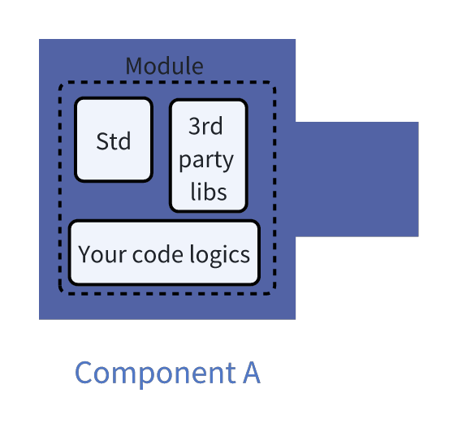
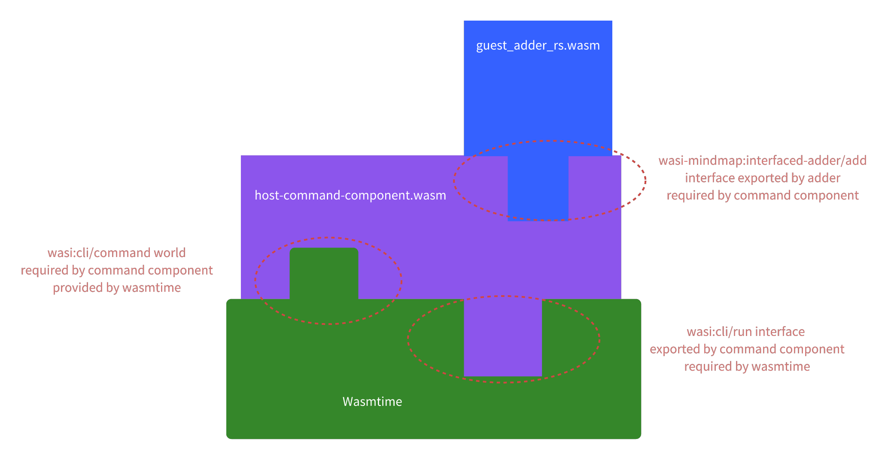

+++
title = "WASIp2 指南 - 面向 Rust 和 Python 程序员"
description = "一个真正通用的运行时的指南"
draft = false

weight = 11

[taxonomies]
tags = ["Rust", "WebAssembly", "WASI"]

[extra]
feature_image = "bottled_rust.png"
feature = true
+++


长久以来，程序员一直梦想着一个统一所有语言和平台的通用运行时。任何对这个运行时编译的程序都可以在任何平台上运行，无需任何修改。一个（虚拟）机器就能运行所有程序。说到虚拟机，我首先想到的"通用运行时"是 Java 虚拟机 (JVM)。如果你有不同技术背景，你可能会想到 .NET 运行时、Beam VM，或者甚至是 JavaScript
运行时。它们都很成功且被广泛使用，但它们还是不够通用。 比如说，JVM 主要是为 Java 设计的，所以它内置了垃圾收集器，但并非所有语言都需要。我最爱的 Rust 就不需要垃圾收集，而我也同样喜欢 Python，但是它的垃圾回收跟 Java 有所不同。 既然浏览器无处不在，我们可以只写 JS 程序？可以，看 Electron 和 Node.js 就知道，但同时我们也知道
JS 相比编译型语言如 C/C++/Rust 要慢一些。

不过，方向大致是对的，所以我们有了一个新的解决方案：WebAssembly (WASM)。

WASM 只是这篇博客的一部分。在这里，我主要介绍 WebAssembly System Interface Preview 2 (WASIp2)。顾名思义，WASIp2 是关于 WASM 的接口。 我会举例子，展示把 Rust 和 Python 程序编译为 WASIp2 组件（特殊的 WASM 模块），把它们组合成更强大的组件，以及如何在 Rust、Python 和 Wasmtime（标准 WASM 运行时）中运行这些组件。

博客里涉及到的完整代码可以在 [wasi_mindmap](https://github.com/ifsheldon/wasi_mindmap) 仓库中找到。

> **版权和参考资料**
>
> 在开始之前，我想明确的是，这篇指南结合了官方文档以及我在官方文档教程以及各种 GitHub 问题中摸索的经验。
> 和官方文档不同，我希望使本指南从概念到实现都是自洽的，但我不想在一些写得很好的文档上画蛇添足，所以我会直接复制粘贴一些官方文档的内容。
> 我复制粘贴内容的时候，我会在段落末尾加上符号 ↪ 以链接参考，避免过多的阅读干扰。我想强调某些引用时，我会使用引号和引用部分。
>
> 以下是参考资料：
> - 主要来自 [WebAssembly 组件模型文档](https://component-model.bytecodealliance.org/introduction.html)（以下简称 "**WACMDoc**"），是 [CC-BY-4.0](https://github.com/bytecodealliance/component-docs/blob/main/LICENSE.md) 许可。
> - `wit-bindgen` 的 [README 和文档](https://github.com/bytecodealliance/wit-bindgen)，是 [Apache-2.0](https://github.com/bytecodealliance/wit-bindgen/blob/main/LICENSE-APACHE) 和 [MIT](https://github.com/bytecodealliance/wit-bindgen/blob/main/LICENSE-MIT) 许可。
> - Wasmtime 的 [文档](https://github.com/bytecodealliance/wasmtime)，是 [Apache-2.0](https://github.com/bytecodealliance/wasmtime/blob/main/LICENSE) 许可。
> - 相关 GitHub 问题：我会在适当位置给出链接。
>
> 本指南也是 [CC BY-SA 4.0](https://creativecommons.org/licenses/by-sa/4.0/) 许可，和参考资料的许可兼容。

## WASM

在深入了解 WASIp2 之前，我们先来了解一下 WASM。

引用自 [维基百科](https://en.wikipedia.org/wiki/WebAssembly)：

> WebAssembly (Wasm) 定义了一种可移植的二进制代码格式和相应的文本格式，用于可执行程序，以及用于促进此类程序与其主机环境之间通信的软件接口。
>
> WebAssembly 的主要目标是促进网页上的高性能应用程序，但它也被设计为可在非网络环境中使用。
> 它是一个开放标准，旨在支持任何操作系统上的任何语言，实际上，许多最流行的语言已经至少有某种程度的支持。

引用的最后一句话是关键。WASM 不仅支持 C/C++/Rust 等语言，还支持 Python、JavaScript 等语言。程序可以被编译为 WASM _模块_，并在任何支持 WASM 的环境中运行。

总结一下关键点：

- "任何语言"都可以编译成 WASM。
- WASM 模块可以在任何支持 WASM 的环境中运行。

如果你感兴趣 WASM 的各种用例以及为什么 WASM 流行，博客 [WASM in the Wild 系列](https://www.jakobmeier.ch/wasm-road-0)写得很好。

## 概念：WASIp2

OK，现在我们有了这个通用虚拟机，就完了吗？还没有。

对于一个简单的程序，我们只要将它编译为 WASM 模块并在 WASM 运行时上运行通常就足够了。所谓"简单"，我指的是可以用单一语言编写的程序，比如 Rust、C 或 Python。但一个有意思而且很实际的问题引入了更多复杂性：
既然这些程序被编译为模块形式的通用汇编语言，我们能不能把它们组合成一个更强大的程序？

> 如果你来自编译型语言，你可能了解 [链接/链接器](https://en.wikipedia.org/wiki/Linker_(computing)) 和 [应用程序二进制接口 (ABIs)](https://en.wikipedia.org/wiki/Application_binary_interface)，
> 它们大致做同样的事情，只不过程序间的通用语言是汇编代码，是用于特定处理器的，例如 x86 汇编。

要进行 WASM 模块的**组合**，我们需要为 WASM 模块的接口定义一个标准。这就是 WASIp2 的用武之地。

> WASM 模块 + WASIp2 接口规范 ≈ WASIp2 组件

为简洁起见，在接下来的部分中，我会简写为：

- WASM 模块（Module） ⇒ 模块
- WASIp2 组件（Component） ⇒ 组件

一个可视化的类比是乐高积木。下面我们有三个积木（即组件），每个积木都有不同的形状。可以认为积木/组件的形状是由其 WASIp2 接口规范定义的。不过，组件的核心逻辑仍然在模块内。


>
> 组件 A 有一个导出，与组件 B 的导入兼容。组件 C 有个导入，需要一个由组件 B 的导出满足。
>
> 如果我们仔细看，组件 A 的核心就是一个模块。

### 基础知识

WASIp2 中有 5 个基本概念：组件（Component）、接口（Interface）、世界（World）、WIT 和包（Package）。

**组件**，是积木。逻辑上，组件是模块或者其他组件的容器，通过 WIT 表达它们的接口和依赖关系。概念上，组件是自描述的代码单元，只能通过接口进行交互。
"自描述"意味着组件内部包含接口描述。存储上，组件是一个特殊格式的 WebAssembly 文件。在内部，组件可以包含多个传统的（"核心"）WebAssembly 模块和子组件，通过它们的导入和导出进行组合。
因此，例如，组件 A、B 和 C 的组合文件也是一个组件。[↪](https://component-model.bytecodealliance.org/design/components.html)

**接口**描述了一个单一目的、可组合的交互约定，通过它，组件可以相互交互并与主机交互。接口描述了用于进行这种交互的*类型*和*函数*。[↪](https://component-model.bytecodealliance.org/design/interfaces.html)

WIT **世界**是描述组件能力和需求的更高级的约定。一方面，世界描述了组件的形状 - 它说明了组件向其他代码公开的接口（导出）以及组件依赖的接口（导入）。
世界*只*定义组件的接口，而不定义内部行为。另一方面，世界定义了组件的托管环境。环境通过为所有导入提供实现并可选地调用一个或多个导出来支持世界。[↪](https://component-model.bytecodealliance.org/design/worlds.html)

**WIT**（Wasm 接口类型）语言用于定义接口和世界。WIT 规范，或者我们非正式称之为 "WASIp2 接口规范"，存储在 `.wit` 文件中。有关 WIT 语言的详细信息，请参见 WACMDoc 的[相关部分](https://component-model.bytecodealliance.org/design/wit.html)。

WIT **包**是包含一组相关接口和世界的一个或多个 WIT（Wasm 接口类型）文件的集合。[↪](https://component-model.bytecodealliance.org/design/packages.html)

说太多了，我们来看一个最简单的 WIT 文件示例：

```
// interfaced-adder.wit
package wasi-mindmap:interfaced-adder;

interface add {
  add: func(a: s32, b: s32) -> s32;
}

world adder {
  export add;
}
```

`wasi-mindmap` 是这个包的命名空间，`interfaced-adder` 是这个包的名称。当我们引用一个包时，通常用它的包 ID，在我们的例子中是 `wasi-mindmap:interfaced-adder`。包 ID 可以包含符合语义版本规范的版本信息，例如 `wasi-mindmap:interfaced-adder@0.0.1`。

在这个包中，我们为加法器实现定义了一个 `adder` 世界。这个世界只导出一个名为 `add` 的接口。这个接口只定义了一个东西，就是名为 `add` 的函数。在一个世界里，我们可以导入和导出更多接口。而一个接口可以定义更多的项目，如数据类型、资源（Resource）和/或函数。

这篇博客只是一个教程，不是一本书，所以我们不会深入研究 [WIT 规范](https://github.com/WebAssembly/component-model/blob/main/design/mvp/WIT.md)，但稍后我们会有一个更复杂的 WIT 文件和相应的组件。

## 更多代码

作为例子，我会用 Python 和 Rust 写程序。这两个是我最喜欢的语言，所以让我稍微任性一下。由于 WASM 是"通用的"，你可以尝试将你喜欢的语言的代码编译成组件。
WACMDoc 的[这一部分](https://component-model.bytecodealliance.org/language-support.html) 写了更多语言的示例。

### 加法器组件 {#rust-adder-component}

当我之前说"最简单的例子"时，对也不对。有一个比 `interfaced-adder.wit` 更简单的 WIT 文件。这个文件的名字是 `adder.wit`：

```
package wasi-mindmap:adder;

world adder {
    export add: func(a: s32, b: s32) -> s32;
}
```

`adder.wit` 中的 `adder` 世界直接导出了一个 `add` 函数，而不是通过 `add` 接口公开它。这种写法在技术上是可以的，但是有点奇怪。我们会在讨论组合的时候说为什么奇怪。
现在，我们使用 `adder.wit` 来演示加法器组件的实现。

对于 Rust 实现，你只需要 `rustc` 的 `wasm-wasip2` 目标。

> 要安装 `wasm-wasip2` 目标，运行 `rustup target add wasm32-wasip2`

cargo 项目结构如下：

```shell
├── Cargo.toml
├── src
│   └── lib.rs
└── wit
    └── adder.wit
```

依赖项很少：

```toml
# Cargo.toml
[package]
name = "guest-adder-rs"
version = "0.1.0"
edition = "2021"

[lib]
crate-type = ["cdylib"]

[dependencies]
wit-bindgen = "0.36"
```

有了神奇的 `wit_bindgen::generate` 宏，我们不用手写繁杂的胶水代码，而且所有实现代码都会经过我们最爱的 `rustc` 的静态检查。

```rust
// 使用过程宏为我们在 `wit/adder.wit` 中指定的世界生成绑定
wit_bindgen::generate!({
    // 输入文件 `*.wit-files` 中的世界名称
    world: "adder",
});

// 定义一个自定义类型并为其实现生成的 `Guest` trait，
// 该 trait 表示实现此组件所需的所有导出接口。
struct Adder;

impl Guest for Adder {
    fn add(a: i32, b: i32) -> i32 {
        a + b
    }
}

// export! 定义下面定义的 `Adder` 结构体将定义 `world` 的导出
export!(Adder);
```

总共几十行代码，然后你可以直接运行 `cargo build --target wasm32-wasip2`，在 `target/wasm32-wasip2/debug` 中获得一个新鲜出炉的组件 `guest_adder_rs.wasm`。

> 要检查 `.wasm` 文件等内容，可以通过 `cargo install --locked wasm-tools` 安装 `wasm-tools`，或参考[仓库](https://github.com/bytecodealliance/wasm-tools)里的信息。
>
> 要查看 `guest_adder_rs.wasm` 组件确实是自描述的：
> ```shell
> $ wasm-tools component wit guest_adder_rs.wasm
> package root:component;
> 
> world root {
>   export add: func(a: s32, b: s32) -> s32;
> }
> ```
> `guest_adder_rs.wasm` 本身包含了所有必要的导入和导出接口描述。

#### Python 中的加法器 {#python-adder-component}

Python 没有对 WASIp2 的原生支持，所以我们需要安装 `componentize-py`：

```shell
pip3 install componentize-py
```

对于要实现 `adder` 世界导出的 Python 程序，我们可以通过以下方式生成绑定：

```shell
componentize-py --wit-path adder.wit --world adder bindings .  # 不要漏掉最后的点
```

这会在当前目录里生成一个名为 `adder` 的 Python 包。从 `adder` Python 包导入，你的 Python 程序会由有一个合适的抽象类来继承。

```python
# in guest-adder.py
import adder


# 类名必须是 `Adder`，与抽象类相同
class Adder(adder.Adder):
    def add(self, a: int, b: int) -> int:
        return a + b
```

然后你要把这个 Python 程序组件化：

```shell
componentize-py --wit-path adder.wit --world adder componentize guest-adder -o guest_adder_py.wasm
```

> `guest_adder_py.wasm` 和 `guest_adder_rs.wasm` 有什么区别？
>
> 出乎我的意料，我发现 `guest_adder_py.wasm` 的大小比 `guest_adder_rs.wasm` 大得多，我们稍后讨论为什么。

### 客户端和主机

现在我们已经从 Rust 和 Python 程序中编译了加法器组件，然后呢？由于加法器组件导出一个函数，我们应该能够在程序中调用该函数，就像使用库一样。
与"调用者"和"被调用者"的概念相比，我们使用"客户端"和"主机"，因为主机可能需要客户端提供的能力（即组件的导出），同时也可能提供客户端依赖的能力（即组件的导入）。

阅读以下内容有两种方式：

* 你可以按顺序阅读，因为它从基本示例开始到更复杂的示例。
* 或者，你可以通过查看下表跳转到你感兴趣的部分。

| 主机/客户端                      | Rust 加法器 [↪](#rust-adder-component) | Python 加法器 [↪](#python-adder-component) | Rust KV数据库       |
|-----------------------------|:------------------------------------|:----------------------------------------|:-----------------|
| Rust 主机 [↪](#rust-host)     | ✅                                   | ✅                                       | ✅ [↪](#appendix) |
| Python 主机 [↪](#python-host) | ✅                                   | 🛠️                                     | 🛠️              |
| 命令组件（来自 Rust）               | ✅[↪](#command-component)            | 📌                                      | 📌               |

✅: 当前支持

🛠️: 目前不支持，`wasmtime-py` 正在开发

📌: 还没写，欢迎贡献

#### Rust 主机 {#rust-host}

实现主机有点复杂，所以我们先看 Rust 完整代码，然后分解它。

我们需要最新的 `wasmtime`（_标准_ WASM 运行时的 crate）和 `wasmtime-wasi`（提供用于运行 WASIp1 模块和 WASIp2 组件的实用工具）：

```toml
# in host-rs/Cargo.toml
[package]
name = "host-rs"
version = "0.1.1"
edition = "2021"

[dependencies]
anyhow = "1.0"
wasmtime = "30.0"
wasmtime-wasi = "30.0"
```

在深入主要逻辑之前，我们需要一些辅助工具：

```rust
// in src/utils.rs
use anyhow::Context;
use wasmtime::component::{Component, Linker, ResourceTable};
use wasmtime::{Engine, Result, Store};
use wasmtime_wasi::{IoImpl, IoView, WasiImpl};
use wasmtime_wasi::{WasiCtx, WasiCtxBuilder, WasiView};

// 参考：https://docs.rs/wasmtime/latest/wasmtime/component/bindgen_examples/_0_hello_world/index.html
// 参考：https://docs.wasmtime.dev/examples-rust-wasi.html

pub(crate) struct ComponentRunStates {
    // 这两个基本上是启用 WasiView 和 IoView 实现的标准方式
    pub wasi_ctx: WasiCtx,
    pub resource_table: ResourceTable,
}

impl IoView for ComponentRunStates {
    fn table(&mut self) -> &mut ResourceTable {
        &mut self.resource_table
    }
}

impl WasiView for ComponentRunStates {
    fn ctx(&mut self) -> &mut WasiCtx {
        &mut self.wasi_ctx
    }
}

impl ComponentRunStates {
    pub fn new() -> Self {
        ComponentRunStates {
            wasi_ctx: WasiCtxBuilder::new().build(),
            resource_table: ResourceTable::new(),
        }
    }
}

pub fn get_component_linker_store(
    engine: &Engine,
    path: &'static str,
    alt_path: &'static str,
) -> Result<(
    Component,
    Linker<ComponentRunStates>,
    Store<ComponentRunStates>,
)> {
    let component = Component::from_file(engine, path)
        .or_else(|_| Component::from_file(&engine, alt_path))
        .with_context(|| format!("Cannot find component from path: {path} or {alt_path}"))?;
    let linker = Linker::new(&engine);
    let state = ComponentRunStates::new();
    let store = Store::new(&engine, state);
    Ok((component, linker, store))
}
```

`get_component_linker_store` 是需要的辅助函数，它一次性为我们创建了 `Component`、`Linker<ComponentRunStates>` 和 `Store<ComponentRunStates>`。

`Component` 表示一个已编译的组件，可以实例化，而 `Linker` 用于实例化 `Component`，将组件链接在一起，并向组件提供主机功能。`Store` 概念上有点复杂。
`Store` 是 WebAssembly 状态的集合，这些状态有实例定义的，也有由主机定义的。所有 WebAssembly 实例和项目都会关联到 `Store` 并引用它。例如，实例、函数、全局变量和表都和 `Store` 关联。
实例是通过在 `Store` 中实例化 WASM 模块（位于组件中）而创建的。

> 有关更多详细信息，请参阅关于 [`Component`](https://docs.rs/wasmtime/latest/wasmtime/component/struct.Component.html)、[`Linker`](https://docs.rs/wasmtime/latest/wasmtime/component/struct.Linker.html) 和 [`Store`](https://docs.rs/wasmtime/latest/wasmtime/struct.Store.html) 的文档。

至于 `ComponentRunStates`，它包含了实现 `WasiView` 和 `IoView` traits 所需的必要字段，这对跟 `wasmtime_wasi` 提供的功能进行交互非常重要。

如果上面的内容太多，没关系。你现在只需要知道，除了我写的辅助函数之外，`src/utils.rs` 中的所有代码基本上都是标准的入门代码。你可以稍后慢慢深入了解 wasmtime 运行时的细节。

有了这些实用工具，我们就可以托管、调用一个组件了。要调用 `adder` 组件的 `add` 同步函数，我们只需要几行代码：

```rust
// in src/main.rs
use crate::utils::get_component_linker_store;
use wasmtime::component::bindgen;
use wasmtime::{Engine, Result};

bindgen!({
    path: "adder.wit",
    world: "adder",
});

fn main() -> Result<()> {
    let (component, linker, mut store) = get_component_linker_store(
        engine,
        "./target/wasm32-wasip2/release/guest_adder_rs.wasm",
        "./target/wasm32-wasip2/debug/guest_adder_rs.wasm",
    )?;
    let adder_bindings: Adder = Adder::instantiate(&mut store, &component, &linker)?;
    let a = 1;
    let b = 2;
    let result = adder_bindings.call_add(&mut store, a, b)?;
    assert_eq!(result, 3);
    Ok(())
}
```

非常简单！魔法在于 `wasmtime::component::bindgen` 宏，它在编译时根据 `adder.wit` 生成绑定。

> 你可以运行 `cargo expand --bin host.rs` 来查看由 `bindgen` 生成的代码，调试的时候很有必要。

`bindgen` 也可以生成异步绑定，这在组件内部执行 I/O（如网络）时很有用。可以参考 [wasi_mindmap](https://github.com/ifsheldon/wasi_mindmap) 中的异步示例。

#### Python 主机 {#python-host}

在 Python 中托管、运行组件目前支持不太全，所以我们只能运行不使用任何 [WASIp2 资源](https://component-model.bytecodealliance.org/design/wit.html#resources) 的（小部分）组件。目前这个限制，也意味着我们不能运行任何从 Python 程序编译的组件。

> 更多详细信息请参考 WACMDoc 的[这一部分](https://component-model.bytecodealliance.org/language-support/python.html#running-components-from-python-applications)以及这个[问题](https://github.com/bytecodealliance/wasmtime-py/issues/197)。

不过，我们还是可以运行从 Rust 程序编译的简单组件。

首先我们需要安装 `wasmtime-py`：

```shell
pip install -U "wasmtime>=30.0.0"
```

如果你还没有编译，需要按照 [加法器组件](#rust-adder-component) 里的步骤编译 Rust 加法器组件。

有了 Rust 加法器组件，我们需要生成 Python 绑定：

```shell
# 将 guest_adder_rs.wasm 替换为你的 Rust 加法器组件的路径
python -m wasmtime.bindgen guest_adder_rs.wasm --out-dir adder_rs_bindings  
```

它会在当前文件夹里创建一个名为 `adder_rs_bindings` 的 Python 包。

要运行这个组件，我们可以做类似于 Rust 主机的事情：

```python
# in run_guest_adder_rs.py
from wasmtime import Store
from adder_rs_bindings import Root


def run_adder_rs_guest():
    store = Store()
    adder_component_instance = Root(store)
    result = adder_component_instance.add(store, 1, 2)
    assert result == 3
    print(f"{__name__}: 1 + 2 = {result}")


run_adder_rs_guest()
```

或者，对于这样一个简单的组件，`wasmtime-py` 有一个魔法加载器可以在不生成绑定的情况下加载组件并运行它：

```python
# in run_guest_adder_rs_magic_loader.py
from wasmtime import Store
# 这个魔法，参考 https://github.com/bytecodealliance/wasmtime-py?tab=readme-ov-file#usage
import wasmtime.loader
from guest_adder_rs import Root


def run_adder_rs_guest():
    store = Store()
    adder_component_instance = Root(store)
    result = adder_component_instance.add(store, 1, 2)
    print(f"{__name__}: 1 + 2 = {result}")
    assert result == 3


run_adder_rs_guest()
```

### 深入细节

到目前为止一切顺利。上面的示例非常简单易懂，但是我们略过了几个重要的点：

1. 为什么 Python 主机不能运行 Python 组件？
2. 为什么 Python 组件比 Rust 组件大得多？
3. 为什么我们有一个不同于 `adder.wit` 的 `interfaced_adder.wit`？

在深入研究这些问题之前，请阅读 WACMDoc 中的 [WIT 概述](https://component-model.bytecodealliance.org/design/wit.html)，这是理解以下部分的前提条件。


欢迎回来！

#### 标准库

让我们直接看前两个问题。

根据 WACMDoc，`wasmtime-py` 目前不支持运行使用 `componentize-py` 构建的组件。
这是因为 wasmtime-py 尚未支持资源（Resource），而使用 `componentize-py` 构建的组件总是使用资源，因为 `componentize-py` 无条件地导入了大部分 `wasi:cli` 世界。[↪](https://component-model.bytecodealliance.org/language-support/python.html#running-components-from-python-applications)

解释很简单，但为什么 `componentize-py` 要无条件地导入大部分 `wasi:cli` 世界呢？

我们要更深入地了解编译后的组件。



在 `guest_adder_py.wasm` 的情况下，由于我们不需要第三方库，组件内部模块中的唯一逻辑部分是 Python 的标准库和我们的加法逻辑。
由于 Python 标准库的需求（例如，处理崩溃，读取环境变量），`componentize-py` 无条件地导入了大部分 `wasi:cli` 世界。

Python 自带的标准库非常庞大，所以组件大小比 Rust 组件大得多，尽管在我们的加法器例子里很多标准库功能都没用上。

所以，编译后的组件可能会因标准库变得非常臃肿：

* 从逻辑角度：
    * 标准库可能在组件中包含未使用的代码。
    * 标准库也可能包含我们没有明确要求但很有用的代码，比如错误处理。
* 从接口角度：
    * 标准库可能包含我们不需要的接口
    * 标准库可能需要我们间接需要的接口，例如，当崩溃发生并打印错误消息时需要 stderr 接口。

像 Rust 这样更精简的语言也不例外。对于感兴趣的人，你可以看看 Rust 仓库中的[这个问题](https://github.com/rust-lang/rust/issues/133235)，是我提交的 :)
这个问题的简要总结是，当使用 Rust 标准库中的一个简单功能时，比如 `format!` 宏，Rust 编译器会包含整个 `wasi:cli` 世界，其中包括在这种情况下无用的一些接口，如用于访问环境变量的 `wasi:cli/env`。

#### 来自 Rust 的命令组件和组合 {#command-component}

我们已经尝试在 Rust 和 Python 主机上运行组件，但我们能不能再 WASM 主机上运行组件？行也不行。

我们不能在命令行中使用 `wasmtime` 运行 `adder` 组件，比如 `guest_interfaced_adder_rs.wasm`，但我们可以在命令行中使用 `wasmtime` 运行命令组件（Command Component），例如：

```shell
wasmtime run command_component_hosting_adder.wasm
```

命令组件是一个（特殊的）组件，导出 `wasi:cli/run` 接口，并且仅导入 [`wasi:cli/command world`](https://github.com/WebAssembly/wasi-cli/blob/main/wit/command.wit) 中列出的接口，这样它可以直接由 wasmtime（或其他 `wasi:cli`
主机）执行。[↪](https://component-model.bytecodealliance.org/language-support/rust.html#creating-a-command-component-with-cargo-component)

作为例子，我们会在 Rust 中创建一个命令组件，该组件可以运行一个 `interfaced-adder` 组件。

为了轻松创建一个命令组件，我们需要 `cargo-component`

```shell
# 如果你还没有安装 cargo-component
cargo install cargo-component
# 创建一个名为 `host-command-component` 的新命令组件
cargo component new host-command-component
```

在 `host-command-component` 项目内，你需要在 `Cargo.toml` 中添加以下内容：

```toml
# 其他内容省略..........
[package.metadata.component.target]
# 使用 `wit` 目录中的 WIT 文件定义这个命令组件的世界
path = "wit"

[package.metadata.component.target.dependencies]
# 将下面的路径替换为包含 `interfaced-adder.wit` 的目录的实际路径
"wasi-mindmap:interfaced-adder" = { path = "../guest-interfaced-adder-rs/wit" }
```

在 `host-command-component/wit` 中，你需要为这个命令组件添加一个 WIT 文件，指定它的世界：

```
// host-command-component/wit/host.wit
package wasi-mindmap:host;

world host {
   import wasi-mindmap:interfaced-adder/add;
}
```

然后运行 `cargo component check` 生成 `interfaced-adder` 组件的绑定。你会在 `host-command-component/src/` 中看到 `bindings.rs`。

这个命令组件的主函数很简单：

```rust
mod bindings;
use bindings::wasi_mindmap::interfaced_adder::add::add;

fn main() {
    let result = add(1, 2);
    println!("result: {}", result);
}
```

要编译这个命令组件，运行 `cargo component build`。截至目前，`cargo-component` 仍然使用 `wasm32-wasip1` 作为目标（参见[跟踪问题](https://github.com/bytecodealliance/cargo-component/issues/355)），所以你会在 `target/wasm32-wasip1/debug/host-command-component.wasm` 中找到编译后的组件。

这个命令组件从 `interfaced-adder` 组件导入 `add` 接口，从 `wasi:cli/command` 世界导入接口，然后调用 `add` 函数。它导出的是 `wasi:cli/run` 接口。
因此，你还不能在命令行中使用 `wasmtime` 运行这个命令组件，因为 `wasmtime` 没有实现 `add` 接口。

我们可以做的是**组合**。我们将 `interfaced-adder` 组件与 `host-command-component` 组合形成一个新组件，该组件只导入 `wasi:cli/command` 接口，只导出 `wasi:cli/run` 接口。


>
> 单个组件和组合组件的"形状"。
>
> 组合组件由命令行中的 `wasmtime` 运行。
>

组合可以通过编程方式或者在 [wasmbuilder.app](https://wasmbuilder.app/) 上用 GUI 完成。在这里我们用可视化的方法，更加直观。
> 如果你对编程方式感兴趣，可以参考[使用 WAC 组合](https://component-model.bytecodealliance.org/creating-and-consuming/composing.html#advanced-composition-with-the-wac-language)。


> 使用 wasmbuilder.app 进行组合

步骤很简单：

1. 通过上传添加组件。
2. 将它们拖到画布上。
3. 将导出的 `add` 接口链接到导入的 `add` 接口。
4. 勾选复选框将 `host-command-component` 设置为主组件。
5. 下载组合的组件，并命名，比如 `composed-component.wasm`。

然后最后，你可以在命令行中使用 `wasmtime` 运行组合的组件：

```shell
$ wasmtime run composed-component.wasm
result: 3
```

你可以用任何兼容的组件来组合，不仅仅是命令组件和简单的加法器组件。这是 WASIp2 真正的价值。
想象一下，你有一个 Python 组件、一个 Go 组件和一个 C# 组件，只要它们有兼容的导入和导出接口，你就可以将它们组合在一起形成一个新的组件。如果你试过用 C ABI 粘合程序，你就知道这种体验有多神奇。

> 回到问题：为什么我们有一个不同于 `adder.wit` 的 `interfaced_adder.wit`？
>
> 组件的可组合性是在接口级别。当组合组件时，我们匹配的是组件导出和导入的接口，而不是导入或导出的函数。
> 所以，即使函数可以在世界的顶层被导入或导出，它们也不是组合的单位。

#### 主机：在运行时导入接口

在 [Rust 主机示例](#rust-host) 中，我们知道神奇的 `bindgen` 宏在编译时为组件的接口生成绑定。但如果我们想在运行时动态导入接口呢？例如，对具有任意接口的组件进行模糊测试。

`wasmtime` crate 提供了这方面的 API，但用户体验故意做得不太好，来阻止用户。不过，这里有一个简单的例子：

```rust
pub fn run_adder_dynamic(engine: &Engine) -> Result<()> {
    let (component, linker, mut store) = get_component_linker_store(
        engine,
        "./target/wasm32-wasip2/release/guest_interfaced_adder_rs.wasm",
        "../target/wasm32-wasip2/release/guest_interfaced_adder_rs.wasm",
    )?;
    let instance = linker.instantiate(&mut store, &component)?;
    let interface_name = "wasi-mindmap:interfaced-adder/add";
    let interface_idx = instance
        .get_export(&mut store, None, interface_name)
        .unwrap();
    let parent_export_idx = Some(&interface_idx);
    let func_name = "add";
    let func_idx = instance
        .get_export(&mut store, parent_export_idx, func_name)
        .unwrap();
    let func = instance.get_func(&mut store, func_idx).unwrap();
    // 参考：
    // * https://github.com/WebAssembly/wasi-cli/blob/main/wit/run.wit
    // * [Func::typed](https://docs.rs/wasmtime/latest/wasmtime/component/struct.Func.html#method.typed) 和 [ComponentNamedList](https://docs.rs/wasmtime/latest/wasmtime/component/trait.ComponentNamedList.html) 的文档

    // 如果你在编译时不知道函数参数和返回值的类型
    // 在运行时迭代参数类型
    for (i, p) in func.params(&store).iter().enumerate() {
        println!("第 {}个参数的类型: {:?}", i, p);
    }
    // 在运行时迭代返回值类型
    for (i, r) in func.results(&store).iter().enumerate() {
        println!("第 {}个结果的类型: {:?}", i, r);
    }

    // 如果你在编译时知道函数参数和返回值的类型
    let typed_func = func.typed::<(i32, i32), (i32,)>(&store)?;
    let (result,) = typed_func.call(&mut store, (1, 2))?;
    // 必需，参见 TypedFunc::call 的文档
    typed_func.post_return(&mut store)?;
    assert_eq!(result, 3);
    Ok(())
}
```

你需要从组件中递归获取导出项（例如，接口、函数、资源等）的句柄（即 `wasmtime::runtime::component::component::ComponentExportIndex`），可以使用父句柄。
对于使用句柄获取的函数对象（即 `wasmtime::runtime::component::func::Func`），你可以迭代参数和返回值的类型。
如果你在编译时知道参数和返回值的类型，你可以使用 `Func::typed` 获取 `TypedFunc` 对象，它可以用来调用已经类型检查的函数。

## 结语

我们已经探索了 WASIp2 概念和 API 的各个方面：

1. 主机和客户端的实现
2. 语言：Rust、Python
3. 异步和同步 API：我们在示例中看到了同步 API，而 [wasi_mindmap](https://github.com/ifsheldon/wasi_mindmap) 仓库中有异步示例。
4. 编译时和运行时接口导入：我们见过使用 `bindgen` 的编译时接口导入，并接触了运行时接口导入。
5. 独立组件和组合
6. 应用复杂度：我们看过简单的加法器示例，我在[附录](#appendix)中留了一个更复杂的例子

有了这些，我希望这个指南给 WASIp2 开发开了一个好头。Good luck and happy coding!

## 问题和贡献

在我摸索 WASIp2 教程、文档和示例的过程中，我发现了一些问题和缺失的部分，有些已解决，有些未解决：

* 我解决了的问题，仅供参考：
    * [Missing examples for using bindgen! async, imports and resource in host](https://github.com/bytecodealliance/wasmtime/issues/9776)
    * [Bindgen improvement: Remove the use of async_trait](https://github.com/bytecodealliance/wasmtime/issues/9823)
    * [Documentation: Wrong doc about Config::wasm_component_model](https://github.com/bytecodealliance/wasmtime/issues/9694)
    * [Renovate host example with latest wasmtime and wasmtime_wasi](https://github.com/bytecodealliance/component-docs/issues/179)
    * [Renovate the WASI example](https://github.com/bytecodealliance/wasmtime/issues/9777)
* 未解决的问题，对有兴趣贡献的人：
    * [Compiled wasm32-wasip2 component from simple code requires excessive WASI interfaces](https://github.com/rust-lang/rust/issues/133235)
    * [Bindgen! gives weird name to an interface well-named in WIT file](https://github.com/bytecodealliance/wasmtime/issues/9774)

由于 WASIp2 技术相对新，如果你觉得 WASIp2 有意思，可以给相关的 WASIp2 项目贡献代码和/或文档，如 [wasmtime](https://github.com/bytecodealliance/wasmtime) 和 [WebAssembly Component Model Documentation](https://github.com/bytecodealliance/component-docs)。

最后，我的代码也是开源的：

* [wasi_mindmap](https://github.com/ifsheldon/wasi_mindmap)：关于 WASIp2 的示例和教程集合。
* [ideas reifying](https://github.com/ifsheldon/ideas_reifying)：这个博客网站的源码。

欢迎给我的仓库写 PR！

## 个人思考、WASIp2之外还有什么

我用 WASIp2 的动机是给大型语言模型 (LLM) 和自主代理实现现代的软件互操作。LLM 和代理现在可以解决非常复杂的编码问题，并且很快它们会变得更强。但今天的软件非常分散，
软件互操作的基础仍然是传统的 C ABI，它脆弱且危险。我想不到这些超级智能怎么能够用今天的软件互操作性解决现实世界的软件问题，因为我们人也面临同样的问题。

除了可能会可能不会终结人类的 LLM 之外，我也看到了人类的一些有趣探索：

* [使 WebAssembly 和 Wasmtime 更具可移植性](https://bytecodealliance.org/articles/wasmtime-portability)：这将使 `wasmtime` 能够在更多平台上运行，包括移动设备和边缘设备。
    * 在机器人技术的用例中，使用 WASIp2，我们可以在机器人和/或其身体部件的 MCU 上运行（用不同语言编写的）组件，同时保持它们的互操作性。这可能比 [机器人操作系统 (ROS)](https://www.ros.org/) 更强大和灵活。
* [k23](https://github.com/JonasKruckenberg/k23)：这是一个用 WebAssembly 重新构想的操作系统内核，利用 WebAssembly 的内置沙箱为运行不受信任的代码提供安全环境。使用 WASIp2，程序（包括内核）可以用任何语言编写，具有最大的互操作性和灵活性。

## 附录：更多示例 {#appendix}

这里我们有一个更复杂的例子 - KV 存储。

```
package wasi-mindmap:kv-store;

interface kvdb {
  resource connection {
    constructor();
    get: func(key: string) -> option<string>;
    set: func(key: string, value: string);
    remove: func(key: string) -> option<string>;
    clear: func();
  }
}

world kv-database {
  import kvdb;
  import log: func(msg: string);
  export replace-value: func(key: string, value: string) -> option<string>;
}
```

由于我们不想按值传递整个 KV 存储，所以需要使用资源。在这个世界中，我们需要接口 `kvdb` 来获取连接资源，然后使用连接资源进行获取/设置/删除/清除值操作。还需要日志函数来记录错误。

导出的 `replace-value` 函数用于替换键的值，如果键存在则返回旧值。

Rust 中客户端组件的实现很简单：

```rust
// guest-kv-store-rs/src/lib.rs
wit_bindgen::generate!({
    // `*.wit` 输入文件中的世界名称
    world: "kv-database",
});

struct KVStore;

impl Guest for KVStore {
    fn replace_value(key: String, value: String) -> Option<String> {
        let kv = wasi_mindmap::kv_store::kvdb::Connection::new();
        // 替换
        let old = kv.get(&key);
        kv.set(&key, &value);
        old
    }
}

export!(KVStore);
```

提供 `kvdb` 接口和 `log` 函数的主机更复杂：

```rust
// main.rs
use crate::utils::get_component_linker_store;
use crate::utils::{bind_interfaces_needed_by_guest_rust_std, ComponentRunStates};
use std::collections::HashMap;
use wasmtime::component::bindgen;
use wasmtime::component::Resource;
use wasmtime::{Engine, Result};

bindgen!({
    path: "../wit-files/kv-store.wit",
    world: "kv-database",
    with: {
        "wasi-mindmap:kv-store/kvdb/connection": Connection
    },
    // 与 `ResourceTable` 的交互可能会陷入困境，因此启用从生成的函数返回陷阱的能力。
    trappable_imports: true,
});

pub struct Connection {
    // 使用哈希映射存储键值对
    pub storage: HashMap<String, String>,
}

impl KvDatabaseImports for ComponentRunStates {
    fn log(&mut self, msg: String) -> Result<(), wasmtime::Error> {
        println!("Log: {}", msg);
        Ok(())
    }
}

impl wasi_mindmap::kv_store::kvdb::Host for ComponentRunStates {}

impl wasi_mindmap::kv_store::kvdb::HostConnection for ComponentRunStates {
    fn new(&mut self) -> Result<Resource<Connection>, wasmtime::Error> {
        Ok(self.resource_table.push(Connection {
            storage: HashMap::new(),
        })?)
    }

    fn get(
        &mut self,
        resource: Resource<Connection>,
        key: String,
    ) -> Result<Option<String>, wasmtime::Error> {
        let connection = self.resource_table.get(&resource)?;
        Ok(connection.storage.get(&key).map(String::clone))
    }

    fn set(&mut self, resource: Resource<Connection>, key: String, value: String) -> Result<()> {
        let connection = self.resource_table.get_mut(&resource)?;
        connection.storage.insert(key, value);
        Ok(())
    }

    fn remove(&mut self, resource: Resource<Connection>, key: String) -> Result<Option<String>> {
        let connection = self.resource_table.get_mut(&resource)?;
        Ok(connection.storage.remove(&key))
    }

    fn clear(&mut self, resource: Resource<Connection>) -> Result<(), wasmtime::Error> {
        let large_string = self.resource_table.get_mut(&resource)?;
        large_string.storage.clear();
        Ok(())
    }

    fn drop(&mut self, resource: Resource<Connection>) -> Result<()> {
        let _ = self.resource_table.delete(resource)?;
        Ok(())
    }
}

pub fn run_kv_store_sync(engine: &Engine) -> Result<()> {
    let (component, mut linker, mut store) = get_component_linker_store(
        engine,
        "./target/wasm32-wasip2/release/guest_kv_store_rs.wasm",
        "../target/wasm32-wasip2/release/guest_kv_store_rs.wasm",
    )?;
    KvDatabase::add_to_linker(&mut linker, |s| s)?;
    // 这是一个特殊的辅助函数，详情请参见 wasi-mindmap 仓库
    bind_interfaces_needed_by_guest_rust_std(&mut linker);
    let bindings = KvDatabase::instantiate(&mut store, &component, &linker)?;
    let result = bindings.call_replace_value(store, "hello", "world")?;
    assert_eq!(result, None);
    Ok(())
}

fn main() -> Result<()> {
    let engine_sync = Engine::default();
    run_kv_store_sync(&engine_sync)?;
    Ok(())
}
```

这个代码示例应该能让你了解怎么实现带有资源的主机和客户端。

## 元数据

版本：0.1.0

日期：2025.04.22

许可：[CC BY-SA 4.0](https://creativecommons.org/licenses/by-sa/4.0/)