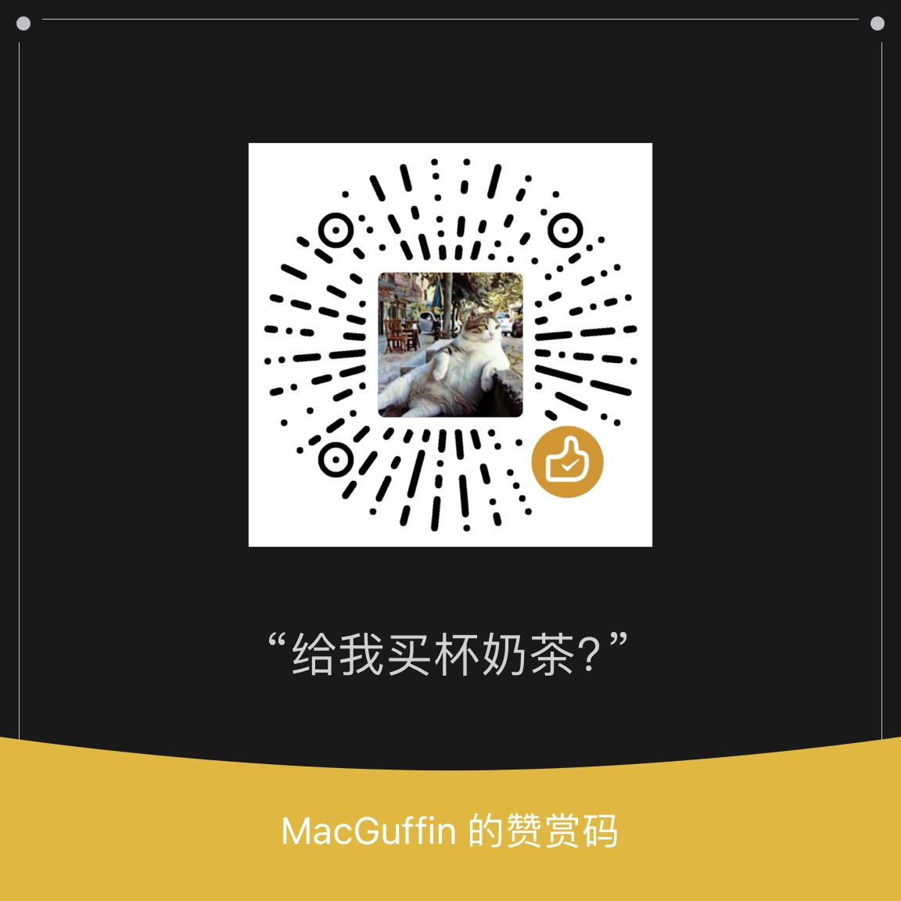

+++
title = "Metadata of AR@Reifying"
description = "Feel free to skip this"
draft = false

weight = 0

[taxonomies]
tags = ["metadata", "misc"]

[extra]
feature = true
feature_image = "meta.png"
+++

## License

[CC BY-SA 4.0](https://creativecommons.org/licenses/by-sa/4.0/)

When you want to quote or link to this blog, please click the link above to understand the content of the license, especially when you use it for commercial purposes.

## Acknowledgement

* [Zola](https://www.getzola.org/): A static site generator written in Rust, I use it to generate this blog.
* [Float](https://gitlab.com/float-theme/float.git): A theme for Zola, which I did a bit modification to fit my needs.
  * License：[MIT](https://opensource.org/licenses/MIT)
* [Oppo Sans](https://www.coloros.com/index/newsDetail?id=72): Sans-serif font used in this blog, which is generously provided by Oppo to the public.
* [Vercel](https://vercel.com/): I use Vercel to deploy this blog.
* [MidJourney](https://www.midjourney.com/): I use MidJourney to generate some images in this blog.
* [OpenAI GPT](https://openai.com) 和 [LobeChat](https://github.com/lobehub/lobe-chat): I use OpenAI GPT and LobeChat to generate some texts in this blog, mostly translation drafts.

## Say Hi

fl at reify.ing

## Buy me a coffee

Cheers ☕️

### Wechat Pay

### Patreon

[**Patreon Link**](https://www.patreon.com/user/shop/buy-me-coffee-140915?u=120377676&utm_medium=clipboard_copy&utm_source=copyLink&utm_campaign=productshare_creator&utm_content=join_link)

