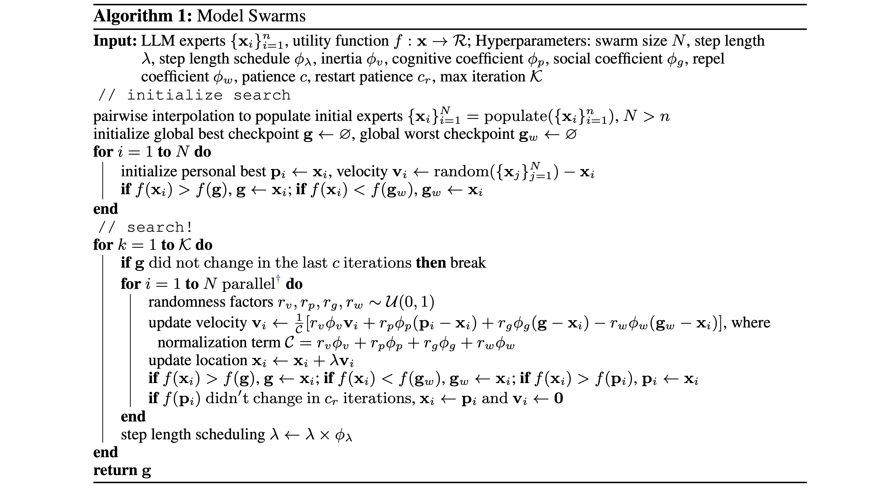

+++
title = "自监督进化：从模型群体到通用人工智能"
description = "自监督微调、模型群体 (Model Swarm) 和动态效用函数会是下一代 AI 训练方式"
draft = false

weight = 12

[taxonomies]
tags = ["AI"]

[extra]
feature_image = "particles_agi.png"
feature = true
+++

想象一下，你正在为律师事务所开发一个 AI SaaS 产品，一个法律助手，用来搜索和分析客户文档。由于这些文档极其敏感且价值连城，客户不愿意把内容发送到某个远程服务器。本地部署是**必需的**。客户还希望可以微调 AI 法律模型，使它完全贴合他们的需求。但是作为一名 AI 开发者，你想要以可扩展的方式不断改进你的模型，保持领先地位，而不是钻入定制化开发的牛角尖。
最理想的情况是形成一个飞轮：用户越多，模型迭代就越快。这些都必须在不碰用户敏感数据的前提下实现。

当老板跟我说类似的话的时候，我想，行吧，应该要用[联邦学习](https://en.wikipedia.org/wiki/Federated_learning)了。但是这是一个还不是很成熟的领域，还有很多复杂的问题没有解决。那能不能定期从我们的律所合作伙伴那里发回 [LoRA](https://arxiv.org/abs/2106.09685) 模型，然后合并这些模型呢？我们可以说服他们：这些 LoRA 是用来改进基础模型的匿名数据，不包含任何敏感的明文数据。
但是他们的训练目标可能过于细分，跟我们的训练目标不完全一致，所以这些 LoRA 的组合出来的模型，可能不会在我们通用法律评估集上表现更好。我们要从这些 LoRA 高维向量里提取出有用的方向。这里的"有用"指的是能够提高在**我们的**评估集上的性能。

巧合的是，就在第二天，我看到了模型群体（[Model Swarm](https://arxiv.org/abs/2410.11163)）这篇论文。这是我要在博客中讨论的内容，而不是我们的法律助手。

结合一些延展，我相信论文中的技术可以改变我们后训练（post-train）AI 模型的方式。

## 什么是模型群体(Model Swarm)

我经常发现一个有意思的事：不同的人对同一篇文章的理解可以有很大的不同，所以下面我给了不同的三个总结，而不是仅仅一个。

首先我先请 [Claude](https://claude.ai) 帮我总结了这篇论文：

> 以下是关键想法：
> 1. 核心概念：
>    - 模型群体是一个使用群体智能来适应语言模型(LLM)的协作搜索算法
>    - 多个 LLM 专家在效用函数的指导下共同探索和优化模型权重
>    - 灵感来自粒子群优化，每个 LLM 被视为在权重空间中移动的"粒子"
>
> 2. 主要优势：
>    - 无需训练：仅需 200 个样本即可工作，无需大量微调数据
>    - 无需假设：自动发现最优模型组合，无需预定义规则
>    - 灵活：可以针对任何标量效用函数进行优化（性能、奖励、人类偏好）
>
> 3. 工作原理：
>    - 从一组多样的 LLM 专家开始
>    - 每个专家都有一个位置（模型权重）和速度（权重空间中的方向）
>    - 专家受到以下因素的影响：
>        - 他们自己最好的先前位置
>        - 群体的最佳位置
>        - 群体的最差位置（用于避免）
>    - 通过迭代更新，专家协作搜索最优权重
>
> 4. 主要结果：
>    - 在各种任务中比 12 种基准模型组合方法提高了最多 21% 的性能
>    - 在以下方面表现良好：
>        - 单一任务（知识、推理、安全性）
>        - 多任务领域（医疗、法律、科学）
>        - 奖励模型优化
>        - 人类兴趣主题
>    - 实现弱到强的模型转变：较弱的模型可以通过协作变得更强
>
> 5. 显著发现：
>    - 多样性很重要：初始专家越多样化，结果越好
>    - 出现新能力：模型发现了任何初始专家都不具备的能力
>    - 最终最佳模型往往一开始并非表现最好的
>    - 通过"token swarms"变体可以适用于不同架构

我们再来看看作者的摘要：

> 翻译：
>
> 我们提出了模型群体(Model Swarm)，这是一个通过群体智能来适应 LLM 的协作搜索算法，其中群体智能是指引导个体系统的集体行为。具体来说，模型群体从一组 LLM 专家和一个效用函数开始。在整个模型中发现的最佳检查点的引导下，不同的 LLM 专家在权重空间中协作移动，并优化代表模型适应目标的效用函数。
> 与现有的模型组合方法相比，模型群体提供了无需调优的模型适应，在低数据环境下可以仅用 200 个样本就能工作，并且不需要对群体中的特定专家或它们应该如何组合做出假设。大量实验表明，模型群体这个方法可以灵活地使 LLM 专家适应单一任务、多任务领域、奖励模型以及多样化的人类兴趣，在各种任务和场景中相比 12 种模型组合基准提高了最多 21.0% 的性能。
> 进一步分析揭示，LLM 专家发现了初始检查点中不存在的能力，并且模型群体通过协作式搜索过程实现了专家从弱到强的转变。
>
> <br>
>
> 原文：
>
> We propose Model Swarms, a collaborative search algorithm to adapt LLMs via swarm intelligence, the collective behavior guiding individual systems. Specifically, Model Swarms starts with a pool of LLM experts and a utility function. 
> Guided by the best-found checkpoints across models, diverse LLM experts collaboratively move in the weight space and optimize a utility function representing model adaptation objectives. 
> Compared to existing model composition approaches, Model Swarms offers tuning-free model adaptation, works in low-data regimes with as few as 200 examples, and does not require assumptions about specific experts in the swarm or how they should be composed. 
> Extensive experiments demonstrate that Model Swarms could flexibly adapt LLM experts to a single task, multi-task domains, reward models, as well as diverse human interests, improving over 12 model composition baselines by up to 21.0% across tasks and contexts. 
> Further analysis reveals that LLM experts discover previously unseen capabilities in initial checkpoints and that Model Swarms enable the weak-to-strong transition of experts through the collaborative search process.

### 我的理解和思考

读完了这篇论文，我的感觉是：虽然摘要确实总结了作者的贡献，但它低估了一些关键点。从大语言模型(LLM)推广开来，这些点可能会有更大的影响力。

以下是我认为需要强调更多的关键点（段落里用***粗斜体*** 标出）。



读着论文的时候，有了一些概念，然后我想到了两个问题：

* 那它怎么同步这个优化过程？
* 梯度在哪里？

我发现，这两个问题对于理解和推广这个算法很有帮助。

稍微激进地简化一下，本质上，这个算法将粒子（不同的 LLM 专家）散布到优化空间（即高维的参数空间）里。空间的高度由效用函数 𝑓 给出。每次迭代里，每个粒子都会评估所在高度。每个例子都被引导向当前最高的一个 **g**，也就是当前的全局最优，同时考虑他们的路径和当前的全局最差 **g_w**。

这非常类似于反向传播（或者叫基于梯度的优化），但是***没有梯度***。众所周知，在分布式训练中，反向传播会带来大量的同步开销，这可能是扩展模型和训练过程中最大的问题。

如果没有反向传播、假设我们不需要同步，那我们就可以"无限制"地扩展训练/优化过程。那么，这个算法中的同步点在哪里？我希望找不到🙏🏻

我再仔细看论文，发现了几个***同步点（Synchronization Points, SPs）***：

1. 交换效用分数（即 𝑓(**x_i**) ）需要一次同步，也就是”在这次迭代中谁得到最高分（榜样）谁得到最低分（反例）？“

2. 榜样和反例的权重的交换过程也是一次**非常昂贵的**同步，因为在更新速度时需要这些权重。

3. **如果**效用函数 𝑓 的评估是中心化的，我们还需要把所有模型的权重发送到一个交换点，我们姑且称之为"权重交换点（Weight eXchange Point, WXP）"，所以发送权重和评估 𝑓 也需要同步。

抛开同步不谈，作者们通过两个实验无意间解决了 SP.1 和 SP.2：

1. ***Dropout-K/N***：

   引用原文："随机跳过 *d_k* % 迭代中的模型评估或对 *d_n* % 的专家跳过评估"。这种方法有效地模拟了 *d_k* % 的迭代不同步，以及 *d_n* % 的专家不同步的情况。从同步的角度来解读，他们的结果表明：即使专家群体不一定能保持同步，但是模型也会有改善。这让我们有了希望：可能即使所有专家都异步更新，他们仍然能够对整体有所贡献。

2. ***Token Swarms 词元群体***：

   作者想把这个方法推广到有不同架构的专家，但他们过程中无意解决了 SP.2。不交换榜样和反例的完整权重，而是交换 token swarm 矩阵，这些矩阵会更改专家的下一个词元概率分布。这些矩阵的参数要少得多，让同步的开销大大降低，但是代价就是改进效果也稍微差一点。

从技术角度来看，解决 SP.3 很简单：我们可以假设每个分布式节点都是可信的。他们可以各自在本地计算 𝑓 然后向所有人报告分数，这样就不用中心化计算了。

另外，让专家们在全局信号（**g** 和 **g_w**）的指导下维持自己的轨迹，***这个算法有效地提取出可泛化而且有用的权重更新，同时过滤掉细分训练带来的噪声***。有了这个算法，合并来自我们律师朋友的细分训练后的 LoRA，就不是简单地组合权重，而是可以使用效用函数 𝑓 来识别权重空间中有益的方向，同时通过个体轨迹保持个体的细分专业化。

最后，这篇论文的结果***再次确现了模型可以从特定任务中泛化并产生新的行为，专业化的个体可以相互学习，变成更好的整体***。这和 [Multimodal Pathway](https://arxiv.org/abs/2401.14405) 的发现总体上是一致的。

## 然后呢

所以，除了作者摘要中的亮点外，这篇论文的方法还有以下特点：

* 无梯度优化
* 一些可以（部分）消除的同步点，可能可以实现分布式异步训练
* 提取出可泛化而且有用的权重更新并同时过滤掉细分训练带来的噪声的机制
* 重新确认了 LLM 从特定任务中泛化的能力

然后呢？我举一些例子，这些例子可能会进化成通用人工智能！

### 例子 1：自动驾驶

特斯拉车上的 HW4 [估计](https://www.autopilotreview.com/tesla-hardware-4-rolling-out-to-new-vehicles/)有 50 TOPs 的加速器。根据 [Wikipedia](https://en.wikipedia.org/wiki/Tesla_Model_Y)的数据，Model Y 在2023 年大约卖出了 120 万辆。这么简单计算一下，这些汽车的总计算能力是 60 Exa-OPS，而目前[最快的超级计算机](https://en.wikipedia.org/wiki/TOP500) 有 1.1 Exa-Float-OPS 的算力。

假如我们可以用所有这些计算能力来训练一个自动驾驶模型，会发生什么？你可能也听过一个超级有名的人说过类似的话 :)

有了模型群体这个方法，这个想法可能就不那么不切实际了！

一辆特斯拉出厂会有同一个的预训练好的模型 **x_p**，但通过影子模式，车载模型会在本地训练，慢慢从司机那里学习。一段时间之后，**x_p** 被训练成一个微调/专业化的模型 **x_i**（也就是群体中的专家或粒子）。
就算 **x_i** 从老司机那学到了不安全的驾驶方式，效用函数 𝑓 也会给安全驾驶的模型更高的分数。通过 OTA，车子就可以定期交换 **x_i**、**g** 和 **g_w** 的参数。

稍微大胆想象一下，把 Token Swarms 应用到所有的自动驾驶汽车并不难，即使它们的制作商不一样，因为驾驶这个行为的动作空间基本上是标准化了。

### 例子 2：下一帧预测和世界模型

在自动驾驶汽车中，有一个模块或神经网络，会根据历史和当前观察来预测短期的未来，比如下一帧或者世界的下一个状态。在 AI 内容生成领域，视频生成模型可以根据几帧画面或文本提示生成合理的未来帧。

可以说，能够准确预测未来帧的模型本质上就是在对世界建模。我们可以通过让它预测未来帧，来训练一个"世界模型"。这个任务可以完全自监督，意味着训练数据不需要人工标注。

当这样的世界模型部署在设备上（例如，汽车、机器人、无人机）时，它是一个同一个预先训练好的模型，但随后它在我们的物理世界中持续训练，观察 4维时空的片段。它会成为这个世界的某个 4 维片段的专家。然后，通过同步点，这些世界模型交换它们的学到的世界，而好的（以 𝑓 为准）世界模型会变得”有名“，变得有影响力。

> 我们作为个体，也是这个世界的某个 4 维片段的专家。想想你的邻里，你大致可以想象到在特定时间街道上会发生什么。你也知道它过去是什么样子。同时，你可能不太熟悉几十年前或千里之外的地方。我们脑子里的世界模型模拟了地球上的一小片面积，而它能推演的历史长河里的片段就更小了。
> 但是，我们也可以相互交换信息或者从新闻里获得信息，所以我们知道某些人的八卦，某些国家的战争等等。

### 自监督微调

上面的例子里，我故意简略了一件事，就是数据收集和训练的方式。我觉得数据收集的方法和训练的方式就是一体两面的。在这两个例子这种这么大规模的情况下，我们很明显负担不起监督学习/微调，烧钱也不是这么烧的。我们很难让数百万人给他们的智驾汽车标注数据。所以，我们需要在没有显性人力要求的情况下做自监督训练和微调。

> 对于自监督微调（Self-supervised Finetuning, SSFT），我指的是我们可以**自动**收集数据来持续优化一个**预训练的**模型。
>
> <br>
> 强调"预训练"是因为我们不想在这种分布式异步的设定里从头开始训练模型。中心化的、基于梯度的训练效率更高，所以就用它来预训练模型。
>
> ”自动化“是决定性的。它的范围比自监督学习的定义更广。自监督学习通常的实现是掩码预测或下一个 X 预测。 然而，我想把强化学习和基于反思的引导（像下面这样）纳入 SSFT 的范畴：
>
> 比如，我们与 LLM 进行对话：
>
>     用户：9.11 和 9.9，哪个更大？
>     LLM：9.11 更大。
>     用户：我澄清一下，我说的不是圣经章节也不是日期。我说的是数字*
> 	  LLM：对不起，数字 9.9 大于 9.11。
>
> <br>
> 然后我们有一个使用相同 LLM 的反思机制或使用更强大模型的评判机制来自动收集数据：
>
>     系统消息：根据上述对话，进行反思并尝试以问答形式给出更好的答案······
>     LLM：（一些反思，然后是修改后的问答）
>     ```
>     用户：9.11 和 9.9，哪个更大？
>     LLM：从数学角度来看 9.9 大于 9.11。但如果你说的是日期或圣经章节，那么 9.11 更大。
>     ```
>
> 这样我们就自动获得了一个新的、更好的、用于微调这个 LLM 的数据。
> 
> <br>
>
> \* 可以看看 [Transluce](https://transluce.org) 做的有意思而且很有价值的研究！


在例子 1 里，SSFT 是通过在司机手动驾驶汽车时，自动收集人类数据来实现的。这种收集方法没有显性的人力要求（除非我们付费让司机开车，专门收集数据）。在例子 2 中，SSFT 是通过下一帧预测来实现的。我们一直开着摄像头就可以收集数据了。

### 结合动态效用函数的终身学习

我认为效用函数是一个强大而且能泛化的工具，可以助推专家群体的进化。就像论文里说的，𝑓 的分数可以是数据集上的性能、奖励模型的评分或人类偏好。但它**远不止于此**：

* 相比于评估集性能，𝑓 通过选择榜样和反例来作为影响因子，让其他人可以直接学习（参见速度更新公式），从而隐式地推动专家的权重。
* 虽然奖励（Reward）和 𝑓 分数都提供间接的反馈，但 𝑓 的反馈信息量更大，这是因为有 (**g** - **x_i**) 和 (**g_w** - **x_i**) 项，而不是概率估计。
* 显然，这种基于进化的机制比人类评分更加泛用，也更能拓展。
* 𝑓 可以把这三项都融合进来。

我们的世界总是在变。我觉得一个世界模型如果不能适应世界的动态变化，那它就不是真正的通用人工智能 AGI。终身学习能力是必要的，可能是与实现静态（只学一次）的超级人工智能同样重要的目标。

虽然在论文中 𝑓 是静态的，但它可以动态发展，就像进化过程本身。假如 𝑓 是评估集性能的评测，我们可以设置权重，逐步引入新的评估集，从而选出新的榜样和反例来"引导"专家探索新的空间。这跟人类的变迁很像。优化空间是由 𝑓 塑造的，所以当 𝑓 改变时，优化空间重塑，居民（即专家）就会迁徙。
同样的，当自然景观在几十年里慢慢变化时，我们人类也会逐渐迁居新的地方。而且自然选择的"适应度函数"并非也并非静态、一成不变的，而是随环境条件变化而变化。相反，在模型（进行基于梯度的）训练的时候，我们去修改评估集，没用也没有意义。

动态效用函数（Dynamic Utility Function, DUF）可能以实用主义的方式解决一个很多人（包括我）的在思考的问题：

> 当我们用完评估集或基准测试时该怎么办？

或者等价地说："人工超级智能的评估集是什么？"

有一个不断进化的动态效用函数，我们可能才可以心安理得地接受这样的答案："我们不能确切地知道，但我们总是可以慢慢改进我们的效用函数，然后这个超级智能会遵循我们的标准"。

> 不过，动态效用函数是不是真的有效还不清楚，因为作者在论文中没有实验，这仅仅是我的想法。

### 自监督进化

我觉得模型群体、自监督微调和动态效用函数的组合可能是训练 AI 的 Next Big Thing，所以我将其称为自监督进化，强调了自监督学习的重要性和模型群体的动态进化的本质。

> 自监督进化 = 模型群体 + 自监督微调 + 动态效用函数

## 结语

巨头正在烧掉数十亿美元来开发下一代 AI。作为一个计算机科学家，我理解他们必须集中算力的技术理由，但我不喜欢这种赛博朋克未来。而且，这种中心化和同步的特性感觉很不自然，因为这不是大自然的运作方式。大自然是异步运行的，而且它是一个分布式系统。

有了自监督进化的技术，AI 可能可以再次在设备上进行微调。而它们作为一个整体，可以看到更完整、更动态的世界。我希望 AI 能从服务器机架中解放出来，也帮助每个人打破他们自己的束缚。

## 致谢

特别感谢 Claude 的总结、翻译、审阅并给出深刻的想法！

## 元数据

版本：0.0.1

日期：2024.10.28

许可证：[CC BY-SA 4.0](https://creativecommons.org/licenses/by-sa/4.0/)