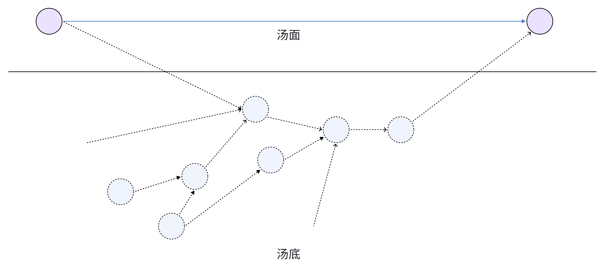

+++
title = "LLM、海龟汤和猜词游戏"
description = "把问题答对的能力很重要，问对的问题更重要。从海龟汤说起，怎么让 LLM 提出好问题"
draft = false

weight = 7

[taxonomies]
tags = ["LLM", "Random Thoughts"]

[extra]
feature_image = "baymax_surfing.png"
feature = false
+++

想法起源于即刻上看到的即友的[一篇文章](https://mp.weixin.qq.com/s/7GVlt8IJMxJkR0kDNPVMLw)。TA 用了两万条真人 AI 海龟汤游戏数据，评估哪一个大模型推理能力更强。我觉得非常有意思，甚至可以基于这个来写一篇 paper，所以在这里记录一下我的想法。

## 海龟汤

不过首先，“海龟汤” 是什么？我觉得文章里的解释已经非常好了，所以引用如下（格式有点改动）：

> 我人生中第一次接触海龟汤游戏是我的初中英语课上，课间休息时老师突然问： 一个男人走进一家餐厅，点了一碗海龟汤, 他吃完问服务员：这是真的海龟汤吗？服务员说：是的。他就举枪自杀了, 请问为什么？
> 
> 游戏规则：你可以提问或给出猜测，老师只能回答 “是”“否”或者“和故事无关”，比如你可以问：男人是否曾经经历灾难？但不能问男人今年多少岁。
> 
> 我们猜了好多轮，最后上课铃响了，老师揭晓答案：他和妻子度蜜月时遭遇海难，流落荒岛，由于没有粮食，妻子被饿死，同伴用妻子的肉煮汤给他喝，骗他是海龟汤。后来他被路过的船只救走。今天，他喝到真正的海龟汤，才想起来当时吃下的是妻子的肉，悔恨之下举枪自尽。
> 
> 在海龟汤中，展现给玩家的是汤面，而沉在水底的故事真相被称作汤底，这是一个至少两个人才能玩的游戏：一个人是裁判，他在知晓汤底的情况下，对玩家的猜测作出判定，给出“是”“否”“无关”的回答。

我没有遇上即友的那么有趣的英语老师，所以当我看到这篇文章的时候才第一次知道这个游戏。我的第一个反应是：汤面总是简单而惊奇，但是汤底太复杂了，这要问多少问题才能猜到呢？

## 博弈和信息论

我学过一点点信息论，最粗略的推算是，每个问题的答案是三种之一，问一个问题能够得到的信息量大概是 `log2(3) = ~1.58` 个比特，信息量是非常少的，也就意味着要问很多问题才能猜到汤底。

这我想起了另一个名词，叫“不完全信息博弈”。在不完全信息博弈中，每个对弈的玩家都不知道对方的全部信息，所以要通过观察对方的行为来推断对方的信息。海龟汤我觉得也算是一种不完全信息博弈。裁判知道汤底，玩家不知道。初始时，玩家知道的信息非常少，同时玩家问问题得到的信息也非常少。

如果我们用不严谨的推理逻辑图来表示，像上图，表面上我们知道从起点到终点的关系，但是实际上，我们需要知道隐藏在底下的很多背景信息以及它们之间的联系才能推断出终点。

以海龟汤的例子来说，我们一开始能知道的起因就只有“男人喝了海龟汤”，而我们要推断的终点是“男人自杀了”。 但是，从答案反推，我们至少可以知道五点信息：
1. 男人之前有过妻子
2. 男人和妻子有过灾难经历
3. 这个灾难经历里有男人和妻子以外的人，也就是伙伴
4. 这个灾难经历里**只有**妻子死了
5. 男人在灾难经历之前都没有喝过海龟汤

或者说，要让答案成立、合理，我们要假定这些信息是正确的。这些信息对于推出答案是必要的。

> 进一步解释，我们可以用反证法来说明这些信息的必要性：
> 
> * 1-3 点就是答案里的信息，所以是必要的。
> * 如果这个灾难经历里还有别的人死了，那男人怎么能够确定“海龟汤”是妻子的肉呢？
> * 如果男人在灾难经历之前就喝过海龟汤，那同伴就不能用“海龟汤”来骗他了。
> 

## 提问

有一句老话叫“提问的能力比回答问题的能力更重要”。如果我们要最快地把这五点信息问出来，最快的问法可能是：
1. 男人是否曾经经历灾难？裁判回答“是”
2. 这个灾难经历里有别人？裁判回答“是”
3. “别人”是多个人？裁判回答“是”
4. 有人死了？裁判回答“是” 
5. 死的只有一个人？裁判回答“是”
6. 死的人对男人很重要？裁判回答“是”

基本上，这六个问题就可以把汤底的信息问出来了。只不过这是我们知道了汤底的情况下的最优解，而在实际游戏中，玩家是不知道汤底的情况的。每一次提问，都是在无限的可能中排除掉一半，但是无限的一半还是无限。

> 但是，这六个问题没有问到第五点信息，这是隐含的必要条件，不过我觉得人类可以在推理的时候放弃一些严谨性，推断出大概的汤底。

## 回答

## 元数据

版本：0.0.1

日期：2024.07.12

版权协议：[CC BY-SA 4.0](https://creativecommons.org/licenses/by-sa/4.0/)

### 更新日志

2024.07.16：写完了 “什么是不确定性” 这一章节

